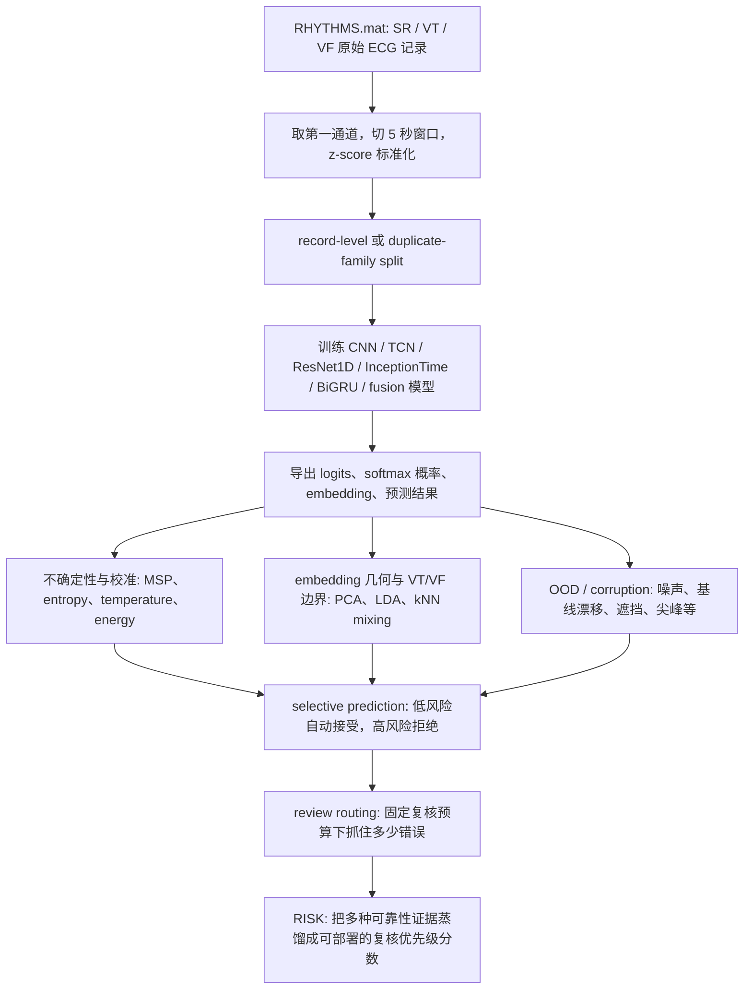

# ECG 不确定性项目组会讲解稿（小白版）

这份说明按“明天给老师汇报”的方式写：先讲这个项目到底想解决什么问题，再讲数据怎么处理、模型怎么训练、不确定性怎么评估、图片分别在证明什么，最后讲当前最稳妥的结论和限制。

重要提醒：这个项目是可靠性研究原型，不是临床诊断系统，不是医疗器械验证。汇报时不要说“模型可以诊断 VT/VF”，应该说“模型在内部 ECG 窗口分类任务上，用不确定性和复核路由来识别高风险预测”。

## 1. 一句话讲清楚项目

这个项目研究的是：给一个 ECG 片段，模型要判断它是 `SR`、`VT` 还是 `VF`，但我们不只关心它猜得准不准，还关心它能不能知道“自己什么时候不可靠”，从而把高风险窗口交给专家复核。

三个类别是：

- `SR`: sinus 或非室性节律；
- `VT`: ventricular tachycardia，室性心动过速；
- `VF`: ventricular fibrillation，室颤。

真正的研究重点是 `VT` 和 `VF` 的边界。因为 SR 和室性节律通常更容易分开，但 VT/VF 之间更容易互相混淆。项目最终想回答的是：如果只能人工复核 10%-30% 的 ECG 窗口，模型能不能优先把最危险、最容易错的 VT/VF 边界错误挑出来？

## 2. 你可以这样开场

我的项目不是单纯做一个 ECG 三分类器，而是做一个“可靠性评估管线”。传统做法可能只汇报 accuracy 或 macro-F1，但在这个任务里，一个模型整体准确率高，不代表它在 VT/VF 这种高风险边界上可靠。所以我把任务拆成三步：

1. 先训练 SR/VT/VF 三分类模型；
2. 再计算不同类型的不确定性和表示空间风险；
3. 最后把高风险样本路由到 expert review，评估有限复核预算下能抓住多少错误。

这就是为什么项目里会有分类模型、embedding PCA、不确定性校准、OOD/corruption、review routing、PRO、RISK 这些模块。它们不是散的，而是在共同回答“模型什么时候不该被自动相信”。

## 3. 数据做了什么

本地数据文件是 `RHYTHMS.mat`，里面有三个 MATLAB cell array：`SR`、`VT`、`VF`。我刚用 `python -m src.inspect_data --mat RHYTHMS.mat` 做了只读检查，确认本地文件包含：

- SR: 488 条原始记录；
- VT: 46 条原始记录；
- VF: 60 条原始记录。

每条记录长度不一样，代码会取第一通道 ECG，然后切成固定 5 秒窗口。`src/data.py` 里 `load_rhythm_windows()` 的默认参数是 `sample_rate=100`、`seconds=5`、`stride_seconds=5`，所以一个窗口默认是 500 个采样点。窗口会做 z-score 标准化，输出形状是 `[n, 1, length]`。

防止数据泄漏是这里的关键。因为同一条 ECG 记录切出来的相邻窗口很像，如果把同一条记录的窗口同时放进 train 和 test，模型看起来会很强，但其实可能只是记住了相似片段。所以项目使用 `GroupShuffleSplit`，按 record id 或 duplicate-family 分组划分 train/val/test。

公开汇总表 `results_public/tables/dataset_split_statistics.csv` 显示窗口级 split 大致是：

| split | SR windows | VT windows | VF windows | 说明 |
|---|---:|---:|---:|---|
| train | 11364 | 541 | 733 | 训练模型 |
| val | 3811 | 373 | 390 | 调参、温度缩放、选择 risk 权重 |
| test | 4159 | 506 | 165 | 最终评估 |

老师如果问“为什么 split 这么重要”，可以答：因为 ECG 窗口之间可能高度相关，所以 leakage 控制比普通图像分类更重要。项目后期还引入 duplicate-family split，把完全重复或近似重复连接起来的 source records 放在同一组里，进一步避免过度乐观。

## 4. 整体流水线

可以把项目理解成下面这条线：

## 5. 模型训练部分讲什么

核心训练入口是 `src/train.py`。

它做的事可以小白化理解成：

1. 读 `RHYTHMS.mat`；
2. 切窗口；
3. 按 record 或 duplicate-family 分 train/val/test；
4. 选择模型，比如 CNN、TCN、ResNet1D、InceptionTime、BiGRU、RegularityFusion、ReliabilityGatedFusion；
5. 用 cross entropy 训练；
6. 保存最优模型、预测结果、embedding 和指标。

代码对应关系：

- `src/data.py`: 数据读取、窗口化、标准化、split、regularity features；
- `src/models.py`: 所有神经网络结构；
- `src/train.py`: 训练主流程；
- `src/metrics.py`: accuracy、macro-F1、ECE 等指标；
- `src/uncertainty.py`: 不确定性分数公式。

训练输出通常包括：

- `best_model.pt`: 最优模型权重；
- `history.csv`: 每个 epoch 的训练/验证过程；
- `metrics.json`: test 指标；
- `test_predictions.csv`: 每个测试窗口的概率和预测；
- `embeddings_train.npz`、`embeddings_val.npz`、`embeddings_test.npz`: 后续不确定性和几何分析要用。

### 模型家族怎么讲

`src/models.py` 里模型不是随便堆的，而是为了比较不同时间序列骨干网络：

- `ECGCNN`: 基础 1D CNN，作为 baseline；
- `TCN`: temporal convolution，适合时序局部模式；
- `ResNet1D`: 残差网络，更深；
- `InceptionTime1D`: 多尺度卷积；
- `BiGRUClassifier`: 循环网络，建模前后时序；
- `RegularityFusionResNet1D`: 把 waveform embedding 和 ECG regularity 手工特征拼起来；
- `ReliabilityGatedRegularityFusion`: 学一个 gate，决定 regularity 特征对 embedding 的影响强弱。

公开表 `results_public/tables/model_performance_and_geometry.csv` 里，`GatedFusion-12` 的 accuracy 是 0.9491、macro-F1 是 0.7750，是公开汇总里很强的分类模型之一。但汇报时要强调：分类强不代表 review routing 一定强，所以后面还要看复核捕获率。

## 6. 不确定性与校准讲什么

这部分回答：模型错的时候，它有没有表现出“不确定”？

核心代码：

- `src/uncertainty.py`: 定义分数；
- `src/evaluate_uncertainty.py`: 计算分数、画可靠性图、coverage-risk 图；
- `src/selective_analysis.py`: 按风险从低到高保留样本，看覆盖率和错误率；
- `src/per_class_selective_analysis.py`: 按 SR/VT/VF 分开看 selective prediction。

主要分数：

- `MSP`: maximum softmax probability 的反向分数，最大概率越低越不确定；
- `entropy`: softmax 熵，概率越平均越不确定；
- `temperature_msp`: 温度缩放后再算 MSP，用于校准；
- `energy`: energy score；
- `prototype`: embedding 到类别原型的距离；
- `mahalanobis`: embedding 到类别分布的 Mahalanobis 距离；
- `knn`: embedding 到训练样本近邻的距离；
- hybrid scores: 例如 entropy + kNN，结合决策不确定性和表示空间 atypicality。

公开表 `results_public/tables/uncertainty_error_detection.csv` 给了一个很重要的负结果：MSP 和 entropy 对普通错误检测通常较强，例如 TCN-20 的 entropy error AUROC 约 0.949；但 energy 在一些模型上非常弱，例如 CNN-10 energy AUROC 约 0.100、TCN-20 energy AUROC 约 0.052。这说明“不确定性”不能只选一个流行分数就结束，必须比较不同机制。

## 7. Embedding / PCA 图在讲什么

Embedding 可以理解成模型内部对 ECG 的“压缩理解”。如果三个类别在 embedding 空间里分得很开，说明模型内部表示更清楚；如果 VT/VF 混在一起，就说明它们是天然的困难边界。

核心代码：

- `src/embedding_geometry_analysis.py`: 计算类别中心距离、kNN mixing、PCA/LDA/t-SNE 投影；
- `src/ambiguity_analysis.py`: 专门计算 VT/VF ambiguity；
- `src/pro_geometry_comparison.py`: 比较 PRO 前后 embedding 几何是否改变。

关键解释：

- PCA 图不是统计证明，只是把高维 embedding 投影到 2D/3D，帮助观察结构；
- 图里常见现象是 SR 更容易从室性节律里分出来；
- VT 和 VF 更容易混在一起，所以后续重点变成 VT/VF boundary error。

公开图 `results_public/figures/00_summary/embedding_geometry_distances.png` 显示，多数模型里 VT/VF 的 normalized centroid distance 明显小于 SR-VT 和 SR-VF。这就是项目为什么专门分析 VT/VF cross-error 的依据。

## 8. VT/VF 边界分析讲什么

这部分不是问“模型错了多少”，而是问“哪些错误最危险、最有结构”。

核心代码是 `src/ambiguity_analysis.py`。它把 VT/VF 边界模糊性拆成几部分：

- `prototype_vtvf_ambiguity`: 到 VT 原型和 VF 原型距离是否接近；
- `softmax_vtvf_ambiguity`: softmax 里 VT 和 VF 概率是否接近；
- `knn_label_entropy`: 近邻标签是否混乱；
- `knn_vtvf_mix`: 近邻里 VT/VF 是否混在一起；
- `ventricular_ambiguity_index`: 上面几个分数的综合。

输出包括：

- `ambiguity_scores.csv`: 每个窗口的 ambiguity 分数；
- `ambiguity_summary.csv`: 分数对 VT/VF boundary error 的检测能力；
- `embedding_pca_ambiguity.png`: PCA 图上用颜色表示 ambiguity；
- `ambiguity_distribution.png`: 正确 VT/VF、VT/VF 错误、SR 的 ambiguity 分布。

这部分可以这样讲：我不是把所有错误一锅端，而是把 VT->VF、VF->VT 这种临床上更需要谨慎的边界错误单独建模，后续 review routing 也是围绕这个风险来设计。

## 9. ECG regularity 特征讲什么

模型不应该只看黑盒 embedding。VT 和 VF 本身有节律、频域、复杂度差异，所以项目提取 ECG-domain regularity features 来解释可靠性。

核心代码：

- `src/data.py`: 快速 regularity 特征；
- `src/regularity_analysis.py`: regularity 与 atypicality / ambiguity 的关系；
- `src/feature_only_analysis.py`: 只用 regularity features 做 classical model；
- `src/regularity_feature_ablation.py`: 按特征组做消融；
- `src/gate_analysis.py`: 分析 gated fusion 模型里的 gate。

9 个 regularity 特征是：

- spectral entropy；
- dominant frequency；
- dominant frequency concentration；
- spectral centroid；
- spectral bandwidth；
- autocorr peak；
- autocorr peak lag seconds；
- zero crossing rate；
- line length。

图 `results_public/figures/03_regularity_interpretability/contact_sheet.png` 里有 6 张 regularity 图，主要看不同 case group 的 autocorr、frequency concentration、sample entropy、spectral entropy 等是否不同。最后一张 feature permutation importance 图告诉我们：打乱某些 regularity 特征会让 macro-F1 降低，说明这些手工特征确实携带信息。

## 10. OOD / corruption 图讲什么

这部分回答：如果 ECG 信号质量变差，模型的不确定性或风险分数会不会升高？

核心代码：

- `src/evaluate_ood.py`: 早期 OOD 风格扰动；
- `src/evaluate_corruption_severity.py`: 11 类 ECG-like corruption，severity 1-4；
- `src/monotonicity_analysis.py`: 看分数是否随 severity 单调变化；
- `src/stability_aware_analysis.py`: 看扰动前后预测、置信度、embedding 是否稳定；
- `src/evaluate_risk_corruption_robustness.py`: 专门看 RISK 在 corruption 下是否仍有效。

11 类 corruption 是：

- gaussian noise；
- powerline interference；
- baseline wander；
- baseline jump；
- random masking；
- flatline dropout；
- spike；
- amplitude scaling；
- clipping saturation；
- time scaling；
- mixed noise baseline。

公开图 `results_public/figures/04_ood_corruption/contact_sheet.png` 里每张图横轴是 severity，纵轴是 OOD AUROC。你可以讲：一个好的可靠性分数应该在信号越来越坏时更容易把 corrupted 样本识别出来，但不同分数对不同 corruption 的响应不同，所以项目比较了 MSP、Mahalanobis、kNN、hybrid entropy-kNN。

## 11. Review routing 是项目的中心

不确定性分数本身只是一个数字，真正有意义的是它能不能改变决策。

项目把测试窗口按风险分数排序：

- 分数低：自动接受模型预测；
- 分数高：交给专家复核；
- 然后统计在 10%、20%、30% review burden 下，抓住了多少错误。

核心代码：

- `src/review_efficiency_analysis.py`: 计算 review burden vs error captured；
- `src/reliability_map.py`: 把样本分成 typical auto、boundary review、signal-quality review、forced review；
- `src/ambiguity_routing_policy.py`: 用 ambiguity、conformal、reliability 条件形成路由策略；
- `src/runtime_supervisor.py`: 离线模拟 safety supervisor 状态；
- `src/conformal_analysis.py` 和 `src/conformal_review_analysis.py`: conformal prediction set baseline。

公开表 `results_public/tables/review_routing_boundary_lrii.csv` 是可以重点讲的表：

| 模型 | 10% 复核抓住 VT/VF 边界错误 | 20% 复核抓住 VT/VF 边界错误 | 30% 复核抓住 VT/VF 边界错误 |
|---|---:|---:|---:|
| CNN-10 | 72.9% | 91.7% | 98.3% |
| TCN-20 | 82.0% | 93.7% | 97.9% |
| ResNet1D-12 | 38.3% | 71.4% | 91.4% |
| RegularityFusion-12 | 75.0% | 96.5% | 100.0% |

这张表的讲法很重要：ResNet1D 分类性能不差，但 10% 复核预算下抓 VT/VF 边界错误很弱。这说明“强分类器不等于强可靠性排序器”，所以 review routing 是必要评价。

## 12. PRO 要谨慎讲

PRO 是 prototype separation / boundary-structure intervention，可以理解成在训练中让表示空间更有结构，尤其希望 VT 和 VF 边界更清楚。

相关代码：

- `src/train.py`: `--prototype-center-weight`、`--prototype-margin-weight`、`--prototype-vtvf-margin`；
- `src/pro_geometry_comparison.py`: 比较 baseline vs PRO 的 embedding 几何和自动路由残余错误；
- `src/run_core_intervention_pipeline.py`: 跑 PRO 等 intervention；
- `src/seedwise_statistical_summary.py`: 三个 seed 的 paired summary；
- `src/record_cluster_statistics.py`: record-cluster bootstrap。

早期 V4/V5 图显示 PRO 会改变 embedding 几何，也可能减少某些 automatic-route VT/VF errors。但最终 V6 duplicate-family 证据更严格，结论变谨慎：PRO 不是稳定的最终提升方法，而是 boundary-structure 和 error-migration 分析。

公开表 `results_public/tables/duplicate_family_baseline_pro_summary.csv` 显示三种子下：

- baseline 平均 accuracy 约 0.9451，macro-F1 约 0.7603；
- PRO 平均 accuracy 约 0.9148，macro-F1 约 0.7162；
- PRO 在不同 seed 上会把错误迁移到不同方向，尤其可能增加 SR_to_VT 或 VT_to_VF。

老师问 PRO 是否成功时，可以回答：PRO 作为最终 deployable 方法不稳定，但它证明了 VT/VF 边界结构可以被 intervention 改变，也暴露出 error migration 风险，所以它是研究过程中的重要负/混合结果。

## 13. RISK 是当前最稳的贡献

RISK 的想法是：不要让部署时依赖一堆 post-hoc 分析脚本，而是把多种可靠性证据蒸馏成一个轻量 risk head，直接输出“这个 ECG 窗口应该优先复核的程度”。

核心代码：

- `src/generate_risk_targets.py`: 从 entropy、kNN、local instability、VT/VF mixing、softmax VT/VF ambiguity 等生成 soft risk target；
- `src/select_deployable_risk_weights.py`: 在 validation set 上选择最符合 review 目标的权重；
- `src/train_embedding_risk_head.py`: 用 embedding 训练 risk head；
- `src/fine_tune_risk_head.py`: 继续微调风险头或接回主模型；
- `src/risk_head_review_analysis.py`: 看 risk score 的复核曲线；
- `src/evaluate_risk_corruption_robustness.py`: 看 RISK 在 signal degradation 下是否仍有用。

最终 V6 duplicate-family RISK 结果来自：

- `results_public/tables/duplicate_family_selected_risk_review_aggregate.csv`
- `results_public/tables/duplicate_family_risk_error_type_capture_mean_std.csv`
- `results_public/tables/duplicate_family_risk_record_cluster_ci.csv`

关键数字：

| review burden | all-error capture mean | VT/VF cross-error capture mean | auto error rate mean |
|---:|---:|---:|---:|
| 5% | 37.6% | 52.1% | 3.84% |
| 10% | 70.2% | 82.8% | 2.15% |
| 20% | 90.2% | 100.0% | 0.86% |
| 30% | 94.4% | 100.0% | 0.59% |

这就是目前最适合汇报的中心结论：在最终三种子 duplicate-family 内部验证里，validation-selected RISK 可以在 10% 复核预算下抓住约 82.8% 的 VT/VF cross-errors，在 20% 复核预算下抓住 100%。但这仍然是内部研究证据，不是临床验证。

## 14. 公开图片怎么讲

公开图片主要在 `results_public/figures/`。每个文件夹都有：

- `contact_sheet.png`: 这一组所有图的缩略总览；
- `individual_figures/`: 单张图；
- `README.md`: 图组说明。

### 00_summary: 4 张总览图

路径：`results_public/figures/00_summary/`

- `model_performance_summary.png`: 各模型 accuracy 和 macro-F1。用于说明“分类性能不错，但不是全部”。
- `embedding_geometry_distances.png`: SR-VT、SR-VF、VT-VF 的 normalized centroid distance。用于说明 VT/VF 是最紧的边界。
- `uncertainty_error_detection.png`: 不同 uncertainty score 的 error AUROC。用于说明 softmax 类分数强，但 energy 等分数可能很弱。
- `review_routing_vtvf_capture.png`: 不同 review budget 下抓住 VT/VF 边界错误的比例。用于说明 review routing 才是可靠性落地评价。

### 01_embedding_pca: 26 张 embedding / PCA / LDA 图

路径：`results_public/figures/01_embedding_pca/`

这些图是同一类证据：不同模型或不同视角下的 embedding 投影。可以按“图类”讲，不必一张一张重复。

- `fig_001`、`fig_005`、`fig_009`、`fig_013`、`fig_017`、`fig_020`、`fig_023`: 2D PCA 或类似 2D projection，点的颜色代表类别，错误点通常另外标出。
- `fig_002`、`fig_006`、`fig_010`、`fig_014`、`fig_018`、`fig_021`、`fig_024`: LDA 或类别分离投影，用于看 SR/VT/VF 是否线性上更好分。
- `fig_003`、`fig_007`、`fig_011`、`fig_015`、`fig_019`、`fig_022`、`fig_025`: 3D PCA projection，用于看高维结构在 3D 中是否仍有 VT/VF 混合。
- `fig_004`、`fig_008`、`fig_012`、`fig_016`、`fig_026`: ambiguity 或 boundary score overlay，用颜色表示 VT/VF 模糊程度。

统一讲法：这些图不是证明分类一定可分，而是诊断模型内部表示。主结论是 VT/VF 边界更混，错误常出现在混合区域，所以后面要做 boundary-aware review routing。

### 02_uncertainty_calibration: 10 张不确定性、校准和复核曲线

路径：`results_public/figures/02_uncertainty_calibration/`

- `fig_027`: ventricular ambiguity index 分布。看正确 VT/VF、VT/VF boundary error、SR 的 ambiguity 分布是否不同。
- `fig_028`: atypicality vs VT/VF ambiguity 的 reliability map。四个区域对应自动分类、边界复核、信号质量复核、强制复核。
- `fig_029`: 同样的二维图，但突出 correct / error，用来看错误是否集中在高风险区域。
- `fig_030`: coverage-risk 曲线。保留越多样本，风险如何变化。
- `fig_031`: 多种 uncertainty score 的 coverage-risk 曲线对比。
- `fig_032`、`fig_033`: reliability diagram / calibration 图，看置信度和实际准确率是否一致。
- `fig_034`: review burden vs all errors captured。
- `fig_035`: review burden vs VT/VF errors captured，这张比 all-error 更关键。
- `fig_036`: regularity score 在不同 case group 的分布，连接不确定性和 ECG 信号结构。

### 03_regularity_interpretability: 6 张 regularity 解释图

路径：`results_public/figures/03_regularity_interpretability/`

- `fig_037`: autocorr peak by group，看节律周期性。
- `fig_038`: dominant frequency concentration by group，看主频是否集中。
- `fig_039`: spectral entropy vs autocorr peak scatter，看频域复杂度和周期性。
- `fig_040`: sample entropy by group，看信号复杂度。
- `fig_041`: spectral entropy by group，看频谱分散程度。
- `fig_042`: feature permutation importance，看哪些 regularity 特征对 macro-F1 更重要。

讲法：这些图把黑盒模型错误和 ECG 信号结构联系起来，说明模型不只是概率输出，也可以用节律/频域特征解释难样本。

### 04_ood_corruption: 11 张 corruption severity 图

路径：`results_public/figures/04_ood_corruption/`

每张图横轴是 corruption severity，纵轴是 OOD AUROC，曲线是不同 score。

- `fig_043`: gaussian_noise；
- `fig_044`: baseline_wander；
- `fig_045`: powerline_interference；
- `fig_046`: clipping_saturation；
- `fig_047`: spike；
- `fig_048`: random_masking；
- `fig_049`: flatline_dropout；
- `fig_050`: amplitude_scaling；
- `fig_051`: time_scaling；
- `fig_052`: baseline_jump；
- `fig_053`: mixed_noise_baseline。

讲法：这些图测试的是“信号变坏时，风险/不确定性是否能反应”。结论不是某个分数永远最好，而是不同分数对不同类型 shift 的敏感性不同。

### 05_risk_supervisor_ablation: 13 张 risk head / supervisor / ablation 图

路径：`results_public/figures/05_risk_supervisor_ablation/`

- `fig_054`-`fig_057`: 不同 risk-head 或 supervisor setting 下，review burden 与 error captured 的曲线。
- `fig_058`: Boundary、Entropy、Full、Neighborhood 等路由策略对 all errors captured 的对比。
- `fig_059`: 同样策略对 VT/VF errors captured 的对比，更贴近本项目核心。
- `fig_060`: risk 或 supervisor 分数在更细 review burden 下的 error capture 曲线。
- `fig_061`: regularity score 在不同错误类型中的分布。
- `fig_062`、`fig_063`: stability-aware 风险与其他 routing 分数的对比曲线。
- `fig_064`: prediction flip rate、embedding drift、stability-aware risk 的分布，用来说明扰动稳定性。
- `fig_065`: 稳定性/错误案例的 ECG 小图，内部解释可用，公开展示时要遵守项目说明。
- `fig_066`: conformal VT/VF boundary prediction-set baseline 的复核捕获曲线。

讲法：这组图说明项目试过多种可靠性路由策略，并且不是只看一个分数。最终要看固定复核预算下能不能捕获关键错误。

### 06_pro_geometry: 2 张 PRO 几何图

路径：`results_public/figures/06_pro_geometry/`

- `fig_067`: baseline 和 PRO 的 VT/VF embedding geometry 对比。看 PRO 是否改变表示空间。
- `fig_068`: normalized VT/VF separation 和 automatic-route VT/VF errors 的柱状图。看几何变化是否对应安全相关错误变化。

讲法：PRO 有助于研究“表示空间边界”是否能被干预，但不能直接夸成最终稳定提升。

### 07_pro_severity_robustness: 6 张 PRO severity robustness 图

路径：`results_public/figures/07_pro_severity_robustness/`

- `fig_069`、`fig_072`: gaussian_noise 下的 severity 曲线；
- `fig_070`、`fig_073`: mixed_noise_baseline 下的 severity 曲线；
- `fig_071`、`fig_074`: time_scaling 下的 severity 曲线。

讲法：这些图检查 PRO / boundary intervention 在信号逐渐变坏时，不确定性或 OOD 检测是否仍有规律。

### 08_risk_corruption_robustness: 3 张 RISK corruption 图

路径：`results_public/figures/08_risk_corruption_robustness/`

- `fig_075`: RISK score 随 corruption severity 的变化。理想情况是信号越差，risk 越高。
- `fig_076`: RISK error-detection AUROC 随 severity 的变化。看 RISK 分数还能不能区分错误。
- `fig_077`: RISK 在 20% review budget 下的 all-error capture 随 severity 的变化。看复核策略在信号退化下是否仍能抓错误。

讲法：这组图把 RISK 从 clean test 推到 corrupted test，说明 risk score 不是只在干净数据上好看。

### 09_pro_boundary_mitigation: 2 张 PRO V5 解释图

路径：`results_public/figures/09_pro_boundary_mitigation/`

- `fig_078`: PRO 对 VT/VF separation 和 automatic-route VT/VF errors 的影响。
- `fig_079`: PRO 前后的 embedding PCA 对比。

讲法：V5 时期把 PRO 解释为 boundary-structure mitigation，而不是普通 prototype loss。这是历史证据，最终要和 V6 一起看。

### 10_v6_pro_error_migration: 2 张 V6 PRO 最终谨慎图

路径：`results_public/figures/10_v6_pro_error_migration/`

- `fig_081`: duplicate-family split 下 baseline vs PRO 的 VT/VF cross-errors 和 total errors，按 seed 展示。
- `fig_082`: PRO minus baseline 的 VT/VF boundary error 差值，显示 seed 间不稳定。

讲法：这组图是最终对 PRO 降温的关键证据。PRO 不是稳定提升，而是会导致 error migration。

### 11_v6_risk_distillation: 2 张 V6 RISK 最终图

路径：`results_public/figures/11_v6_risk_distillation/`

- `fig_083`: selected deployable RISK head 在不同 review burden 下的错误捕获率。重点看 10%、20%、30%。
- `fig_084`: validation-only RISK evidence weights，显示不同 seed 下最终选择的证据来源权重。

讲法：这组图是当前最适合放到结论页的图。它支持“RISK 是主要 deployable review-priority contribution”。

## 15. 原始 results / report / doctor_review_examples 图片怎么处理

除了 `results_public/`，本地还有很多图：

- `results/<run>/embedding_pca*.png`: 单次 run 的 embedding 投影；
- `results/<run>/reliability_before.png` 和 `reliability_after_temperature.png`: 温度缩放前后校准图；
- `results/<run>/coverage_risk.png`、`selective_risk_coverage.png`: selective prediction；
- `results/<run>/ambiguity_distribution.png`、`atypicality_vs_ambiguity_map.png`: VT/VF ambiguity 和 reliability map；
- `results/<run>/regularity_*.png`: regularity 特征解释；
- `results/<run>/severity_*.png`: corruption severity；
- `results/<run>/review_burden_vs_*.png`: review routing；
- `results/<run>/boundary_waveforms/case_*.png`: 单个边界错误 ECG 波形案例；
- `doctor_review_examples/images_blinded/ECG_*.png`: 匿名医生复核示例；
- `doctor_review_examples/contact_sheet_blinded.png`: 医生复核样本总览；
- `report/safety_supervisor/*.png`: safety supervisor qualitative case studies。

汇报建议：组会内部可以提到这些作为补充材料，但公开展示或发给外部时优先用 `results_public/figures/`，不要分发 raw ECG、内部 key、样本级临床样式图片。

## 16. 代码速查表

### 数据和指标

| 文件 | 小白解释 |
|---|---|
| `src/data.py` | 读 `RHYTHMS.mat`，切 5 秒 ECG 窗口，做 z-score，提取 regularity features，按 record/duplicate-family split。 |
| `src/inspect_data.py` | 只读检查 MAT 文件结构、类别数量、记录长度。 |
| `src/audit_data_protocol.py` | 检查数据协议假设是否合理。 |
| `src/audit_duplicate_family_splits.py` | 检查 duplicate-family split 是否把重复相关记录放在同一组。 |
| `src/duplicate_leakage_sensitivity.py` | 看重复或近重复记录可能带来的 leakage 敏感性。 |
| `src/metrics.py` | 计算 accuracy、macro-F1、混淆矩阵、ECE、softmax。 |

### 模型和训练

| 文件 | 小白解释 |
|---|---|
| `src/models.py` | 定义 CNN、TCN、ResNet1D、InceptionTime、BiGRU、RegularityFusion、ReliabilityGatedFusion。 |
| `src/train.py` | 主训练入口，保存模型、预测、embedding、metrics。 |

### 不确定性、校准、选择性预测

| 文件 | 小白解释 |
|---|---|
| `src/uncertainty.py` | MSP、entropy、energy、temperature scaling、prototype、Mahalanobis、kNN 等分数。 |
| `src/evaluate_uncertainty.py` | 计算不确定性分数、error AUROC/AUPR、可靠性图、coverage-risk 图。 |
| `src/selective_analysis.py` | 按风险保留低风险样本，看 coverage 和 risk。 |
| `src/per_class_selective_analysis.py` | 分 SR/VT/VF 看 selective prediction。 |

### 边界、embedding、OOD

| 文件 | 小白解释 |
|---|---|
| `src/embedding_geometry_analysis.py` | 看 embedding 空间中 SR/VT/VF 是否分开，计算中心距离、kNN mixing，画 PCA/LDA。 |
| `src/ambiguity_analysis.py` | 专门算 VT/VF ambiguity，标出 VT->VF 和 VF->VT 边界错误。 |
| `src/boundary_case_analysis.py` | 抽取边界错误案例并画波形，主要用于内部 qualitative 分析。 |
| `src/pro_geometry_comparison.py` | 比较 baseline 和 PRO 的 embedding 几何及安全相关错误。 |
| `src/evaluate_ood.py` | 做早期 OOD 风格扰动测试。 |
| `src/evaluate_corruption_severity.py` | 做 11 类 ECG corruption 的 severity 1-4 测试。 |
| `src/monotonicity_analysis.py` | 汇总 corruption severity 下分数是否单调上升。 |
| `src/stability_aware_analysis.py` | 分析扰动前后预测翻转、置信度下降、embedding drift。 |

### ECG regularity 和 fusion

| 文件 | 小白解释 |
|---|---|
| `src/regularity_analysis.py` | 研究 ECG regularity 特征和错误/ambiguity/atypicality 的关系。 |
| `src/feature_only_analysis.py` | 只用 regularity features 训练传统模型，看特征本身有多强。 |
| `src/regularity_feature_ablation.py` | 按特征组做消融，看哪些 ECG-domain 特征重要。 |
| `src/gate_analysis.py` | 分析 reliability-gated fusion 的 gate 在不同 case 上如何变化。 |

### review routing 和 risk modelling

| 文件 | 小白解释 |
|---|---|
| `src/reliability_map.py` | 把样本分成自动接受、边界复核、信号质量复核、强制复核四类。 |
| `src/review_efficiency_analysis.py` | 计算不同复核预算下能抓住多少 all errors / VT/VF errors。 |
| `src/ambiguity_routing_policy.py` | 用 ambiguity 和可靠性条件生成路由策略。 |
| `src/conformal_analysis.py` | 生成 conformal prediction sets。 |
| `src/conformal_review_analysis.py` | 把 conformal set 转成复核触发策略并评估。 |
| `src/runtime_supervisor.py` | 离线模拟 safety supervisor 状态和动作。 |
| `src/aggregate_supervisor_results.py` | 汇总 supervisor 多次运行结果。 |
| `src/error_type_routing_analysis.py` | 按错误类型分析路由能抓住哪些错误。 |
| `src/generate_risk_targets.py` | 从多种可靠性证据生成 soft risk targets。 |
| `src/train_embedding_risk_head.py` | 用 embedding 训练轻量 risk head。 |
| `src/fine_tune_risk_head.py` | 微调 risk head 或接回主模型。 |
| `src/risk_head_review_analysis.py` | 评估 risk head 的复核曲线。 |
| `src/evaluate_risk_corruption_robustness.py` | 测试 RISK 在 corruption 下是否仍能识别错误。 |
| `src/select_deployable_risk_weights.py` | 在 validation set 上选择最符合 review 目标的 RISK 权重。 |
| `src/summarize_risk_ablation.py` | 汇总 risk target 消融实验。 |

### 批量实验和汇总

| 文件 | 小白解释 |
|---|---|
| `src/run_analysis_suite.py` | 对一个训练好的 run-dir 批量跑主要分析脚本。 |
| `src/run_multiseed_experiments.py` | 多 seed 批量训练模型，生成 manifest。 |
| `src/run_core_validation_matrix.py` | 跑核心模型验证矩阵。 |
| `src/run_core_intervention_pipeline.py` | 跑 intervention pipeline，包括 regularity、RISK、PRO。 |
| `src/run_auxiliary_intervention_matrix.py` | 跑辅助 intervention 组合。 |
| `src/run_deployable_risk_ablation.py` | 跑 deployable RISK 消融。 |
| `src/run_mitigation_experiments.py` | 跑 mitigation 实验。 |
| `src/run_severity_validation.py` | 跑 severity robustness 验证。 |
| `src/aggregate_version_results.py` | 汇总不同版本实验结果。 |
| `src/aggregate_multiseed_results.py` | 汇总多 seed 的 mean/std。 |
| `src/aggregate_core_validation.py` | 汇总核心验证矩阵。 |
| `src/aggregate_mitigation_results.py` | 汇总 mitigation 结果。 |
| `src/aggregate_auxiliary_robustness.py` | 汇总 auxiliary robustness。 |
| `src/aggregate_risk_versions.py` | 汇总不同 RISK 版本。 |
| `src/aggregate_risk_corruption_robustness.py` | 汇总 RISK corruption robustness。 |
| `src/aggregate_deployable_risk_ablation.py` | 汇总 deployable RISK 消融。 |
| `src/seedwise_statistical_summary.py` | 做 paired seed-level 统计，明确只有 3 个 paired seeds。 |
| `src/record_cluster_statistics.py` | 做 record-cluster level bootstrap 和 CI。 |
| `src/unified_review_budget_comparison.py` | 在统一复核预算下比较不同 review policy。 |

## 17. 老师可能会问的问题

### Q1: 为什么不只汇报 accuracy？

因为这个任务里错误的风险不一样。总体 accuracy 高，仍可能在 VT/VF 边界上犯错。项目目标是可靠性和复核路由，所以要看固定 review budget 下能抓住多少关键错误。

### Q2: 为什么强调 record-level / duplicate-family split？

因为同一条 ECG 记录切出来的窗口很相似。如果窗口级随机划分，会让相似片段同时出现在 train 和 test，导致性能过度乐观。duplicate-family split 是更严格的 leakage 控制。

### Q3: PCA 图能证明什么？

PCA 图不能单独证明统计显著性。它是诊断图，帮助观察 embedding 里 SR/VT/VF 的相对结构，尤其是 VT/VF 是否混合、错误是否集中在边界区域。

### Q4: RISK 和普通 uncertainty 有什么区别？

普通 uncertainty 是 post-hoc 分数，比如 entropy、kNN、Mahalanobis。RISK 是把多种可靠性证据蒸馏成一个 deployable risk score，目标直接对齐 expert review routing。

### Q5: PRO 是不是失败了？

不能简单说失败。PRO 作为最终稳定提升方法证据不足，V6 duplicate-family 下还出现 error migration。但 PRO 作为 boundary-structure intervention 很有价值，因为它揭示了表示空间边界改变会怎样影响错误类型。

### Q6: 现在最强结论是什么？

最稳妥的结论是：在内部数据、三种子 duplicate-family 证据下，validation-selected RISK 能较好地按复核优先级排序 ECG 窗口；10% review burden 抓住约 82.8% VT/VF cross-errors，20% 抓住 100%。但这不是外部临床验证。

### Q7: 最大限制是什么？

主要限制是：数据集受限且未外部验证；最终 paired evidence 只有 3 个 seeds；corruption 是合成扰动；窗口级分类不能等同患者级诊断；项目不是医疗器械。

## 18. 最后结论页可以这样说

这个项目的贡献不是“训练了一个最强 ECG 分类器”，而是搭建了一套可靠性证据链：

1. 用 record-level / duplicate-family split 控制 leakage；
2. 比较多个 ECG time-series backbone；
3. 用 softmax、embedding、neighbourhood、regularity、corruption stability 多种信号评估不可靠性；
4. 单独分析 VT/VF cross-error，而不是只看 overall accuracy；
5. 用 review routing 把不确定性转化成实际决策；
6. 最终把多源可靠性证据蒸馏成 RISK，用固定复核预算捕获高风险错误。

保守表述：目前结果支持 RISK 作为内部研究场景下的 expert-review priority score，但还需要外部数据、更多 seeds 和临床流程定义，才能讨论更强的泛化和部署。
