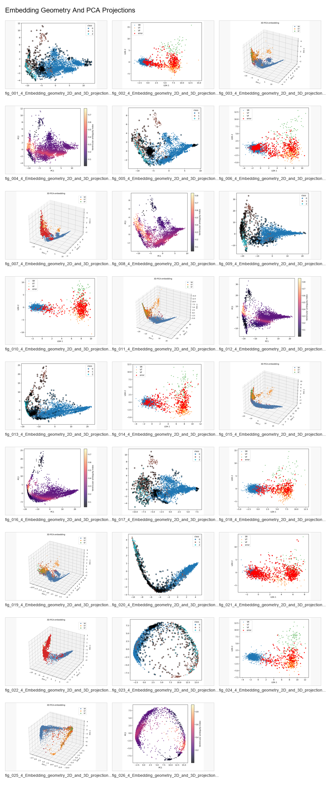
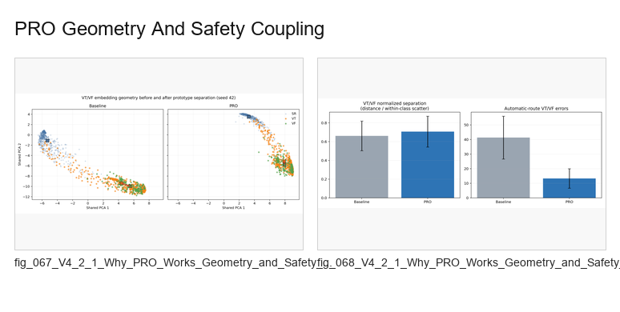
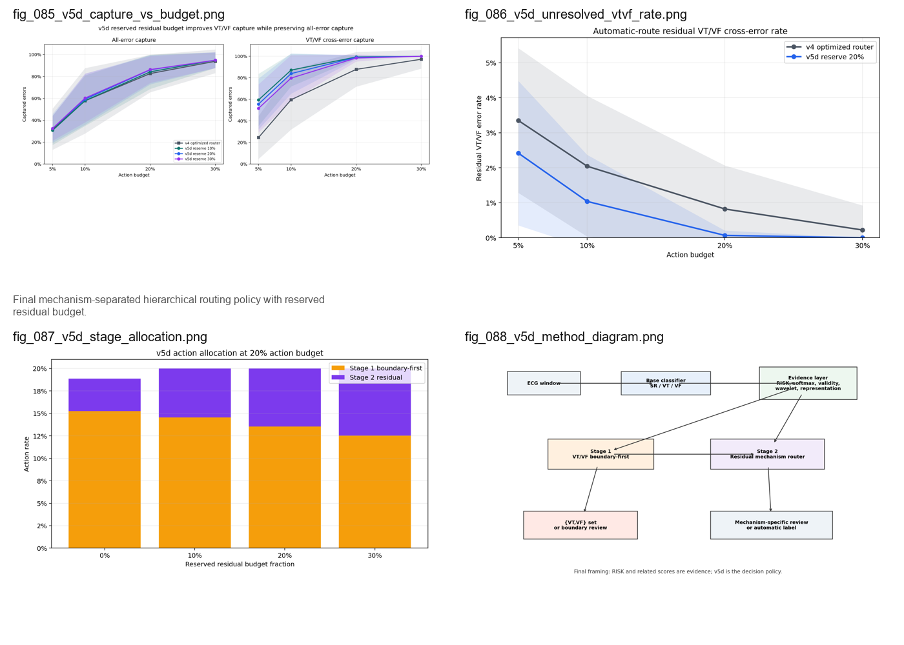

# Mechanism-Aware ECG Reliability for VT/VF Boundary Classification

This repository studies reliable short-window ECG classification for three
rhythm labels:

- `SR`: sinus or non-ventricular rhythm
- `VT`: ventricular tachycardia
- `VF`: ventricular fibrillation

The central problem is not ordinary classification accuracy. The project asks
why VT and VF remain confusable even when aggregate accuracy is high, how this
confusion appears in representation and signal-level evidence, and which
mechanism-aware training constraints can reduce the boundary risk without
damaging calibration or causing error migration.

> Research prototype only. This repository is not a medical device, does not
> provide clinical validation, and must not be used for diagnosis or clinical
> decision-making.

## For Supervisors: Read These 3 Files First

This repository contains many scripts because it preserves the full research
trail. For a fast review, start here:

1. [Final model selection report](docs/FINAL_MODEL_SELECTION_REPORT_CN.md):
   the completed 36-run internal mechanism-derived search, selected main
   candidate, controls, figures, and limitations.
2. [Mechanism-targeted causal full results](docs/MECHANISM_TARGETED_CAUSAL_FULL_RESULTS_CN.md):
   the component-level `do(training constraint) -> mechanism -> outcome`
   evidence behind the final model choice.
3. [Model-layer all-model benchmark](docs/MODEL_LAYER_ALL_MODEL_BENCHMARK_CN.md):
   the broader CNN, CNN-LSTM, prototype, constrained, and complex-model
   context.

Current status: the internal 36-run mechanism-derived search is complete. The
next step is larger full validation and, if permitted by the dissertation
module and ethics/data rules, external validation. The repository should be
described as a **research prototype**, not as a validated ECG diagnosis system.

## Protocol Guard: Avoiding Circular Evidence

The project explicitly separates mechanism discovery from model selection, so
it does not simply "use its own key to open its own lock."

- Split safety is audited with record-level and duplicate-family checks; public
  duplicate-family summaries are provided under `results_public/tables/`.
- Mechanism variables such as embedding geometry, KNN local purity, prototype
  ambiguity, entropy, and waveform regularity generate candidate constraints,
  but they are not accepted as success criteria by themselves.
- Final model selection is based on paired outcome guards: accuracy, macro-F1,
  ECE, VT/VF cross-errors, total errors, and error migration penalty.
- Visualizations and representation metrics are used as explanation evidence,
  while the model claim is decided by outcome changes under matched seeds.

## Research Story

The paper logic is organized as a sequence of controlled hypotheses:

```text
1. Traditional CNN / CNN-LSTM baselines
   -> show that high aggregate accuracy can hide VT/VF boundary confusion

2. Representation and signal-level analysis
   -> explain why VT/VF are mixed in embedding, KNN, prototype, softmax,
      waveform, and validity evidence

3. First model upgrades
   -> GatedFusion and constrained models show that evidence fusion helps,
      but representation improvement alone is not enough

4. Mechanism-targeted causal-style ablation
   -> test which mechanism constraints truly change outcomes

5. Mechanism-derived model search
   -> completed 36-run internal search from validated constraints rather than
      heuristic weight choices

6. Stage 1 / Stage 2 recover routing
   -> provide a fallback for residual high-risk cases under fixed review
      budgets
```

The main contribution is therefore the **model-layer mechanism evidence chain**:

```text
observed VT/VF failure
  -> measured mechanism variables
  -> explicit training constraints
  -> multi-objective outcome guard
  -> mechanism-derived model candidate
```

The recover/router layer is important, but it is a downstream fallback rather
than the primary model contribution.

## 1. Defining The Problem: VT/VF Confusion Is Hidden By Accuracy

The first stage compares conventional CNN and CNN-LSTM classifiers. CNN gives a
reasonable baseline, and CNN-LSTM adds temporal context. However, the important
finding is that overall accuracy does not describe the reliability problem.
The clinically relevant failure mode is concentrated in the VT/VF boundary.

CNN-LSTM reduces VT/VF cross-errors relative to CNN, but its accuracy,
calibration, and total-error behavior are worse. This motivates a more precise
problem definition: the project must explain and reduce VT/VF boundary
confusion, not simply maximize aggregate accuracy.

| Metric | CNN mean | CNN-LSTM mean | Interpretation |
| --- | ---: | ---: | --- |
| Accuracy | 0.8649 | 0.8518 | CNN-LSTM is lower. |
| Macro-F1 | 0.5928 | 0.6145 | CNN-LSTM improves class-balanced F1. |
| ECE | 0.0670 | 0.0747 | CNN-LSTM is less calibrated. |
| Total errors | 589.5 | 640.9 | CNN-LSTM has more total errors. |
| VT/VF cross-errors | 232.4 | 183.1 | CNN-LSTM reduces the key boundary error. |

Evidence:

- [paired_classification_comparisons.csv](results_public/tables/paired_classification_comparisons.csv)
- [model_performance_and_geometry.csv](results_public/tables/model_performance_and_geometry.csv)


## 2. Mechanism Diagnosis: Why VT/VF Are Confused

After defining the VT/VF boundary problem, the project analyzes where the
confusion comes from. The analysis does not rely on a single embedding plot.
It compares multiple mechanism families:

| Mechanism family | Evidence measured | Role in the project |
| --- | --- | --- |
| Embedding geometry | PCA/LDA projections, silhouette, class-center distance | Shows whether VT and VF separate in representation space. |
| KNN neighborhood structure | Local purity, label entropy, VT/VF local mixing | Shows whether a sample is surrounded by conflicting labels. |
| Prototype ambiguity | Distances to VT and VF class prototypes | Shows whether a sample is geometrically ambiguous between VT and VF. |
| Softmax ambiguity | Entropy, probability margin, VT/VF ambiguity | Shows whether the classifier expresses uncertainty at the boundary. |
| Waveform regularity | Spectral entropy, dominant frequency, autocorrelation, line length | Shows whether ECG rhythm structure explains atypical cases. |
| Gate / validity evidence | Validity gate, boundary score, gate-boundary interaction | Shows whether the model has learned unsafe automatic-decision regions. |

These analyses indicate that VT/VF errors are structured: they occur where
representation neighborhoods, prototypes, probabilities, and waveform evidence
become ambiguous. This is why the next step is not simply a larger network, but
a mechanism-aware model design.

Visual evidence:



More evidence:

- [Embedding PCA figures](results_public/figures/01_embedding_pca/)
- [Regularity and waveform figures](results_public/figures/03_regularity_interpretability/)
- [Mechanism variable inventory](docs/MECHANISM_VARIABLE_MASTER_INVENTORY_CN.md)

## 3. Model Evolution: What Improved And What Failed

The project then tests whether model upgrades can solve the boundary problem.
This stage is not a leaderboard; each model tests a specific hypothesis.

| Model stage | Why introduced | What improved | What remained unresolved | What it motivated |
| --- | --- | --- | --- | --- |
| CNN | Establish a conventional baseline. | Basic SR/VT/VF classification. | VT/VF boundary errors remain hidden by aggregate accuracy. | Define the boundary problem. |
| CNN-LSTM | Add temporal context. | VT/VF cross-errors decrease. | Accuracy, ECE, and total errors worsen. | Separate boundary improvement from overall reliability. |
| GatedFusion | Fuse learned representation with regularity/reliability evidence. | Stronger aggregate backbone. | It does not identify which mechanism caused improvement. | Move to mechanism-level analysis. |
| PRO / prototype / RiskPro-style constraints | Reshape geometry and risk-aware structure. | Some representation measures improve. | Improved geometry can still produce trade-offs or error migration. | Add outcome guards. |
| Mechanism-targeted ablation | Intervene on individual mechanisms. | Boundary and prototype-center mechanisms show strong evidence. | Not every mechanism is safe to add directly. | Build mechanism-derived candidates. |
| Mechanism-derived model search | Recompose the model from validated constraints. | `proto_center_only` and `proto_center_margin` emerge as the strongest mechanism-supported candidates. | The older four-term model remains useful but is not the minimal sufficient configuration. | Select `prototype_center_weight` as the main model-layer mechanism and retain margin/boundary variants as controls. |
| V5D / recover | Catch residual high-risk cases. | Fixed-budget VT/VF capture improves. | It is a fallback, not the main classifier. | Complete the safety-oriented workflow. |

Evidence:

- [Model-layer all-model benchmark](docs/MODEL_LAYER_ALL_MODEL_BENCHMARK_CN.md)
- [PRO geometry figures](results_public/figures/06_pro_geometry/)
- [PRO error migration figures](results_public/figures/10_v6_pro_error_migration/)



## 4. Mechanism-Targeted Causal-Style Ablation

The key upgrade is to treat training constraints as interventions:

```text
do(training constraint)
  -> measured mechanism variable change
  -> model outcome change
```

The outcomes are:

```text
accuracy
macro-F1
ECE
VT/VF cross-errors
total errors
error migration penalty
```

The 33-run mechanism-targeted experiment tests 11 candidates across 3 paired
seeds. Representative paired mean effects relative to baseline are:

| Candidate | Mechanism tested | Accuracy | Macro-F1 | ECE | VT/VF cross-errors | Total errors | Migration penalty |
| --- | --- | ---: | ---: | ---: | ---: | ---: | ---: |
| `proto_center_only` | Prototype compactness | +0.0415 | +0.0471 | -0.0244 | -20.67 | -178.0 | -109.3 |
| `proto_margin_only` | VT/VF prototype margin | +0.0099 | +0.0019 | -0.0071 | 0.00 | -43.67 | -26.83 |
| `boundary075` | Softmax boundary weighting | +0.0318 | +0.0230 | -0.0153 | -2.67 | -137.3 | -77.5 |
| `boundary075_prototype` | Boundary + prototype geometry | +0.0317 | +0.0429 | -0.0183 | -20.33 | -135.0 | -85.0 |
| `prototype_plus_contrastive` | Prototype + KNN/contrastive | +0.0288 | +0.0186 | -0.0150 | +2.00 | -123.7 | -68.0 |
| `regularity_aux_medium` | Waveform regularity auxiliary | -0.0016 | +0.0039 | +0.0081 | -5.67 | +9.0 | -1.67 |

Interpretation:

- Prototype center compactness is a strong mechanism.
- Prototype margin alone is weak.
- Boundary weighting is useful but does not fully solve VT/VF cross-errors by
  itself.
- Prototype plus contrastive can improve some mechanism signals while worsening
  VT/VF cross-errors.
- Regularity evidence is useful diagnostically, but direct auxiliary training
  is unstable as a main loss.

Full results:
[docs/MECHANISM_TARGETED_CAUSAL_FULL_RESULTS_CN.md](docs/MECHANISM_TARGETED_CAUSAL_FULL_RESULTS_CN.md)

## 5. From Mechanism Analysis To Constraint Weights

The mechanism analysis determines which constraints should be tested in the
model. Each weight is a bridge between an observed failure mode and a training
intervention.

| Analysis source | Constraint weight | Intended effect | Current interpretation |
| --- | --- | --- | --- |
| VT/VF softmax ambiguity and boundary risk | `boundary_ce_weight` | Upweight high-risk boundary samples in CE loss. | Useful, but needs representation support. |
| Loose class clusters and low local purity | `prototype_center_weight` | Make within-class embeddings more compact. | Strong single-mechanism result. |
| VT/VF prototype ambiguity | `prototype_margin_weight` | Penalize insufficient VT/VF prototype separation. | Weak alone; must be tested with center/boundary. |
| Desired VT/VF separation target | `prototype_vtvf_margin` | Define the margin threshold for VT/VF centers. | Only meaningful when margin loss is active. |
| KNN local mixing | `contrastive_weight` | Improve local neighborhood purity. | Strong alone, but may conflict with prototype constraints. |
| Calibration / overconfidence | `risk_entropy_weight`, `anti_confident_risk_weight` | Align uncertainty with risk and reduce confident high-risk errors. | Guarded add-on, not the main mechanism. |
| Waveform regularity | `regularity_aux_weight` | Encourage embeddings to encode ECG waveform attributes. | Diagnostic evidence; unstable as direct loss. |
| Gate / validity evidence | `risk_gate_weight`, `risk_boundary_weight` | Align gate and boundary heads with risk targets. | Better suited for routing/recover evidence. |

The older four-term boundary-prototype candidate was:

```text
boundary_ce_weight = 0.75
prototype_center_weight = 0.02
prototype_margin_weight = 0.05
prototype_vtvf_margin = 1.0
```

The completed mechanism-derived model search asks whether all four terms are
necessary, or whether the model can be simplified to:

```text
boundary075_center:
  boundary_ce_weight = 0.75
  prototype_center_weight = 0.02
```

This is not a preference for a smaller neural network. It is a search for the
smallest sufficient mechanism-supported constraint set. The 36-run paired
search shows that `proto_center_only` is currently the clearest main candidate:
it improves all six guarded outcomes across 3/3 seeds while using only the
prototype-center compactness constraint.

Final model selection evidence:
[docs/FINAL_MODEL_SELECTION_REPORT_CN.md](docs/FINAL_MODEL_SELECTION_REPORT_CN.md)

## 6. Active Validation: Decomposing The Old Four-Weight Model

The current validation run is a targeted decomposition of the older
`boundary075_prototype` model.

| Candidate | Constraint structure | Purpose |
| --- | --- | --- |
| `boundary075` | `boundary_ce_weight=0.75` | Test boundary-risk weighting alone. |
| `proto_center_only` | `prototype_center_weight=0.02` | Test whether class compactness is the main prototype contribution. |
| `proto_margin_only` | `prototype_margin_weight=0.05`, `prototype_vtvf_margin=1.0` | Test whether VT/VF margin works without center compactness. |
| `proto_center_margin` | `center=0.02`, `margin=0.05`, `vtvf_margin=1.0` | Test the prototype-only combination. |
| `boundary075_center` | `boundary=0.75`, `center=0.02` | Main new candidate: boundary risk plus prototype compactness. |
| `boundary075_margin` | `boundary=0.75`, `margin=0.05`, `vtvf_margin=1.0` | Test whether margin adds value without center. |
| `boundary075_prototype` | `boundary=0.75`, `center=0.02`, `margin=0.05`, `vtvf_margin=1.0` | Older four-term reference candidate. |
| `boundary050_center` / `boundary100_center` | boundary dose `0.50` or `1.00` with center fixed | Test boundary-dose sensitivity. |
| `boundary075_contrastive` | `boundary=0.75`, `contrastive=0.02` | Test whether KNN/local-purity control can replace the prototype path. |
| `boundary075_center_calibrated` | `boundary=0.75`, `center=0.02`, entropy/confidence terms | Test whether calibration can be added without sacrificing VT/VF safety. |

The result of this run will determine whether the final model remains the
four-term boundary-prototype candidate or becomes a simpler boundary-plus-center
model.

## 7. Multi-Objective Selection

The final model is not selected by one metric. A candidate must satisfy a
multi-objective guard:

1. Preserve or improve accuracy.
2. Improve macro-F1.
3. Reduce or preserve ECE.
4. Reduce or avoid increasing VT/VF cross-errors.
5. Reduce total errors.
6. Reduce error migration penalty.
7. Remain interpretable through the mechanism evidence that motivated it.

This is why the project does not simply add all mechanisms to one large loss.
Some mechanisms are better used as diagnostic or routing evidence rather than
as classifier training terms.

Strong mechanism-outcome associations from the 33-run quantification include:

| Mechanism variable | Outcome | Association |
| --- | --- | --- |
| `local_purity_k_mean` | Total errors | Spearman -0.874 |
| `local_purity_k_mean` | Accuracy | Spearman +0.853 |
| `local_purity_k_mean` | Error migration penalty | Spearman -0.850 |
| `knn_label_entropy_mean` | Accuracy | Spearman -0.735 |
| `entropy_mean` | Accuracy | Spearman -0.663 |

These are internal causal-style proxies, not formal biological causal claims.

## 8. Recover / V5D As A Fallback Layer

Recover is placed after the model layer. Its purpose is to handle residual
high-risk errors under limited review resources.

| Stage | Target | Evidence used |
| --- | --- | --- |
| Stage 1: VT/VF boundary-first protection | Samples near the VT/VF boundary | Softmax ambiguity, validity-boundary evidence, wavelet risk, prototype ambiguity, KNN mixing |
| Stage 2: residual mechanism recovery | Remaining high-risk non-boundary cases | SR-ventricular confusion, representation conflict, atypical signal, hidden confident evidence |

At a 20% action budget:

| Method | All-error capture | VT/VF cross-error capture | Automatic unresolved VT/VF rate |
| --- | ---: | ---: | ---: |
| v4 optimized mechanism router | 82.6% | 87.9% | 0.82% |
| v5d, 20% residual reserve | 86.0% | 99.0% | 0.07% |



V5D evidence:
[docs/V5D_CAUSAL_PARETO_WEIGHT_UPGRADE_RESULTS_CN.md](docs/V5D_CAUSAL_PARETO_WEIGHT_UPGRADE_RESULTS_CN.md)

## Claim-To-Evidence Index

| Claim | Evidence | Source |
| --- | --- | --- |
| VT/VF is the key reliability boundary. | CNN/CNN-LSTM cross-error comparison and representation mixing. | [paired_classification_comparisons.csv](results_public/tables/paired_classification_comparisons.csv), [embedding figures](results_public/figures/01_embedding_pca/) |
| Representation improvement does not guarantee safer outcomes. | PRO and regularity-style experiments show trade-offs and migration. | [PRO geometry](results_public/figures/06_pro_geometry/), [PRO migration](results_public/figures/10_v6_pro_error_migration/) |
| Prototype center is a strong mechanism. | `proto_center_only` improves all reported model outcomes in the mechanism-targeted ablation and the completed 36-run mechanism-derived search. | [Final model selection report](docs/FINAL_MODEL_SELECTION_REPORT_CN.md), [Mechanism full results](docs/MECHANISM_TARGETED_CAUSAL_FULL_RESULTS_CN.md) |
| Boundary weighting is useful but insufficient alone. | `boundary075` improves global errors but gives smaller VT/VF cross-error reduction. | [Mechanism full results](docs/MECHANISM_TARGETED_CAUSAL_FULL_RESULTS_CN.md) |
| The final model should be mechanism-derived. | The completed 36-run search decomposes boundary, center, margin, contrastive, and calibration components, then selects candidates by Pareto/outcome guard. | [Final model selection report](docs/FINAL_MODEL_SELECTION_REPORT_CN.md) |
| Recover is a fallback. | V5D captures residual high-risk errors under fixed review budgets. | [V5D results](docs/V5D_CAUSAL_PARETO_WEIGHT_UPGRADE_RESULTS_CN.md) |

## Repository Map

```text
src/
  train.py                                      Model training
  run_mechanism_targeted_causal_ablation.py    Component-level mechanism interventions
  summarize_mechanism_targeted_causal_quantification.py
                                                Intervention -> mechanism -> outcome summaries
  run_model_layer_causal_pareto_search.py      Mechanism-derived model search
  run_model_layer_all_model_benchmark.py       Model-stage benchmark inventory
  run_v5d_causal_pareto_weight_upgrade.py      V5D stage1/stage2 routing intervention
  hierarchical_router_v5d_reserved_budget.py   Reserved-budget V5D router

docs/
  Mechanism, model-layer, routing, and thesis-facing reports

results_public/
  Public-safe aggregate tables and figures only
```

## Main Documents

1. [Final model selection report](docs/FINAL_MODEL_SELECTION_REPORT_CN.md)
2. [Mechanism-targeted causal full results](docs/MECHANISM_TARGETED_CAUSAL_FULL_RESULTS_CN.md)
3. [Mechanism-derived model search plan](docs/MECHANISM_DERIVED_MODEL_SEARCH_PLAN_CN.md)
4. [Model-layer all-model benchmark](docs/MODEL_LAYER_ALL_MODEL_BENCHMARK_CN.md)
5. [V5D causal-Pareto weight upgrade](docs/V5D_CAUSAL_PARETO_WEIGHT_UPGRADE_RESULTS_CN.md)
6. [Thesis method section draft](docs/THESIS_METHOD_SECTION_CAUSAL_MECHANISM_CN.md)
7. [Full documentation guide](docs/README.md)

## Reproduce Key Experiments

The raw ECG file is expected locally as `RHYTHMS.mat`. It is not included in
this repository.

```powershell
# Inspect local data availability.
python -m src.inspect_data --mat RHYTHMS.mat

# Train a simple baseline.
python -m src.train --mat RHYTHMS.mat --model cnn --epochs 30

# Mechanism-targeted ablation.
python -m src.run_mechanism_targeted_causal_ablation --seeds 42 43 44 --epochs 30

# Mechanism-derived model search.
python -m src.run_model_layer_causal_pareto_search --candidate-set mechanism-derived --seeds 42 43 44 --epochs 30

# V5D routing weight intervention.
python -m src.run_v5d_causal_pareto_weight_upgrade --budgets 0.20
```

## Quick Demo Without ECG Data

The dissertation evidence depends on private/local ECG data and generated
experiment outputs that are not distributed. To make the repository runnable
for a first-time reviewer, a synthetic toy demo is included:

```powershell
python quick_demo\synthetic_quick_demo.py
```

The demo generates non-clinical synthetic SR/VT/VF-like waveforms, trains a
small classifier, computes accuracy, macro-F1, ECE, VT/VF cross-errors, and
writes a PCA/error figure under `quick_demo/output/`. It is only a smoke test
for the public pipeline shape; it is not used as dissertation evidence and is
not a clinical ECG simulation.

## Public Evidence Boundary

The repository provides code, documentation, and aggregate non-identifiable
evidence. It does not distribute raw ECG waveforms, private review examples,
model checkpoints, full window-level prediction files, or internal metadata.

Public-safe summaries and figures are under:

```text
results_public/tables/
results_public/figures/
```

## Limitations

- Evidence is internal and paired-seed based; it is not external clinical
  validation.
- The 36-run mechanism-derived search is complete as internal validation; the
  next step is larger full validation and external validation if permitted.
- Mechanism variables are post-training diagnostics and causal-style proxies,
  not formal biological mediation proof.
- Several comparisons have only 3 paired seeds.
- Window-level classification should not be interpreted as patient-level
  diagnosis.
- This repository is intended for research review, not deployment.
