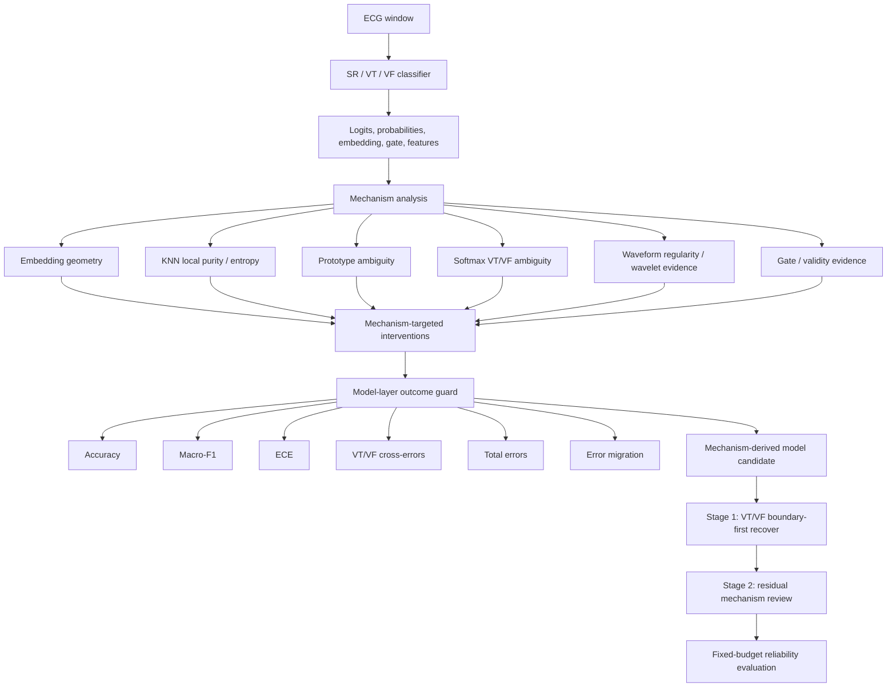

# Mechanism-Aware ECG Reliability Under Uncertainty

This repository studies reliable short-window ECG classification for three
rhythm labels:

- `SR`: sinus or non-ventricular rhythm
- `VT`: ventricular tachycardia
- `VF`: ventricular fibrillation

The central research question is not only whether a classifier is accurate. It
is whether the model can identify and reduce the failure mechanisms that make
VT/VF boundary decisions unreliable.

> Research prototype only. This repository is not a medical device, does not
> provide clinical validation, and must not be used for diagnosis or clinical
> decision-making.

## Current Framing

The project is now model-first:

```text
traditional CNN / CNN-LSTM baselines
  -> representation, KNN, prototype, softmax, waveform, and OOD analysis
  -> GatedFusion and constrained-model attempts
  -> mechanism-targeted causal-style ablations
  -> mechanism-derived model constraint search
  -> V5D / recover routing for residual high-risk errors
```

The old GitHub framing emphasized review routing. The updated framing is:

1. **Model layer:** identify which training constraints are actually necessary
   for reliable VT/VF classification.
2. **Outcome guard:** keep a constraint only if it improves model outcomes
   without worsening safety-relevant metrics.
3. **Recover layer:** use stage-wise review routing as a fallback for errors
   that the final model still cannot safely resolve.

The strongest current claim is internal, paired-seed reliability evidence. The
project should be read as a research prototype in uncertainty-aware medical ML,
not as a deployed ECG system.

## Research Logic

The research path is best understood as controlled hypothesis testing, not as a
sequence of unrelated model trials.

| Stage | Question | What was learned |
| --- | --- | --- |
| CNN / CNN-LSTM baselines | Are standard classifiers enough? | CNN-LSTM reduces some VT/VF cross-errors, but calibration, total errors, and stability remain weak. |
| Mechanism analysis | Where do errors come from? | VT/VF boundary cases are locally mixed in embedding, KNN, prototype, softmax, and waveform-derived evidence. |
| GatedFusion | Does evidence fusion help? | GatedFusion is a strong backbone, but it does not explain which mechanism causes outcome improvement. |
| Complex constraints | Can we add all mechanisms? | No. Some constraints improve representation appearance but do not improve outcomes, or create error migration. |
| Causal-style mechanism ablation | Which mechanisms truly affect outcomes? | Boundary weighting and prototype compactness are strong; margin, contrastive, gate, and regularity require guarded interpretation. |
| Mechanism-derived search | Which weights are actually necessary? | The active model question is whether `boundary + prototype center` is sufficient, or whether the full VT/VF margin is required. |
| V5D / recover routing | What about residual risk? | A boundary-first plus residual-mechanism router catches high-risk errors under fixed review budgets. |

## Method Overview

The method has two connected layers.



The model layer asks:

```text
do(training constraint)
  -> measured mechanism variable change
  -> model outcome change
```

The routing layer asks:

```text
model prediction + mechanism evidence
  -> review / recover action
  -> fixed-budget error capture and unresolved risk
```

These layers are deliberately separated. A model, an evidence head, and a
routing policy are not treated as the same object.

## Mechanism-Derived Model Layer

The earlier boundary-prototype model used four main constraint terms:

```text
boundary_ce_weight = 0.75
prototype_center_weight = 0.02
prototype_margin_weight = 0.05
prototype_vtvf_margin = 1.0
```

Those weights were originally reasonable heuristic candidates. They are now
being re-evaluated using the 33-run mechanism-targeted ablation, so the final
model can be justified by mechanism evidence rather than by post-hoc score
selection.

| Constraint | Source analysis | Intended role |
| --- | --- | --- |
| `boundary_ce_weight` | VT/VF softmax ambiguity and high-risk boundary targets | Upweight boundary-risk samples in cross-entropy. |
| `prototype_center_weight` | Loose class clusters and low KNN local purity | Encourage within-class compactness. |
| `prototype_margin_weight` | VT/VF prototype ambiguity | Penalize insufficient VT/VF center separation. |
| `prototype_vtvf_margin` | Desired VT/VF prototype distance | Set the margin threshold used by the penalty. |

The current mechanism-derived search tests whether all four are necessary:

```text
boundary only
prototype center only
prototype margin only
center + margin
boundary + center
boundary + margin
boundary + center + margin
```

The most important new candidate is:

```text
boundary075_center:
  boundary_ce_weight = 0.75
  prototype_center_weight = 0.02
```

This candidate asks whether the model can be simplified to the smallest
mechanism-supported constraint set. Here, "smallest" means the fewest necessary
loss constraints, not the fewest neural-network parameters.

Detailed plan:
[docs/MECHANISM_DERIVED_MODEL_SEARCH_PLAN_CN.md](docs/MECHANISM_DERIVED_MODEL_SEARCH_PLAN_CN.md)

## Key Evidence So Far

### CNN vs CNN-LSTM

CNN-LSTM is not simply better or worse than CNN. It is an important partial
positive result: temporal modeling reduces VT/VF cross-errors, but does not
solve the reliability problem.

| Metric | CNN mean | CNN-LSTM mean | Interpretation |
| --- | ---: | ---: | --- |
| Accuracy | 0.8649 | 0.8518 | CNN-LSTM is lower. |
| Macro-F1 | 0.5928 | 0.6145 | CNN-LSTM improves class-balanced F1. |
| ECE | 0.0670 | 0.0747 | CNN-LSTM calibration is worse. |
| Total errors | 589.5 | 640.9 | CNN-LSTM has more total errors. |
| VT/VF cross-errors | 232.4 | 183.1 | CNN-LSTM reduces the core boundary error. |

This motivates the model-first mechanism analysis: architecture changes alone
do not provide a reliable explanation of improvement.

### 33-Run Mechanism-Targeted Ablation

The full mechanism-targeted run tested 11 candidates across 3 paired seeds:

```text
baseline
proto_center_only
proto_margin_only
proto_center_margin
contrastive_vtvf_light
prototype_plus_contrastive
boundary050
boundary075
gate_boundary_joint
regularity_aux_medium
boundary075_prototype
```

Representative paired mean effects relative to baseline:

| Candidate | Accuracy | Macro-F1 | ECE | VT/VF cross-errors | Total errors | Migration penalty | Interpretation |
| --- | ---: | ---: | ---: | ---: | ---: | ---: | --- |
| `boundary075_prototype` | +0.0317 | +0.0429 | -0.0183 | -20.33 | -135.0 | -85.0 | Strong old joint candidate. |
| `proto_center_only` | +0.0415 | +0.0471 | -0.0244 | -20.67 | -178.0 | -109.3 | Prototype center is highly important. |
| `proto_margin_only` | +0.0099 | +0.0019 | -0.0071 | 0.00 | -43.67 | -26.83 | Margin alone is weak. |
| `prototype_plus_contrastive` | +0.0288 | +0.0186 | -0.0150 | +2.00 | -123.7 | -68.0 | Better-looking mechanisms can still hurt VT/VF. |
| `regularity_aux_medium` | -0.0016 | +0.0039 | +0.0081 | -5.67 | +9.0 | -1.67 | Waveform encoding improves, but model outcome is unstable. |

The conclusion is not "add everything." The conclusion is that each mechanism
must pass outcome-level guards.

Full results:
[docs/MECHANISM_TARGETED_CAUSAL_FULL_RESULTS_CN.md](docs/MECHANISM_TARGETED_CAUSAL_FULL_RESULTS_CN.md)

### Mechanism Variables Linked To Outcomes

The strongest mechanism-outcome associations support the use of local
neighborhood and ambiguity evidence as model diagnostics:

| Mechanism variable | Outcome | Association |
| --- | --- | --- |
| `local_purity_k_mean` | Total errors | Spearman -0.874 |
| `local_purity_k_mean` | Accuracy | Spearman +0.853 |
| `local_purity_k_mean` | Error migration penalty | Spearman -0.850 |
| `knn_label_entropy_mean` | Accuracy | Spearman -0.735 |
| `entropy_mean` | Accuracy | Spearman -0.663 |

These are not treated as clinical causal claims. They are internal,
paired-candidate evidence that links representation diagnostics to
model-level outcomes.

## Why Some Mechanisms Are Not Added To The Final Model

Several mechanisms are useful but do not belong directly in the main training
objective.

| Mechanism | What it helps explain | Why it is not automatically in the final model |
| --- | --- | --- |
| Regularity / waveform features | Rhythm structure, spectral entropy, dominant frequency, line length | Direct auxiliary loss can improve waveform encoding while worsening accuracy, ECE, or total errors. |
| Gate / validity | Whether a region is safe for automatic prediction | Gate supervision changes signals, but VT/VF outcome improvement is not stable enough. |
| Contrastive local purity | KNN neighborhood structure | Strong alone, but can conflict with prototype constraints. |
| Stability consistency | Perturbation robustness | Can over-smooth boundary-sensitive decisions. |
| Explanation heads | Error-type interpretation | Better suited for review routing and audits than for the main classifier loss. |

This is why the project now searches for a minimum sufficient model constraint
set and keeps other mechanisms as diagnostic or recover signals.

## Recover / V5D Layer

The recover layer is a clinical-review-budget fallback. It does not replace the
model-layer work. It answers a different question:

> Given that even the best internal model may leave residual high-risk errors,
> which windows should be reviewed first?

The final router has two stages:

| Stage | Target | Evidence |
| --- | --- | --- |
| Stage 1: VT/VF boundary-first protection | Samples near the VT/VF decision boundary | Softmax ambiguity, validity-boundary evidence, wavelet risk, prototype ambiguity, KNN mixing |
| Stage 2: residual mechanism recovery | Non-boundary errors still unsafe for automation | SR-ventricular confusion, representation conflict, atypical signal, hidden confident evidence |

At a 20% action budget, the v5d reserved-budget router improved VT/VF
cross-error capture compared with the earlier v4 mechanism router:

| Method | All-error capture | VT/VF cross-error capture | Automatic unresolved VT/VF rate |
| --- | ---: | ---: | ---: |
| v4 optimized mechanism router | 82.6% | 87.9% | 0.82% |
| v5d, 20% residual reserve | 86.0% | 99.0% | 0.07% |

The V5D causal-Pareto upgrade further tests whether stage1/stage2 routing
weights can be improved without sacrificing VT/VF capture:
[docs/V5D_CAUSAL_PARETO_WEIGHT_UPGRADE_RESULTS_CN.md](docs/V5D_CAUSAL_PARETO_WEIGHT_UPGRADE_RESULTS_CN.md)

## Current Status

| Layer | Status | Main file |
| --- | --- | --- |
| Traditional baselines | Complete | [docs/MODEL_LAYER_ALL_MODEL_BENCHMARK_CN.md](docs/MODEL_LAYER_ALL_MODEL_BENCHMARK_CN.md) |
| Mechanism-targeted ablation | Complete, 33 runs | [docs/MECHANISM_TARGETED_CAUSAL_FULL_RESULTS_CN.md](docs/MECHANISM_TARGETED_CAUSAL_FULL_RESULTS_CN.md) |
| Mechanism-derived model search | Active validation | [docs/MECHANISM_DERIVED_MODEL_SEARCH_PLAN_CN.md](docs/MECHANISM_DERIVED_MODEL_SEARCH_PLAN_CN.md) |
| V5D recover routing | Complete internal evidence | [docs/V5D_CAUSAL_PARETO_WEIGHT_UPGRADE_RESULTS_CN.md](docs/V5D_CAUSAL_PARETO_WEIGHT_UPGRADE_RESULTS_CN.md) |
| OOD-style route stress | Internal stress evidence | [docs/ROUTE_OOD_STRESS_RESULTS_CN.md](docs/ROUTE_OOD_STRESS_RESULTS_CN.md) |

## Documentation Map

Start here for the current model-first logic:

1. [Mechanism-targeted causal full results](docs/MECHANISM_TARGETED_CAUSAL_FULL_RESULTS_CN.md)
2. [Mechanism-derived model search plan](docs/MECHANISM_DERIVED_MODEL_SEARCH_PLAN_CN.md)
3. [Model-layer all-model benchmark](docs/MODEL_LAYER_ALL_MODEL_BENCHMARK_CN.md)
4. [V5D causal-Pareto weight upgrade](docs/V5D_CAUSAL_PARETO_WEIGHT_UPGRADE_RESULTS_CN.md)
5. [Thesis method section draft](docs/THESIS_METHOD_SECTION_CAUSAL_MECHANISM_CN.md)

Broader project reports:

- [docs/README.md](docs/README.md): full documentation guide
- [docs/EXPERIMENT_EVIDENCE_SUMMARY.md](docs/EXPERIMENT_EVIDENCE_SUMMARY.md): compact evidence story
- [docs/RESEARCH_REPORT.md](docs/RESEARCH_REPORT.md): stage-ordered long report
- [docs/FIGURE_ATLAS.md](docs/FIGURE_ATLAS.md): public figure inventory
- [docs/DATA_STATEMENT.md](docs/DATA_STATEMENT.md): public data boundary

## Repository Structure

```text
src/
  train.py                                      Model training entry point
  run_mechanism_targeted_causal_ablation.py    Component-level mechanism interventions
  summarize_mechanism_targeted_causal_quantification.py
                                                Intervention -> mechanism -> outcome summaries
  run_model_layer_causal_pareto_search.py      Mechanism-derived model search
  run_model_layer_all_model_benchmark.py       Model-stage benchmark inventory
  run_v5d_causal_pareto_weight_upgrade.py      V5D stage1/stage2 routing intervention
  hierarchical_router_v5d_reserved_budget.py   Reserved-budget V5D router

docs/
  Mechanism, model-layer, routing, and thesis-facing reports

results_public/
  Public-safe aggregate tables and figures only

data/
  Dataset access notes; raw ECG data are not redistributed
```

## Reproduce Key Experiments

The raw ECG file is expected locally as `RHYTHMS.mat`. It is not included in
this repository.

```powershell
# Inspect local data availability.
python -m src.inspect_data --mat RHYTHMS.mat

# Train a simple baseline.
python -m src.train --mat RHYTHMS.mat --model cnn --epochs 30

# Component-level mechanism ablation.
python -m src.run_mechanism_targeted_causal_ablation --seeds 42 43 44 --epochs 30

# Mechanism-derived model search.
python -m src.run_model_layer_causal_pareto_search --candidate-set mechanism-derived --seeds 42 43 44 --epochs 30

# V5D stage1/stage2 routing weight intervention.
python -m src.run_v5d_causal_pareto_weight_upgrade --budgets 0.20
```

## Public Evidence Boundary

The repository provides code, documentation, and aggregate non-identifiable
evidence. It does not distribute:

- raw ECG waveforms;
- private clinical-looking examples;
- model checkpoints;
- full window-level prediction files;
- internal metadata that could expose restricted data.

Public-safe summaries and figures are under:

```text
results_public/tables/
results_public/figures/
```

## Limitations

- Evidence is internal and paired-seed based; it is not external clinical
  validation.
- The current mechanism-derived model search is an active model-layer
  validation step, not yet a completed final result.
- Mechanism variables are post-training diagnostics and causal-style proxies,
  not formal randomized biological mediation proof.
- Some comparisons have only 3 paired seeds; stronger claims require more
  seeds or external datasets.
- Window-level SR/VT/VF classification should not be interpreted as
  patient-level diagnosis.
- The project is intended for research review, not deployment.

