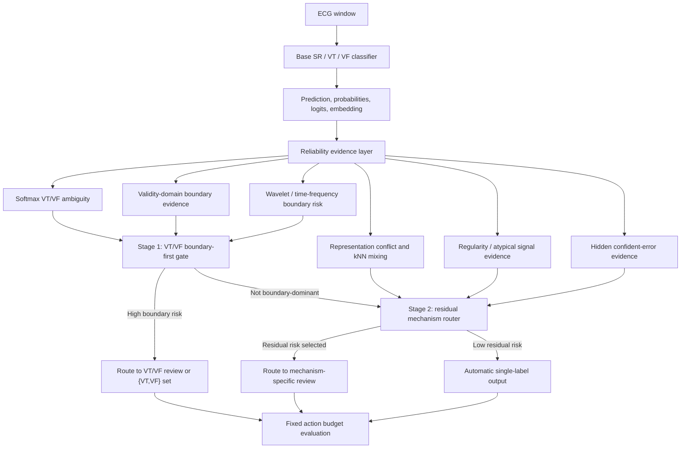
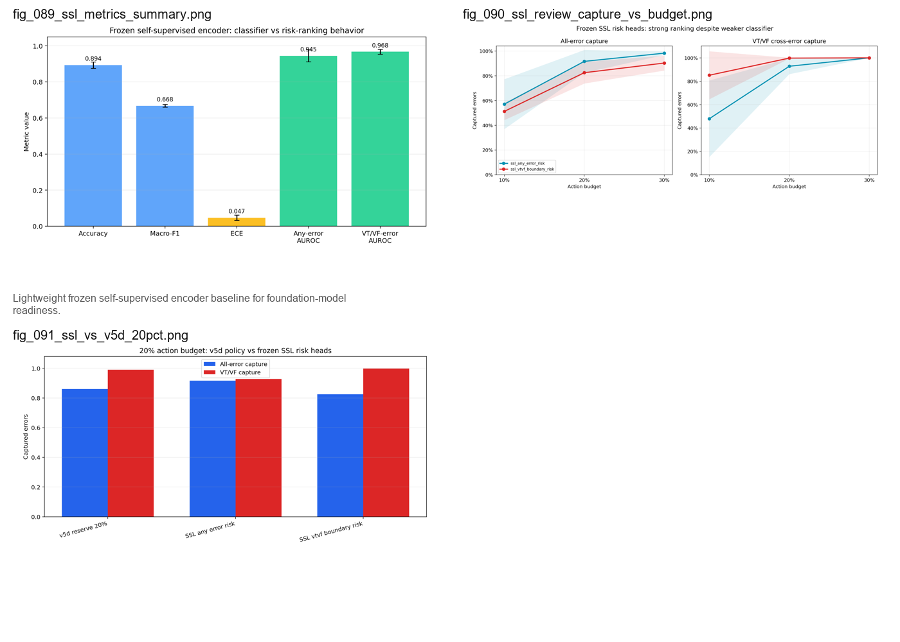

# Reliable ECG Classification Under Uncertainty

Research code for studying whether an ECG classifier can recognize when its
own short-window SR/VT/VF prediction is unreliable.

The project focuses on a three-class rhythm classification task:

- `SR`: sinus or non-ventricular rhythm
- `VT`: ventricular tachycardia
- `VF`: ventricular fibrillation

The central question is not only classification accuracy. The main question is
whether high-risk VT/VF boundary errors can be detected and routed for expert
review before an automated prediction is accepted.

> Research prototype only. This repository is not a medical device and must not
> be used for diagnosis or clinical decision-making.

## Project In One Sentence

This project starts from ordinary SR/VT/VF ECG classification, shows that the
fragile part is the VT/VF boundary rather than aggregate accuracy, then turns
representation, neighborhood, prototype, waveform, and uncertainty analyses
into explicit mechanism constraints and review-routing policies. The central
method is not "add more modules"; it is to test whether each mechanism changes
the model outcome without sacrificing safety-relevant objectives.

The final GitHub framing is:

- Model-layer causal-style ablations connect each proposed constraint to
  measurable outcomes such as accuracy, macro-F1, ECE, VT/VF cross-errors,
  total errors, and error migration.
- A mechanism-derived model search tests whether the old boundary-prototype
  candidate can be simplified into a smaller boundary-plus-center constraint,
  or whether the full VT/VF margin remains necessary.
- `RISK` and `v5d` form the downstream recover/review layer: a
  mechanism-separated hierarchical policy for capturing residual high-risk
  errors under fixed review budgets.
- The strongest claim is internal reliability evidence under paired seeds and
  stricter duplicate-family validation, not clinical validation.

## How The Research Logic Evolved

The project is best read as a staged research story.

1. Define the problem: classify short ECG windows into `SR`, `VT`, and `VF`.
2. Discover the main failure mode: `VT` and `VF` are much closer in learned
   representation space than `SR` is to either ventricular rhythm.
3. Compare simple and temporal baselines first: CNN and CNN-LSTM establish
   that temporal modeling can change VT/VF behavior, but does not by itself
   solve calibration, total-error, or boundary reliability.
4. Analyze failures beyond accuracy: embedding geometry, PCA projections,
   normalized center distances, kNN neighborhoods, prototype distances,
   local VT/VF mixing, regularity features, calibration, OOD corruption, and
   selective prediction.
5. Build the first evidence-fusion models, including GatedFusion and related
   constrained models. These improve some representations, but do not
   automatically prove safer VT/VF classification.
6. Learn the key negative result: a representation can look cleaner while
   outcome-level errors remain, migrate, or worsen. This is why the project
   introduces outcome guards instead of trusting embedding plots alone.
7. Run mechanism-targeted causal-style ablations: `do(boundary weighting)`,
   `do(prototype center)`, `do(VT/VF prototype margin)`,
   `do(contrastive local-purity control)`, `do(gate alignment)`, and
   `do(regularity auxiliary learning)`.
8. Use the ablation results to construct a mechanism-derived model search:
   test which parts of the old boundary-prototype model are truly necessary,
   especially whether `boundary + prototype center` is sufficient or whether
   the full VT/VF margin must be retained.
9. Convert residual evidence into review routing: instead of trusting one
   classifier, use the evidence families to decide which samples need review.
10. Upgrade single-score RISK into `v5d`: a mechanism-separated hierarchical
    router with a VT/VF boundary-first branch and a residual mechanism branch.

The resulting chain is:

```text
SR/VT/VF task
  -> backbone models
  -> representation and signal-level failure analysis
  -> mechanism-targeted causal-style ablation
  -> mechanism-derived model constraint search
  -> RISK evidence and recover signals
  -> v5d multi-mechanism review-routing policy
  -> fixed-budget error-capture evaluation
```

## Key Finding

High overall accuracy was not enough. The important question became whether a
model change truly improves outcome-level reliability, and whether the remaining
high-risk errors can be captured under a fixed review budget.

The final research logic has two connected layers:

1. A model layer tests explicit mechanism constraints and rejects changes that
   only improve representation appearance while harming outcome guards.
2. A routing/recover layer uses mechanism evidence to catch residual errors
   that the classifier should not automatically decide.

The final decision policy is not a single uncertainty score. It is a
hierarchical routing mechanism:

1. A VT/VF boundary-first branch uses softmax ambiguity, validity-domain
   boundary evidence, and wavelet/time-frequency boundary risk.
2. A residual mechanism branch handles other failure types such as
   SR-ventricular confusion, representation conflict, atypical signal evidence,
   and hidden confident errors.



Across ten paired duplicate-family splits, `v5d` with a 20% residual-budget
reserve achieved the following at a 20% action budget:

| Method | All-error capture | VT/VF cross-error capture | Automatic unresolved VT/VF rate |
| --- | ---: | ---: | ---: |
| v4 optimized mechanism router | 82.6% | 87.9% | 0.82% |
| v5d, 20% residual reserve | 86.0% | 99.0% | 0.07% |

This is why the final contribution is best described as:

> Mechanism-separated hierarchical review routing for VT/VF boundary-aware ECG
> reliability.

## Method And Evidence Chain

| Stage | What was done | Why it mattered | Main conclusion |
| --- | --- | --- | --- |
| 1. Leakage-aware data protocol | Record-level and duplicate-family split audits. | ECG windows can be repeated or highly correlated across records. | Final claims use stricter internal duplicate-family evidence. |
| 2. Backbone classification | CNN, TCN, ResNet1D, InceptionTime, BiGRU, RegularityFusion, GatedFusion, and temporal variants such as CNN-LSTM. | Reliability should not depend on one backbone. | Strong accuracy is possible, but accuracy does not identify unsafe VT/VF boundary cases. |
| 3. VT/VF boundary discovery | PCA, embedding geometry, normalized class-center distances, kNN neighborhoods, and local mixing. | The project needed to know whether errors were random or structured. | SR separates more easily from ventricular rhythms; VT and VF form the fragile boundary. |
| 4. Uncertainty and calibration | MSP, entropy, temperature scaling, energy score, conformal sets, and selective prediction. | A reliable classifier should express when a forced single label is unsafe. | Softmax uncertainty is useful; energy is weak/inverted here; conformal `{VT,VF}` sets are a useful baseline but not the final decision policy. |
| 5. Signal and OOD analysis | Regularity features, corruption tests, degradation sensitivity, and waveform-level evidence. | Some failures come from signal quality or rhythm morphology, not only embeddings. | Regularity and corruption evidence help explain risk, but severe degradation remains a limitation. |
| 6. Constrained and structured models | PRO/prototype separation, ProRisk/Risk-Pro-readable constraints, RISK-aware variants, CNN-LSTM/CNN-TCN style temporal upgrades, validity-domain and wavelet evidence. | The project tested whether structural changes inside the model solve the boundary problem. | Some representation metrics improve, but safer VT/VF classification is not guaranteed; error migration is real. |
| 7. Mechanism-targeted causal-style ablation | Boundary weighting, prototype center, VT/VF prototype margin, contrastive local-purity control, gate-boundary alignment, and regularity auxiliary learning were intervened on separately. | This asks whether a mechanism changes both its target representation variable and the final outcome. | Boundary and prototype-center mechanisms are strong; margin, gate, contrastive, and regularity require guarded interpretation. |
| 8. Mechanism-derived model search | Candidate constraints are recomposed from the 33-run mechanism evidence rather than chosen only as heuristic weights. | The model layer should explain which constraint weights are necessary, not just report a high-scoring model. | The active question is whether `boundary + center` is sufficient, or whether the full boundary-prototype margin is needed. |
| 9. RISK evidence score | Multi-source reliability evidence was distilled into a review-priority score. | The practical question is which windows should be reviewed. | RISK is a strong evidence layer, especially for VT/VF boundary capture under fixed budgets. |
| 10. v5d hierarchical router | RISK was upgraded into a multi-mechanism decision policy. | Different errors need different routing logic. | Boundary-first plus residual mechanism routing is the strongest downstream recover strategy. |
| 11. Frozen encoder comparison | A lightweight self-supervised frozen ECG encoder was tested. | This checks whether the pipeline can later plug into a real ECG foundation model. | Useful baseline, not yet an external foundation-model validation. |
| 12. Explanation reliability audit | Each explanation family was tested against the error type it claims to explain. | Interpretability should be evaluated, not only visualized. | Boundary and representation explanations align best; regularity and hidden-confidence explanations need more cautious wording. |

The key transition is not simply "embedding analysis followed by routing."
Representation analysis first identified where the classifier failed: VT/VF
samples were often locally mixed in embedding, prototype, and kNN space. The
project then used those findings to design model-side interventions such as
PRO, ProRisk/Risk-Pro-readable, CNN-LSTM, CNN-TCN-Validity, and wavelet-boundary
variants. These models showed that representation structure, temporal evidence,
validity-domain evidence, and time-frequency evidence can all become more
organized or more interpretable, but this does not guarantee safer VT/VF
classification; errors can remain or migrate into new directions. Therefore,
the final router uses not only embedding evidence, but also the data and signal
properties revealed by those failed or imperfect model analyses. Embedding,
prototype, kNN, softmax, regularity, validity-domain, wavelet, and
model-disagreement evidence are all converted into mechanism-specific routing
signals.

For the full stage-ordered report, see
[docs/RESEARCH_REPORT.md](docs/RESEARCH_REPORT.md).

For the compact experiment-and-evidence narrative, see
[docs/EXPERIMENT_EVIDENCE_SUMMARY.md](docs/EXPERIMENT_EVIDENCE_SUMMARY.md).

For a reusable method framework that can be adapted to other projects, see
[docs/VT_VF_TRANSFERABLE_METHOD_FRAMEWORK_CN.md](docs/VT_VF_TRANSFERABLE_METHOD_FRAMEWORK_CN.md).

For the public figure index, see
[docs/FIGURE_ATLAS.md](docs/FIGURE_ATLAS.md).

For the documentation map, see
[docs/README.md](docs/README.md).

## Backbone Results Snapshot

Selected public aggregate classifier results:

| Model | Accuracy | Macro-F1 | ECE | Interpretation |
| --- | ---: | ---: | ---: | --- |
| CNN-10 | 92.4% | 71.6% | 1.6% | Strong baseline and useful review-routing behavior. |
| TCN-20 | 88.6% | 66.0% | 2.3% | Lower accuracy, but strong VT/VF review capture. |
| ResNet1D-12 | 92.4% | 67.3% | 6.0% | Competitive classifier, weaker under review-budget routing. |
| InceptionTime-12 | 93.9% | 74.1% | 1.4% | Strong classification baseline. |
| BiGRU-12 | 81.9% | 53.4% | 9.5% | Weaker baseline in this setup. |
| RegularityFusion-12 | 91.6% | 69.1% | 3.0% | Useful bridge between signal features and reliability. |
| GatedFusion-12 | 94.9% | 77.5% | 2.9% | Best aggregate classifier, but not automatically the safest router. |

The CNN-LSTM and structured temporal analyses are important because they showed
that architectural improvements can reduce some VT/VF cross-errors and improve
some embedding geometry. However, they also reinforced the main lesson:
representation separation alone is not a sufficient reliability criterion.

## Mechanism-Derived Model Layer

After the first GatedFusion and constrained-model experiments, the project did
not treat the best-looking representation as the final answer. Instead, it
converted the representation and reliability analyses into explicit,
testable constraint weights.

The older boundary-prototype candidate used four main constraint terms:

```text
boundary_ce_weight = 0.75
prototype_center_weight = 0.02
prototype_margin_weight = 0.05
prototype_vtvf_margin = 1.0
```

Those terms have different sources:

| Constraint | Mechanism source | Intended effect |
| --- | --- | --- |
| `boundary_ce_weight` | VT/VF softmax ambiguity and high-risk boundary samples | Upweight risky boundary windows in cross-entropy. |
| `prototype_center_weight` | Loose class clusters, low local purity, and unstable embedding neighborhoods | Encourage within-class compactness. |
| `prototype_margin_weight` | VT/VF prototype ambiguity and insufficient class-center separation | Penalize VT and VF centers that remain too close. |
| `prototype_vtvf_margin` | Desired VT/VF prototype separation target | Define the distance threshold used by the margin penalty. |

The 33-run mechanism-targeted ablation then tested these and related
mechanisms separately. It showed that prototype-center compactness and
boundary weighting are strong candidates, while prototype margin alone,
regularity auxiliary learning, and gate-boundary alignment require more
cautious interpretation. Therefore, the current model-layer search does not
blindly add all mechanisms. It asks whether the older four-term model can be
explained or simplified by a smaller mechanism-derived candidate:

```text
boundary075_center:
  boundary_ce_weight = 0.75
  prototype_center_weight = 0.02
```

The active comparison is:

```text
boundary only
vs prototype center only
vs prototype margin only
vs center + margin
vs boundary + center
vs boundary + margin
vs boundary + center + margin
```

This is the bridge between mechanism analysis and model choice. A constraint is
kept only if it improves model outcomes without harming safety-relevant guards:

```text
accuracy, macro-F1, ECE, VT/VF cross-errors, total errors, error migration
```

The mechanism-derived search plan is documented in
[docs/MECHANISM_DERIVED_MODEL_SEARCH_PLAN_CN.md](docs/MECHANISM_DERIVED_MODEL_SEARCH_PLAN_CN.md).
The 33-run mechanism quantification is summarized in
[docs/MECHANISM_TARGETED_CAUSAL_FULL_RESULTS_CN.md](docs/MECHANISM_TARGETED_CAUSAL_FULL_RESULTS_CN.md).

## What Was Learned From The Model Interventions

The project did not simply add constraints and claim success. It used those
models to test a hypothesis:

> If VT/VF errors are caused by representation structure, then improving that
> structure should make VT/VF classification safer.

The answer was mixed.

- Prototype/PRO and ProRisk/Risk-Pro-readable variants can change embedding geometry.
- CNN-LSTM and temporal upgrades can improve some boundary behavior.
- Validity-domain and wavelet/time-frequency evidence are useful for detecting
  boundary-risk samples.
- But improved representation shape does not always reduce VT/VF errors.
- Some interventions move errors into another class direction, which is error
  migration rather than a solved boundary problem.
- Not every useful mechanism can be added directly to the training objective:
  regularity, validity/gate, stability, and explanation signals are often more
  reliable as diagnostic or routing evidence than as main classifier losses.
- The final model layer should therefore be the smallest mechanism-supported
  constraint set that passes outcome guards, not the largest possible
  multi-loss network.

This negative result is central. It is why the final method has two layers: a
mechanism-derived classifier constraint search, followed by a routing/recover
system for the errors that remain.

## Why Embedding Evidence Is Used For Routing

The project uses embedding analysis as diagnostic evidence, not as a guarantee
that changing the embedding will automatically fix the classifier.

This distinction is important:

- Embedding geometry can reveal where VT/VF boundary samples are locally mixed.
- kNN atypicality, prototype conflict, and representation instability can help
  identify samples that deserve review.
- But forcing representations to look more separated can also make the wrong
  regions more stable and more confident.
- Therefore, embedding evidence is most reliable when it is tested by
  downstream error capture, not when it is treated as proof that the classifier
  has become safer.

The table below is the bridge from imperfect model-side intervention to the
final routing design. These models were not discarded as failed attempts; each
one exposed a different reason why a single classifier or a single embedding
constraint is not enough for VT/VF reliability.

| Model or intervention | Structural idea | What was analyzed | Failure or limitation found | How it supports mechanism routing |
| --- | --- | --- | --- | --- |
| CNN / TCN / ResNet / InceptionTime | Test whether stronger backbones solve SR/VT/VF classification. | Accuracy, macro-F1, ECE, confusion matrix, VT/VF cross-errors, and embedding separation. | Stronger aggregate classifiers still leave clinically important VT/VF boundary errors. | The problem is not only insufficient model capacity; boundary errors need explicit routing. |
| CNN-LSTM temporal model | Add recurrent temporal context after CNN features. | CNN vs CNN-LSTM across ten seeds, VT/VF errors, embedding silhouette, softmax boundary AUROC, and calibration. | Some VT/VF cross-errors decrease, but accuracy, calibration, and total-error behavior remain unstable. | Temporal evidence is useful, but should become one evidence family rather than the final decision rule. |
| PRO / prototype separation | Add prototype or class-center pressure to reshape the embedding boundary. | Prototype distance, normalized VT/VF separation, silhouette, kNN mixing, and duplicate-family error migration. | Representation geometry can improve while VT/VF reliability worsens under stricter validation. | Embedding structure is diagnostic evidence, not proof that the classifier is safer. |
| ProRisk | Add reliability-aware pressure during model training. | Teacher vs ProRisk metrics, validity scores, latent strata, boundary-error AUROC, and VT/VF cross-errors. | ProRisk changes internal structure but does not provide stable improvement across all error types. | Reliability constraints reveal mechanisms, but still need downstream routing validation. |
| Risk-Pro-readable / readable variant | Make risk evidence more interpretable through readable or second-opinion style signals. | Model disagreement, second-model probabilities, both-agree-wrong cases, confidence, and entropy. | Two models can agree and still be confidently wrong. | This motivates a separate hidden-confident route rather than relying on ordinary uncertainty. |
| CNN-TCN-Validity V2 | Combine temporal features with a validity-domain gate. | Validity gate, boundary score, gate x boundary, low-validity confidence, and validity-domain review curves. | Validity evidence identifies regions where the model should not be trusted, but does not fully repair classification. | Validity is better used as a routing gate: "is this region safe for automatic judgment?" |
| CNN-Wavelet-TCN Boundary | Add multi-scale wavelet and time-frequency boundary evidence. | Wavelet energy, slope/oscillation/shape statistics, fine-to-coarse energy, and wavelet VT/VF boundary risk. | Time-frequency evidence detects some VT/VF boundary risk, but does not remove all boundary errors. | Wavelet evidence becomes a boundary-specific route rather than a standalone classifier claim. |
| RegularityFusion / GatedFusion | Inject ECG-domain rhythm and morphology features. | Spectral entropy, dominant frequency, autocorrelation, line length, regularity atypicality, and review-routing behavior. | Signal regularity explains atypical windows but not every error type. | Atypical-signal failures should be routed separately from pure VT/VF boundary failures. |
| RISK head / risk distillation | Distill post-hoc uncertainty and neighborhood evidence into a review score. | Entropy, MSP, kNN, prototype risk, local instability, VT/VF mixing, review curves, and capture at fixed budgets. | A single score is useful but compresses heterogeneous failures into one ranking. | This motivates v5d: boundary-first routing plus reserved residual mechanism routing. |

This is why the final system uses representation evidence inside the routing
policy. It does not claim that embedding regularization alone solves VT/VF
classification.

## Internal Stress Test For Dataset Size Effects

The project also checks whether the routing result could be an artifact of a
small internal dataset or an unusually favorable validation split.

Two internal stress tests were used:

- Validation downsampling: the boundary-first router stayed stable when the
  validation evidence was reduced. At a 10% action budget, VT/VF capture was
  90.3% with 25% validation evidence versus 90.4% with the full validation
  evidence. At a 20% budget, both were about 99.7%.
- Cluster concentration audit: VT/VF capture was partly concentrated in a few
  duplicate-family clusters, so the project also reported capture after
  removing the largest cluster. Without the top cluster, capture remained 76.6%
  at a 10% budget and 99.3% at a 20% budget.

These tests do not replace external validation, but they reduce the risk that
the final result is only a small-sample artifact.

## Final Routing Policy

`RISK` is the evidence layer. It combines signals such as:

- softmax ambiguity and entropy;
- VT/VF boundary ambiguity;
- embedding-neighborhood instability;
- kNN atypicality;
- local class mixing;
- prototype and representation conflict;
- ECG regularity and atypicality;
- validity-domain evidence;
- wavelet/time-frequency boundary evidence.

`v5d` is the policy layer. It decides how to act on the evidence:

- route likely VT/VF boundary cases to a `{VT,VF}` set or expert review;
- reserve part of the review budget for residual mechanisms;
- allow lower-risk samples to keep a single automated label;
- evaluate every policy under fixed action budgets rather than only by
  accuracy.

The routing diagram above is the intended reading of the final method: RISK and
other reliability signals are not used as a single threshold only. They are
organized into a boundary-first decision branch and a residual mechanism branch.

Public v5d figures:


## Recent Research Upgrades

Recent upgrades added the causal-style mechanism and model-selection layer on
top of the older review-routing evidence.

| Upgrade | Location | Purpose |
| --- | --- | --- |
| 33-run mechanism-targeted ablation | `docs/MECHANISM_TARGETED_CAUSAL_FULL_RESULTS_CN.md` | Quantify how boundary, prototype, KNN/contrastive, gate, and regularity interventions affect mechanisms and outcomes. |
| Mechanism-derived model search | `docs/MECHANISM_DERIVED_MODEL_SEARCH_PLAN_CN.md` | Recompose model constraints from validated mechanisms instead of relying on heuristic weights alone. |
| Model-layer benchmark | `docs/MODEL_LAYER_ALL_MODEL_BENCHMARK_CN.md` | Compare CNN, CNN-LSTM, prototype, boundary/risk, and complex constrained models under model-only outcomes. |
| V5D causal-Pareto routing upgrade | `docs/V5D_CAUSAL_PARETO_WEIGHT_UPGRADE_RESULTS_CN.md` | Tune stage1/stage2 routing weights while preserving VT/VF capture and residual-risk guards. |
| v5d hierarchical router figures | `results_public/figures/12_v5d_hierarchical_router/` | Show the final multi-mechanism routing policy and budget behavior. |
| Frozen self-supervised encoder comparison | `results_public/figures/13_frozen_ssl_encoder/` | Provide a foundation-model-ready baseline without claiming external validation. |
| Explanation reliability audit | `results_public/figures/14_explanation_reliability/` | Evaluate whether explanation families actually match their intended error mechanisms. |




## Public Evidence

The public evidence layer contains only aggregate tables and figures. It does
not include raw ECG signals, model weights, embeddings, window-level prediction
files, or private review examples.

Current final GitHub evidence is in the duplicate-family and v5d/RISK
summaries:

```text
results_public/tables/duplicate_family_baseline_pro_summary.csv
results_public/tables/duplicate_family_selected_risk_review_aggregate.csv
results_public/tables/duplicate_family_risk_error_type_capture_mean_std.csv
results_public/tables/duplicate_family_risk_record_cluster_ci.csv
results_public/figures/12_v5d_hierarchical_router/
results_public/figures/13_frozen_ssl_encoder/
results_public/figures/14_explanation_reliability/
```

Older paired PRO and review-routing tables remain in `results_public/tables/`
as historical evidence from earlier experiment versions. They are useful for
understanding the research path, but final claims should use the stricter
duplicate-family and v5d evidence.

Additional figures and tables are available in
[results_public/](results_public/README.md). The public figures are grouped by
experiment stage in [results_public/figures/](results_public/figures/README.md).

## Supervisor / PhD Application Entry

If you are reviewing this repository for PhD fit, start here:

1. [Application index](docs/APPLICATION_INDEX.md)
2. [PhD application project brief](docs/phd_application_project_brief.md)
3. [Mechanism-targeted causal full results](docs/MECHANISM_TARGETED_CAUSAL_FULL_RESULTS_CN.md)
4. [Mechanism-derived model search plan](docs/MECHANISM_DERIVED_MODEL_SEARCH_PLAN_CN.md)
5. [V5D causal-Pareto weight upgrade](docs/V5D_CAUSAL_PARETO_WEIGHT_UPGRADE_RESULTS_CN.md)
6. [Experiment evidence summary](docs/EXPERIMENT_EVIDENCE_SUMMARY.md)
7. [Evidence index](docs/evidence_index.md)
8. [Research report](docs/RESEARCH_REPORT.md)
9. [Figure atlas](docs/FIGURE_ATLAS.md)

The intended application framing is trustworthy medical machine learning,
uncertainty estimation, and review-routing reliability. It should not be
described as a clinical system.

## Repository Structure

```text
src/                      Core training, uncertainty, calibration, OOD,
                          boundary, and review-routing code
docs/                     Research report, method overview, data statement,
                          evidence summary, and experiment pipeline
results_public/tables/    Curated aggregate summary tables only
results_public/figures/   Public-safe figure atlas grouped by experiment stage
data/README.md            Dataset access note; raw ECG data are not distributed
requirements.txt          Minimal Python dependencies
```

## Main Entry Points

- `src/inspect_data.py`: dataset inspection
- `src/train.py`: backbone model training
- `src/evaluate_uncertainty.py`: uncertainty and calibration evaluation
- `src/evaluate_ood.py`: corruption and OOD evaluation
- `src/embedding_geometry_analysis.py`: representation-space analysis
- `src/ambiguity_analysis.py`: VT/VF boundary ambiguity analysis
- `src/review_efficiency_analysis.py`: review burden and error-capture curves
- `src/run_mechanism_targeted_causal_ablation.py`: component-level mechanism
  interventions for boundary, prototype, contrastive, gate, and regularity
- `src/summarize_mechanism_targeted_causal_quantification.py`: paired
  intervention-mechanism-outcome quantification
- `src/run_model_layer_causal_pareto_search.py`: mechanism-derived model
  constraint recomposition and Pareto outcome guards
- `src/evidence_informed_recovery_routing.py`: mechanism evidence routing
- `src/boundary_first_router_v5b.py`: VT/VF boundary-first router
- `src/hierarchical_router_v5d_reserved_budget.py`: final v5d reserved-budget router
- `src/run_v5d_causal_pareto_weight_upgrade.py`: stage1/stage2 routing weight
  intervention inside the V5D policy
- `src/frozen_ssl_encoder_comparison.py`: frozen self-supervised encoder comparison
- `src/explanation_reliability_audit.py`: explanation-to-error-mechanism audit
- `src/generate_github_visual_pack.py`: public GitHub figure generation

See [src/README.md](src/README.md) for a code map organized by experiment
stage.

## Quick Start

```powershell
python -m venv .venv
.\.venv\Scripts\Activate.ps1
pip install -r requirements.txt

python -m src.inspect_data --mat RHYTHMS.mat
python -m src.train --mat RHYTHMS.mat --model cnn --epochs 30
python -m src.evaluate_uncertainty --run-dir results\<run-name>
python -m src.evaluate_ood --mat RHYTHMS.mat --run-dir results\<run-name> --model cnn
python -m src.ambiguity_analysis --run-dir results\<run-name>
python -m src.review_efficiency_analysis --run-dir results\<run-name>
```

The raw ECG file is expected locally as `RHYTHMS.mat`, but it is not included in
this repository.

Mechanism-level experiments use the same local data file:

```powershell
# Component-level mechanism ablation.
python -m src.run_mechanism_targeted_causal_ablation --seeds 42 43 44 --epochs 30

# Mechanism-derived model search.
python -m src.run_model_layer_causal_pareto_search --candidate-set mechanism-derived --seeds 42 43 44 --epochs 30

# V5D stage1/stage2 routing weight intervention.
python -m src.run_v5d_causal_pareto_weight_upgrade --budgets 0.20
```

## Data And Scope

The dataset is institutionally restricted and is not redistributed here. The
repository provides code and aggregate non-identifiable evidence only.

Before any public or archival release, the dataset source, licence, consent or
ethics status, and access procedure should be documented in
[data/README.md](data/README.md).

## Limitations

- Current evidence comes from an internal ECG dataset and synthetic corruption
  tests.
- The v5d routing evidence is internal duplicate-family evidence, not external
  clinical validation.
- Some methods were weak or unstable: energy-based error detection was poor,
  stronger classifiers did not always rank VT/VF boundary errors well, and PRO
  showed error migration under stricter validation.
- The frozen self-supervised encoder is an internal baseline, not a real
  external ECG foundation-model evaluation.
- Window-level classification should not be interpreted as patient-level
  diagnosis.
- The repository is intended for research review, not deployment.
