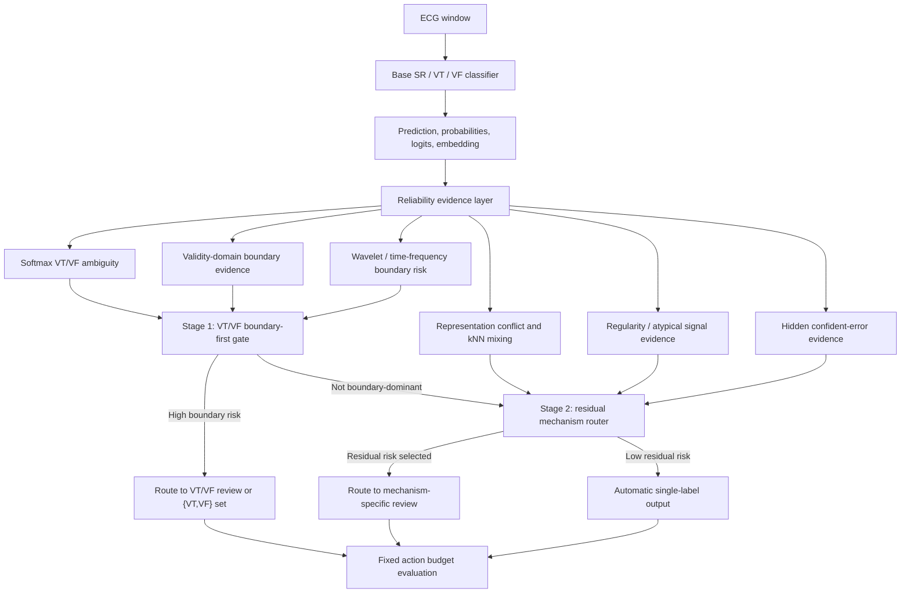

# Experiment Evidence Summary

This document is the compact research narrative behind the repository. It is
written for a PhD supervisor who wants to understand what was done, why each
step was necessary, what the evidence shows, and where the work remains
limited.

## 1. Starting Problem

The project begins with short-window ECG rhythm classification:

- `SR`: sinus or non-ventricular rhythm
- `VT`: ventricular tachycardia
- `VF`: ventricular fibrillation

The initial question was ordinary classification: can a neural network
distinguish SR, VT, and VF? The research question then became more specific:

> Can the model recognize when its own SR/VT/VF prediction is unreliable, and
> can high-risk VT/VF boundary cases be routed for review under a fixed action
> budget?

This matters because overall accuracy can look strong while the model still
makes important VT/VF cross-errors.

## 2. Data Protocol And Leakage Control

The code expects a local restricted ECG dataset, but the raw data are not
included in the repository. The public repository contains code, aggregate
tables, and public-safe figures only.

The project uses record-level and duplicate-family split audits because
adjacent or repeated ECG windows can make performance appear stronger than it
really is. The final interpretation uses stricter duplicate-family evidence
before making reliability claims.

Relevant evidence:

- `src/audit_data_protocol.py`
- `src/audit_duplicate_family_splits.py`
- `results_public/tables/dataset_split_statistics.csv`
- `results_public/tables/duplicate_family_baseline_pro_summary.csv`

## 3. Backbone Models

The first modeling stage tested whether the reliability finding depended on a
single architecture. The project evaluated several ECG time-series classifiers:

- CNN
- TCN
- CNN-LSTM style temporal variants
- ResNet1D
- InceptionTime
- BiGRU
- RegularityFusion
- GatedFusion

Selected aggregate results:

| Model | Accuracy | Macro-F1 | ECE | Interpretation |
| --- | ---: | ---: | ---: | --- |
| CNN-10 | 92.4% | 71.6% | 1.6% | Strong baseline and useful routing behavior. |
| TCN-20 | 88.6% | 66.0% | 2.3% | Lower accuracy, strong VT/VF review capture. |
| InceptionTime-12 | 93.9% | 74.1% | 1.4% | Strong classifier baseline. |
| GatedFusion-12 | 94.9% | 77.5% | 2.9% | Best aggregate classifier, but not automatically the safest router. |

Main lesson: better classification accuracy did not automatically solve the
VT/VF reliability problem.

## 4. Why VT/VF Became The Central Boundary

Embedding analysis showed that SR was generally easier to separate from
ventricular rhythms, while VT and VF were closer and more locally mixed. The
project therefore moved from a general three-class accuracy problem to a
boundary-aware reliability problem.

The analysis included:

- PCA and 3D embedding projections
- normalized class-center distances
- kNN neighborhood atypicality
- local VT/VF mixing
- prototype distance
- layerwise and representation-shift diagnostics

Important interpretation:

> A representation space can look more structured without guaranteeing safer
> VT/VF decisions.

This became one of the project's main negative results.

Relevant evidence:

- `src/embedding_geometry_analysis.py`
- `src/ambiguity_analysis.py`
- `src/layerwise_representation_diagnosis.py`
- `src/advanced_representation_diagnostics.py`
- `results_public/figures/01_embedding_pca/`

## 5. Uncertainty, Calibration, OOD, And Signal Evidence

The project then tested whether uncertainty and signal-level evidence can
identify unreliable predictions.

Evidence families included:

- MSP and entropy
- temperature-scaled confidence
- energy score
- conformal prediction sets
- corruption and OOD-style perturbations
- ECG regularity features
- wavelet/time-frequency boundary evidence
- validity-domain evidence

Findings:

- MSP and entropy were useful ordinary error detectors.
- Energy score was weak or inverted in the selected summaries.
- Regularity and corruption evidence helped explain risk but did not solve the
  problem alone.
- Wavelet and validity evidence were useful as routing signals, especially for
  VT/VF boundary risk.

Relevant evidence:

- `src/evaluate_uncertainty.py`
- `src/evaluate_ood.py`
- `src/evaluate_corruption_severity.py`
- `src/regularity_analysis.py`
- `src/validity_boundary_signal_audit.py`
- `src/wavelet_boundary_routing_audit.py`
- `results_public/figures/02_uncertainty_calibration/`
- `results_public/figures/03_regularity_interpretability/`
- `results_public/figures/04_ood_corruption/`

## 6. Structured Model Interventions

After finding representation structure in the errors, the project tested
whether model-side structure could directly fix the problem.

Tested directions included:

- PRO/prototype separation
- Risk-Pro and Risk-Pro-readable constraints
- CNN-LSTM temporal modeling
- CNN-TCN-Validity bottleneck variants
- CNN-Wavelet-TCN boundary variants
- RISK-aware and reliability-privileged training objectives

The result was deliberately not overclaimed.

Some interventions improved embedding geometry, calibration, or selected
boundary behavior. However, several results showed that representation
improvement does not guarantee safer VT/VF classification. Some interventions
also shifted errors into another direction, which the project treats as error
migration rather than a solved boundary.

This negative result is important because it motivates the final method:

> The project should not only build a more complex classifier. It should build
> a decision policy that routes different error mechanisms differently.

## 7. Why Embedding Helps Routing But Does Not Guarantee Model Improvement

The project makes a deliberate distinction between diagnostic evidence and
optimization targets.

Embedding analysis is useful because it exposes where the classifier is
structurally uncertain: VT/VF mixing, kNN atypicality, prototype conflict,
layerwise instability, and local representation disagreement. These signals
can be evaluated directly by asking whether they capture future errors under a
fixed review budget.

However, embedding improvement is not the same as decision reliability.
Structured models such as PRO, ProRisk/Risk-Pro-readable, CNN-LSTM, and
CNN-TCN/Validity variants showed that a representation can become smoother or
more separated while the classifier still makes VT/VF errors. In some cases,
the intervention can make wrong regions more stable and more confident. This
is why the project does not use embedding geometry alone as a success
criterion.

The final interpretation is:

- embedding analysis is strong evidence for mechanism diagnosis;
- embedding-derived scores are useful routing features when validated against
  error capture;
- embedding regularization alone is not a sufficient model-improvement proof.

Relevant evidence:

- `src/run_core_intervention_pipeline.py`
- `src/run_risk_pro_readable_multiseed.py`
- `src/run_cnn_tcn_validity_experiment.py`
- `src/run_cnn_tcn_validity_v2_experiment.py`
- `src/run_wavelet_tcn_boundary_experiment.py`
- `src/top_journal_reliability_directions.py`
- `results_public/figures/06_pro_geometry/`
- `results_public/figures/10_v6_pro_error_migration/`

## 8. From RISK Score To v5d Decision Policy

The original RISK score was designed as a review-priority evidence score. It
combines reliability evidence such as uncertainty, embedding atypicality,
local mixing, prototype conflict, regularity, validity, and boundary risk.

The final method upgrades this into `v5d`, a mechanism-separated hierarchical
router:

1. Boundary-first branch:
   softmax VT/VF ambiguity, validity-domain boundary evidence, and
   wavelet/time-frequency boundary risk identify samples that should be routed
   to a `{VT,VF}` prediction set or VT/VF-focused review.
2. Residual mechanism branch:
   a reserved action budget handles SR-ventricular confusion, representation
   conflict, atypical signal evidence, and hidden confident errors.

This turns the project from a single-score uncertainty method into a
multi-mechanism review-routing policy.

Key result across ten paired duplicate-family splits at a 20% action budget:

| Method | All-error capture | VT/VF cross-error capture | Automatic unresolved VT/VF rate |
| --- | ---: | ---: | ---: |
| v4 optimized mechanism router | 82.6% | 87.9% | 0.82% |
| v5d, 20% residual reserve | 86.0% | 99.0% | 0.07% |

Relevant evidence:

- `src/evidence_informed_recovery_routing.py`
- `src/boundary_first_router_v5b.py`
- `src/hierarchical_router_v5c.py`
- `src/hierarchical_router_v5d_reserved_budget.py`
- `src/compare_routing_baselines_10seed.py`
- `results_public/figures/12_v5d_hierarchical_router/`

## 9. Internal Stress Test For Dataset Size Effects

Because the dataset is internal and not large, the project includes stress
tests for whether the routing result is inflated by small-sample effects.

The validation downsampling test asks whether the router depends too strongly
on a favorable validation set. The result was stable: at a 10% action budget,
VT/VF capture was 90.3% using only 25% of the validation evidence and 90.4%
using the full validation evidence. At a 20% action budget, both settings
captured about 99.7% of VT/VF cross-errors.

The cluster concentration audit asks whether the result is dominated by a
single duplicate-family cluster. The top cluster did explain a large fraction
of captured VT/VF errors, so the project also evaluated capture without it.
After removing the top cluster, VT/VF capture remained 76.6% at a 10% action
budget and 99.3% at a 20% action budget.

These tests do not solve the external-validation limitation, but they show that
the final routing result is not only a trivial artifact of one favorable
validation split or one dominant cluster.

Relevant evidence:

- `src/internal_stress_test_v5c.py`
- `src/compare_routing_baselines_10seed.py`
- `results_public/figures/12_v5d_hierarchical_router/`

## 10. Final Upgrades For PhD Presentation

Three final upgrades were added to make the repository closer to a modern
research portfolio:

| Upgrade | Purpose | Evidence |
| --- | --- | --- |
| v5d hierarchical router | Final method: mechanism-separated routing. | `results_public/figures/12_v5d_hierarchical_router/` |
| Frozen self-supervised encoder | Foundation-model-ready comparison without claiming external validation. | `results_public/figures/13_frozen_ssl_encoder/` |
| Explanation reliability audit | Tests whether explanations match the error mechanisms they claim to explain. | `results_public/figures/14_explanation_reliability/` |

The frozen encoder is an internal baseline, not an external ECG foundation
model. The explanation audit found that boundary and representation evidence
aligned best with their intended mechanisms, while regularity and
hidden-confidence explanations should be interpreted more cautiously.

## 11. Final Claim

The project's final contribution is not simply a better ECG classifier.

The strongest claim is:

> A multi-source reliability evidence layer can be converted into a
> mechanism-separated hierarchical review-routing policy for short-window
> SR/VT/VF ECG classification, with special attention to VT/VF boundary errors.

RISK is the evidence layer. v5d is the final decision policy.

## 12. Limitations

- The evidence is internal and has not been externally clinically validated.
- The public repository excludes raw ECG data, checkpoints, embeddings, and
  sample-level private material.
- Window-level classification is not patient-level diagnosis.
- Synthetic corruption tests do not replace external dataset validation.
- Some model interventions improved representation metrics without improving
  safety-relevant VT/VF behavior.
- The repository should be read as a research prototype for trustworthy ML and
  review-routing reliability, not as a deployable medical system.
