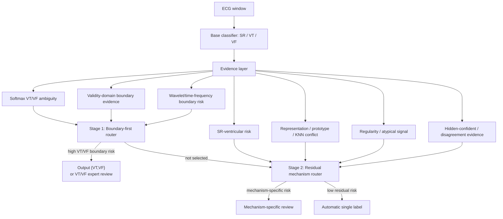

# 机制分离式分层可靠路由：最终方法总结

## 一句话主线

这个项目现在已经从“做一个更复杂的 ECG 分类模型”收束成一个更清楚的研究贡献：

> 对 SR/VT/VF ECG 分类，不再使用单一 uncertainty score 或单一复杂模型处理所有错误，而是先识别错误机制，再为不同机制分配不同决策形式。高风险 VT/VF boundary failures 由 boundary-first branch 优先进入 `{VT,VF}` prediction set；剩余错误再进入 residual mechanism routing。

最终推荐主方法：

```text
v5d: Mechanism-Separated Hierarchical Routing
     with 20% Reserved Residual Budget
```

中文名称：

```text
带残余预算保障的机制分离式分层可靠路由
```

## 最终方法图



## 各版本在研究链条里的角色

| 版本 | 作用 | 结论 |
|---|---|---|
| v4 optimized mechanism router | 原始机制路由 baseline | 比 total risk 更有机制性，但 VT/VF boundary branch 不够强 |
| validity audit | 检查 `validity_gate / boundary_score` 是否能做路由证据 | gate 作为分类修正器不稳，但作为 routing evidence 很强 |
| wavelet audit | 检查 wavelet/time-frequency evidence 是否有独立价值 | wavelet boundary risk 单独可捕获大量 VT/VF cross-errors |
| v5b boundary-first | 把 softmax + validity + wavelet 合成 boundary branch | 10% budget 捕获 90.4% VT/VF cross-errors |
| v5c two-stage | boundary-first 后接 residual mechanism routing | 30% budget 下同时超过 v4 的 all-error 与 VT/VF capture |
| internal stress test | 检查是否由小 validation 或少数 cluster 放大 | downsample 稳定，但 VT/VF errors 高度 cluster-concentrated |
| v5d reserved budget | 给 Stage 2 预留 residual budget | 10%/20% budget 下同时超过 v4 的 all-error 和 VT/VF capture |

## 最终主结果表

### 10% action budget

| method | action rate | Stage 1 | Stage 2 | all-error capture | VT/VF capture | unresolved VT/VF rate |
|---|---:|---:|---:|---:|---:|---:|
| v4 optimized router | 10.0% | - | - | 57.7% | 59.7% | 2.04% |
| v5d reserve 10% | 10.0% | 8.9% | 1.1% | 57.9% | 87.2% | 0.83% |
| v5d reserve 20% | 10.0% | 8.0% | 2.0% | 59.2% | 83.9% | 1.04% |
| v5d reserve 30% | 10.0% | 7.0% | 3.0% | 60.3% | 79.8% | 1.28% |

解释：

- v5d reserve 10%-20% 都比 v4 同时更高 all-error capture 和 VT/VF capture。
- reserve 越大，all-error 越高，但 VT/VF capture 下降。
- 10% budget 下如果强调高风险 VT/VF，推荐 reserve 10%；如果强调整体均衡，推荐 reserve 20%。

### 20% action budget

| method | action rate | Stage 1 | Stage 2 | all-error capture | VT/VF capture | unresolved VT/VF rate |
|---|---:|---:|---:|---:|---:|---:|
| v4 optimized router | 20.0% | - | - | 82.6% | 87.9% | 0.82% |
| v5d reserve 10% | 20.0% | 14.5% | 5.5% | 84.2% | 99.4% | 0.05% |
| v5d reserve 20% | 20.0% | 13.5% | 6.5% | 86.0% | 99.0% | 0.07% |
| v5d reserve 30% | 20.0% | 12.5% | 7.5% | 86.3% | 98.4% | 0.11% |

解释：

- 20% budget 是 v5d 最漂亮的位置。
- reserve 20% 是推荐主方法：all-error capture 86.0%，VT/VF capture 99.0%。
- 相比 v4，v5d reserve 20% 同时提升 all-error capture +3.42 points、VT/VF capture +11.18 points。

### 30% action budget

| method | action rate | all-error capture | VT/VF capture |
|---|---:|---:|---:|
| v4 optimized router | 30.0% | 93.8% | 97.2% |
| v5d reserve 0%-20% | 30.0% | 94.9% | 100.0% |
| v5d reserve 30% | 30.0% | 94.8% | 100.0% |

解释：

- 30% budget 下，Stage 1 已经抓完 VT/VF，Stage 2 也有足够空间处理 residual errors。
- reserve fraction 影响变小。

## Boundary Evidence 总结

| boundary evidence | VT/VF cross-error AUROC | AUPR | 解释 |
|---|---:|---:|---|
| mean softmax + validity + wavelet | 0.9743 | 0.5105 | 最强、最稳 |
| learned boundary ensemble | 0.9696 | 0.4651 | validation 更高但 test 不如简单平均 |
| softmax VT/VF ambiguity | 0.9664 | 0.4578 | 强 baseline |
| validity gate x boundary | 0.9634 | 0.4317 | validity 结构可做路由证据 |
| wavelet VT/VF boundary risk | 0.9619 | 0.4628 | wavelet/time-frequency 证据有独立价值 |

这个结果支持一个重要设计选择：

> 主方法不使用复杂 learned ensemble，而使用简单、可解释、稳定的三证据平均。

## Claim-Evidence Map

| Claim | Evidence | 强度 |
|---|---|---|
| VT/VF boundary errors 需要专门处理，而不是混入 all-error risk | v5b/v5c/v5d | 强，10seed paired |
| softmax、validity、wavelet 是互补边界证据 | boundary diagnostics AUROC/AUPR | 强，10seed |
| validity gate 虽然不能稳定修正分类，但可作为路由证据 | validity boundary signal audit | 强，10seed |
| wavelet/time-frequency 分析方法适合进入路由 | wavelet boundary routing audit | 强，10seed |
| 两阶段结构比单一机制路由更合理 | v5c | 中强，预算敏感 |
| residual budget reserve 让系统更均衡 | v5d | 强，10seed paired |
| 结果不是 validation 太小造成的偶然 | validation downsample stress | 中强，内部 stress |
| 当前效果可能受 latent cluster 集中性放大 | cluster concentration stress | 限制性证据 |
| 方法已经外部泛化 | 当前不能证明 | 需要外部数据 |
| 方法具有临床验证意义 | 当前不能证明 | 不能做医疗声明 |

## Stress Test 结论

### Validation Downsample

| validation fraction | budget | VT/VF capture | min VT/VF capture | all-error capture |
|---:|---:|---:|---:|---:|
| 25% | 10% | 90.3% | 73.0% | 55.9% |
| 100% | 10% | 90.4% | 74.0% | 55.9% |
| 25% | 20% | 99.7% | 97.5% | 78.9% |
| 100% | 20% | 99.7% | 98.3% | 78.9% |

解释：

> boundary-first score 对内部 validation sample size 不敏感。

### Cluster Concentration

| budget | top1 VT/VF-error cluster share | top3 VT/VF-error cluster share | capture without top cluster |
|---:|---:|---:|---:|
| 10% | 70.7% | 98.4% | 76.6% |
| 20% | 70.7% | 98.4% | 99.3% |

解释：

> 当前 VT/VF boundary failures 高度集中在少数 latent clusters。v5d/v5c 的强效果不是只靠一个 cluster，但可能被当前数据分布放大。

## 最终推荐写法

### 中文版本

> 本研究提出一种机制分离式分层可靠路由方法，用于 SR/VT/VF ECG 分类中的高风险不确定决策。与传统单一 uncertainty score 不同，该方法先使用 softmax、validity-domain 与 wavelet/time-frequency 三类证据构建 VT/VF boundary-first branch，将高风险边界样本输出为 `{VT,VF}` prediction set；随后将剩余样本交给 residual mechanism router，根据 SR-ventricular risk、representation conflict、atypical signal 等机制证据分配不同 review 路由。10seed duplicate-family paired evaluation 显示，v5d with 20% residual budget reserve 在 20% action budget 下同时提升 all-error capture 与 VT/VF cross-error capture，分别达到 86.0% 和 99.0%，相比 v4 mechanism router 提升 3.42 和 11.18 个百分点。

### English Version

> We propose a mechanism-separated hierarchical reliability router for high-risk SR/VT/VF ECG classification. Unlike conventional single-score uncertainty ranking, the proposed method first constructs a VT/VF boundary-first branch using softmax ambiguity, validity-domain evidence, and wavelet/time-frequency boundary risk, routing high-risk boundary samples to a `{VT,VF}` prediction set. Remaining samples are then processed by a residual mechanism router that assigns review actions based on SR-ventricular risk, representation conflict, atypical signal evidence, and related failure mechanisms. Across ten paired duplicate-family splits, v5d with a 20% residual-budget reserve improved both all-error capture and VT/VF cross-error capture at a 20% action budget, reaching 86.0% and 99.0%, respectively, compared with 82.6% and 87.9% for the v4 mechanism router.

## Limitations

需要主动写清楚：

1. 当前结果是 RHYTHMS duplicate-family split 下的内部可靠性证据。
2. 10seed 是重复内部划分，不等价于 10 个外部数据库。
3. VT/VF failures 在 latent clusters 中高度集中，可能放大 routing 效果。
4. 当前不能声称外部泛化，也不能声称临床验证。
5. 多类别 ECG、更复杂 rhythm taxonomy、外部设备/医院数据仍需验证。

推荐 limitation 表述：

> Although v5d consistently improved high-risk VT/VF error capture across ten duplicate-family splits, internal stress testing showed that VT/VF boundary failures were highly concentrated in a small number of latent clusters. These results should therefore be interpreted as internal reliability evidence rather than external generalization or clinical validation.

## 最终项目叙事顺序

建议后续写作按这个顺序展开：

1. **Problem**：accuracy 和表征分离不等于 VT/VF safety。
2. **Diagnostics**：softmax、representation、validity、wavelet 等证据揭示不同 failure mechanisms。
3. **v5b**：boundary-first branch 证明 VT/VF boundary 应优先处理。
4. **v5c**：two-stage router 证明 boundary-first + residual routing 可串联。
5. **v5d**：reserved residual budget 让系统更均衡，是最终主方法。
6. **Stress test**：内部稳定，但 cluster concentration 限制泛化 claim。

## 关键文件索引

- `src/boundary_first_router_v5b.py`
- `src/hierarchical_router_v5c.py`
- `src/hierarchical_router_v5d_reserved_budget.py`
- `src/internal_stress_test_v5c.py`
- `docs/BOUNDARY_FIRST_ROUTER_V5B_10SEED_CN.md`
- `docs/HIERARCHICAL_ROUTER_V5C_10SEED_CN.md`
- `docs/HIERARCHICAL_ROUTER_V5D_RESERVED_BUDGET_10SEED_CN.md`
- `docs/INTERNAL_STRESS_TEST_V5C_CN.md`
