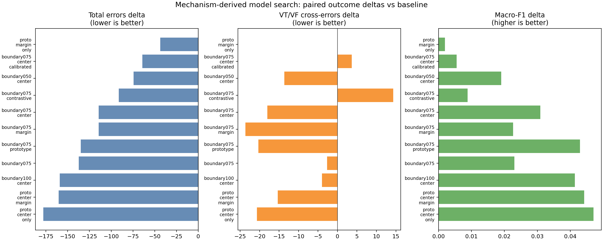
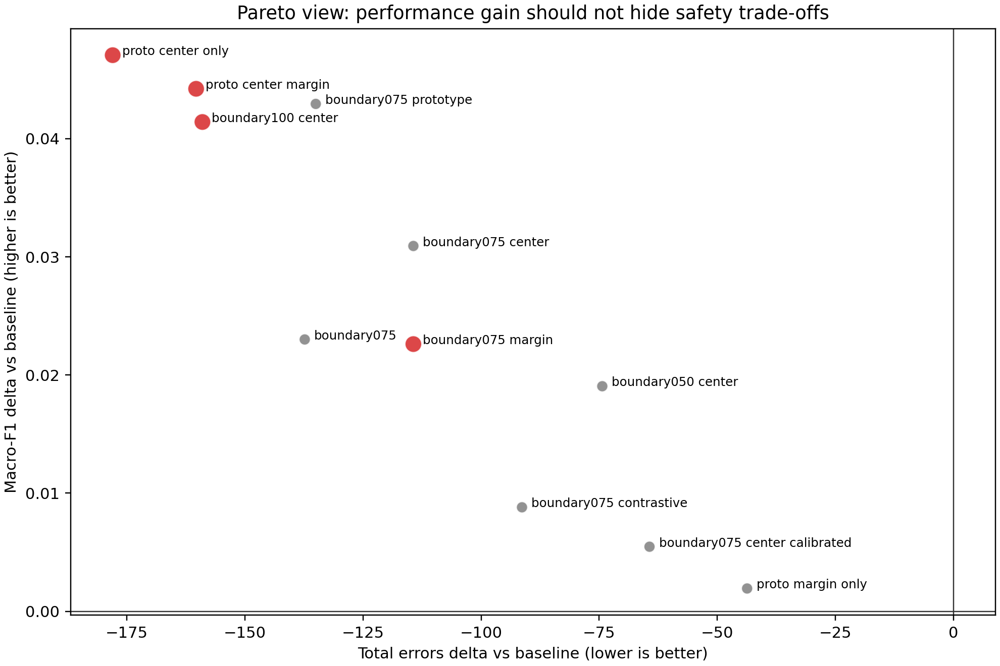
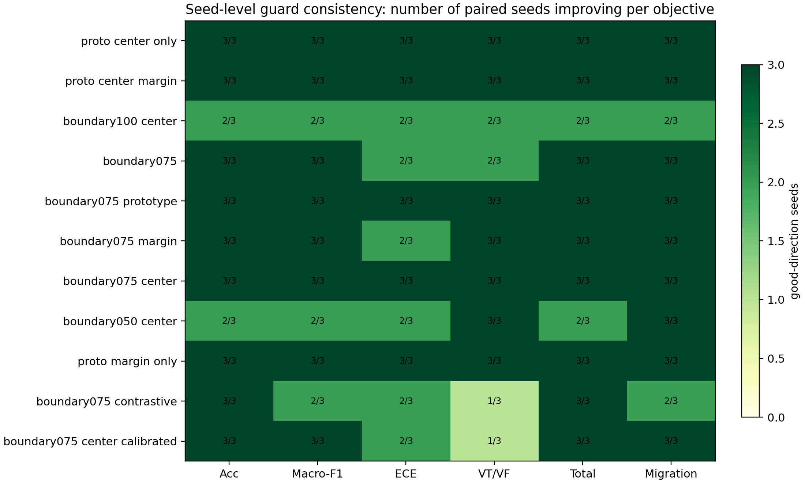
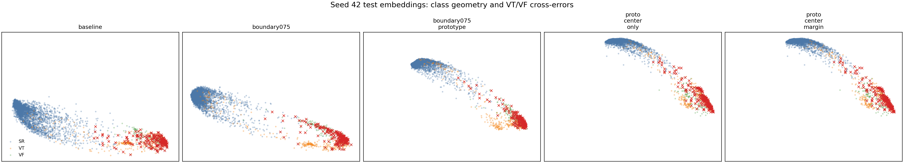

# Final Model Selection Report CN

## 一句话结论

本轮 `mechanism-derived` 搜索完成了 12 个候选配置、3 个 seed、共 36 个训练运行。结果显示：最终模型不应再理解为“把所有分析指标都塞进网络”，而应理解为“用大量机制分析生成候选干预，再用 outcome guard 筛出最小充分约束”。目前最有论文主模型价值的是 `proto_center_only`，因为它用最少的约束项在 3/3 paired seeds 上同时改善 accuracy、macro-F1、ECE、VT/VF cross-errors、total errors 和 error migration penalty。`proto_center_margin` 可作为第二候选或机制组合对照；原四项 `boundary075_prototype` 仍是重要历史模型和桥梁模型，但本轮结果提示它不是最小充分配置。

## 证据范围

- 结果目录：`results/mechanism_derived_model_search_3seed_20260701`
- 运行规模：12 candidates x 3 seeds = 36 runs
- 配对方式：每个候选与同 seed baseline 配对比较
- baseline：`reliability_gated_fusion` without extra model-layer constraint
- 核心 outcomes：accuracy、macro-F1、ECE、VT/VF cross-errors、total errors、error migration penalty

## 防止“拿自己的钥匙开自己的锁”

本项目确实做过这一层防护，但需要在论文里明确写出来。核心原则是：机制分析用于生成候选约束，最终模型选择不能只靠同一套机制指标自证成功。

具体做法有四点：

1. 数据划分层面：使用 record-level / duplicate-family split audit，避免同一来源记录或近重复窗口跨 train/test 造成泄漏。公开证据见 `results_public/tables/duplicate_family_*` 和 `dataset_split_statistics.csv`。
2. 机制发现层面：embedding、KNN local purity、prototype ambiguity、softmax entropy、waveform regularity 等只作为候选机制来源，不单独作为最终成功标准。
3. 干预验证层面：每个候选模型与同 seed baseline 做 paired comparison，只改变训练约束权重，观察 outcome delta。
4. 选择层面：最终选择依据是 outcome guard，包括 accuracy、macro-F1、ECE、VT/VF cross-errors、total errors 和 error migration penalty，而不是某一张 embedding 图或某一个机制变量变好。

因此，`proto_center_only` 被推荐为主候选，并不是因为它让 prototype/embedding 指标看起来更好，而是因为它在 matched-seed outcome guard 上同时改善六个目标。表征可视化仍然有用，但角色是解释机制，不是替代 outcome validation。

## 传统模型对照在论文中的位置

这份报告的核心是最终机制约束模型选择；传统模型负责论文前段的问题定义。CNN/CNN-LSTM 的 10-seed 证据说明：CNN-LSTM 能降低部分 VT/VF 互错并改善整体 embedding silhouette，但同时 accuracy、ECE 和 total errors 并不全面占优。因此传统模型不是最终答案，而是引出“VT/VF boundary confusion 需要机制解释和 outcome guard”的起点。

| model    |   accuracy |    ece |   embedding_silhouette |   macro_f1 |   total_errors |   vtvf_cross_errors |
|:---------|-----------:|-------:|-----------------------:|-----------:|---------------:|--------------------:|
| CNN      |     0.8649 | 0.067  |                 0.2822 |     0.5928 |          589.5 |               232.4 |
| CNN-LSTM |     0.8518 | 0.0747 |                 0.4102 |     0.6145 |          640.9 |               183.1 |

## 因果式定量分析如何表述

这里可以说“因果式机制验证”或“model-layer causal-style intervention analysis”，但不建议写成严格临床因果推断。更准确的表述是：

> We treated model constraints as intervenable variables and evaluated paired outcome changes under do(weight = value)-style interventions across matched seeds.

中文论文里可写为：

> 本文将训练约束权重视为可干预变量，在相同 seed / split 下比较不同权重组合对模型 outcome 的配对影响。该设计不能替代外部临床因果验证，但可以定量回答每个机制约束是否真正改善模型可靠性。

这正好回应“四个权重”的问题：`boundary075_prototype` 的四个项不是凭经验保留，而是可以被拆解为 boundary weighting、prototype center compactness、prototype margin 和 VT/VF margin target 等干预单元，再通过 outcome guard 判断哪些单元真正必要。

## 候选模型结果

| 候选模型                      |   Acc Δ |   Macro-F1 Δ |   ECE Δ |   VT/VF互错 Δ |   总错误 Δ |   迁移惩罚 Δ | Pareto   | Guard   | Full validation   |
|:------------------------------|--------:|-------------:|--------:|--------------:|-----------:|-------------:|:---------|:--------|:------------------|
| proto_center_only             |  0.0415 |       0.0471 | -0.0244 |         -20.7 |     -178   |       -109.3 | True     | True    | True              |
| proto_center_margin           |  0.0371 |       0.0442 | -0.0277 |         -15.3 |     -160.3 |        -94   | True     | True    | True              |
| boundary100_center            |  0.0377 |       0.0414 | -0.0306 |          -4   |     -159   |        -80.3 | True     | True    | True              |
| boundary075_margin            |  0.0266 |       0.0226 | -0.0096 |         -23.7 |     -114.3 |        -88.2 | True     | True    | True              |
| boundary075                   |  0.0318 |       0.023  | -0.0153 |          -2.7 |     -137.3 |        -77.5 | False    | True    | False             |
| boundary075_prototype         |  0.0317 |       0.0429 | -0.0183 |         -20.3 |     -135   |        -85   | False    | True    | False             |
| boundary075_center            |  0.0262 |       0.0309 | -0.0133 |         -18   |     -114.3 |        -70.8 | False    | True    | False             |
| boundary075_contrastive       |  0.0219 |       0.0088 | -0.0057 |          14.3 |      -91.3 |        -44.8 | False    | False   | False             |
| boundary050_center            |  0.0179 |       0.0191 | -0.0084 |         -13.7 |      -74.3 |        -55.3 | False    | True    | False             |
| boundary075_center_calibrated |  0.0149 |       0.0055 | -0.0139 |           3.7 |      -64.3 |        -33.7 | False    | False   | False             |
| proto_margin_only             |  0.0099 |       0.0019 | -0.0071 |           0   |      -43.7 |        -26.8 | False    | True    | False             |

## 候选模型绝对指标审计

| 模型                          |   Acc mean |   Macro-F1 mean |   ECE mean |   VT/VF互错 mean |   总错误 mean |   迁移惩罚 mean |
|:------------------------------|-----------:|----------------:|-----------:|-----------------:|--------------:|----------------:|
| baseline                      |     0.8918 |          0.6244 |     0.0754 |          194.667 |       474     |         304.333 |
| boundary075                   |     0.9236 |          0.6474 |     0.0602 |          192     |       336.667 |         226.833 |
| boundary075_prototype         |     0.9235 |          0.6673 |     0.0571 |          174.333 |       339     |         219.333 |
| proto_center_only             |     0.9332 |          0.6715 |     0.0511 |          174     |       296     |         195     |
| proto_center_margin           |     0.9289 |          0.6686 |     0.0478 |          179.333 |       313.667 |         210.333 |
| boundary075_center            |     0.9179 |          0.6553 |     0.0621 |          176.667 |       359.667 |         233.5   |
| boundary075_margin            |     0.9184 |          0.647  |     0.0659 |          171     |       359.667 |         216.167 |
| boundary100_center            |     0.9295 |          0.6658 |     0.0449 |          190.667 |       315     |         224     |
| boundary075_contrastive       |     0.9137 |          0.6332 |     0.0698 |          209     |       382.667 |         259.5   |
| boundary075_center_calibrated |     0.9067 |          0.6299 |     0.0615 |          198.333 |       409.667 |         270.667 |

## 机制到权重的桥梁

| analysis_finding                                                                    | mechanism                                 | model_terms                                                | tested_configs                                                                    | outcome_interpretation                                                                                                                               |
|:------------------------------------------------------------------------------------|:------------------------------------------|:-----------------------------------------------------------|:----------------------------------------------------------------------------------|:-----------------------------------------------------------------------------------------------------------------------------------------------------|
| VT/VF boundary samples concentrate dangerous errors.                                | Boundary-risk weighting                   | boundary_ce_weight                                         | boundary075; boundary075_center; boundary100_center; boundary075_prototype        | Boundary weighting improves total errors, but boundary075 alone only weakly reduces VT/VF cross-errors; it is not sufficient as the final mechanism. |
| Embedding neighborhoods are mixed and same-class samples are dispersed.             | Prototype-center compactness              | prototype_center_weight                                    | proto_center_only; proto_center_margin; boundary075_center; boundary075_prototype | This is the strongest minimal mechanism: proto_center_only improves all six outcomes in 3/3 paired seeds.                                            |
| VT/VF prototype ambiguity suggests insufficient inter-class separation.             | VT/VF prototype margin                    | prototype_margin_weight + prototype_vtvf_margin            | proto_margin_only; proto_center_margin; boundary075_margin; boundary075_prototype | Margin alone is weak; it can help in combination, but should not be treated as a standalone core explanation.                                        |
| Local purity and VT/VF neighborhood mixing are associated with outcome changes.     | Contrastive local-purity control          | contrastive_weight + contrastive boundary/negative anchors | boundary075_contrastive                                                           | Fails the guard in this search because VT/VF cross-errors increase despite some overall improvement.                                                 |
| Calibration and confident-risk mismatch remain visible in the uncertainty analysis. | Entropy / anti-confident risk calibration | risk_entropy_weight + anti_confident_risk_weight           | boundary075_center_calibrated                                                     | Does not pass the guard: calibration add-ons do not justify inclusion when VT/VF safety outcomes degrade.                                            |
| Waveform regularity and signal morphology are useful diagnostic evidence.           | Regularity / waveform evidence            | regularity auxiliary losses or routing evidence            | not retained in this 36-run final candidate set                                   | Kept as diagnostic/recover evidence, not as the selected model-layer training constraint.                                                            |

## 主模型建议

### 推荐主模型：`proto_center_only`

选择理由：

1. 它是最小充分机制：只引入 `prototype_center_weight=0.02`，但六个 outcome 全部 3/3 seeds 同向改善。
2. 它直接对应前期表征分析发现的核心问题：VT/VF 混淆不仅是边界样本难，而是 embedding 空间中同类样本不够紧凑、局部邻域混杂。
3. 它比 `boundary075` 更能解决 VT/VF 互错：`boundary075` 的 VT/VF cross-errors 平均只减少 2.7，而 `proto_center_only` 减少 20.7。
4. 它比原四项 `boundary075_prototype` 更适合作为博士申请叙事中的“机制筛选结果”：复杂模型有效，但经过拆解后发现 center compactness 是更核心、更小、更可解释的干预。

### 第二候选：`proto_center_margin`

`proto_center_margin` 同样通过 Pareto 和 guard，并且 ECE 改善更强。它适合作为“表征紧凑 + VT/VF 原型间隔”的组合模型，对照 `proto_center_only` 说明 margin 是否提供额外价值。

### 不建议作为主模型：`boundary075_prototype`

原四项模型仍然有价值：它证明 boundary + prototype 方向整体可行，并构成从旧版本到新版本的桥梁。但本轮 36-run 搜索中它没有进入 Pareto selected set，说明它不是最小充分模型。论文里应把它定位为“机制组合历史模型/桥梁模型”，而不是最终主张。

### 明确反例

`boundary075_contrastive` 和 `boundary075_center_calibrated` 很重要，因为它们证明“看起来合理的机制不一定可加入最终模型”。前者在整体指标上有一定改善，但 VT/VF cross-errors 平均增加 14.3，未通过 safety guard。这是论文中解释为什么需要 outcome-guarded multi-objective selection 的关键反例。

## 视觉证据

## 下一轮 full validation 建议

建议进入下一轮重点验证的不是所有模型，而是以下分层组合：

1. `proto_center_only`：主模型，验证最小充分机制是否稳定。
2. `proto_center_margin`：机制组合对照，验证 margin 是否提供额外收益。
3. `boundary075_prototype`：历史四项桥梁模型，保留作为旧模型对照。
4. `boundary075`：简单 boundary-risk 对照，说明单纯边界加权不够。
5. CNN / CNN-LSTM / GatedFusion baseline：放在论文主线前段，说明传统结构和无约束融合模型的局限。

`boundary100_center` 和 `boundary075_margin` 可以作为 supplementary sensitivity，不建议放在主线中心，因为它们虽然被 Pareto 选中，但解释性不如 `proto_center_only`，且 seed-level 稳定性或机制简洁性较弱。

## 限制

- 当前是 3-seed 内部验证，不是外部队列临床验证。
- 所有结论应表述为模型可靠性研究证据，不应表述为临床诊断性能声明。
- Pareto 选择依赖当前 outcome 定义；若未来加入外部数据、病人级 split 或更严格 review budget，最终模型仍需复核。
- 表征可视化是机制解释证据，不是单独成功标准；最终判断仍以 paired outcome guard 为准。
