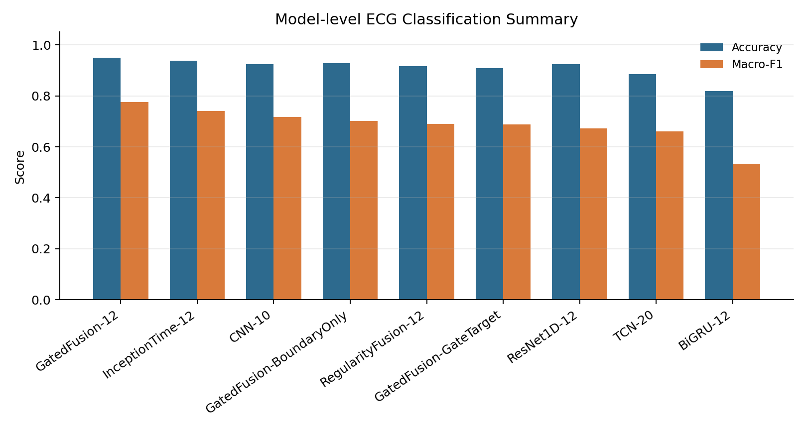
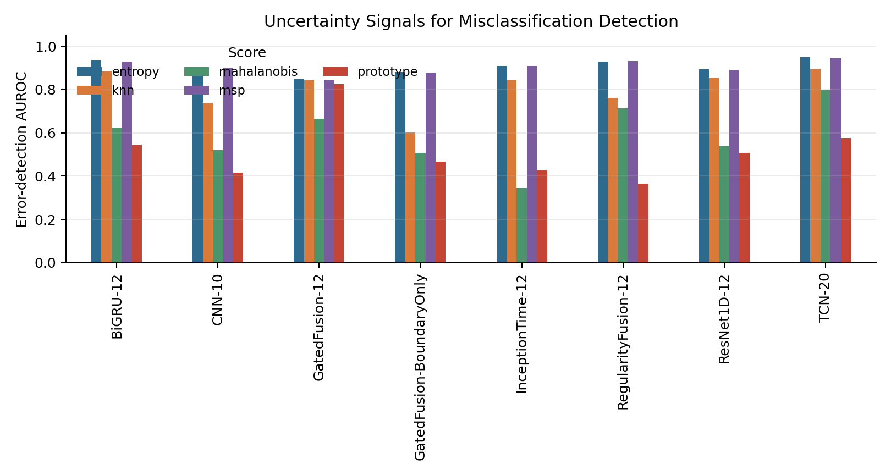

# Reliable ECG Classification Under Uncertainty

## 1. Research Question

This project studies reliable ECG rhythm classification under uncertainty. The
classification task has three labels: SR, VT, and VF. The medically important
failure mode is not just a wrong prediction in the aggregate test set. A more
specific concern is VT/VF cross-classification, where two ventricular rhythms
can occupy a close boundary in the learned representation space.

For the full experiment-by-experiment evidence narrative, see
[COMPLETE_EXPERIMENT_COMPENDIUM.md](COMPLETE_EXPERIMENT_COMPENDIUM.md). For the
extended public-safe figure atlas, see
[../results_public/figures_compendium/README.md](../results_public/figures_compendium/README.md).

The main research question is:

> Can an ECG classifier identify windows where its SR/VT/VF prediction is
> unreliable, so that high-risk VT/VF boundary cases can be routed for expert
> review?

The work is therefore framed as a reliability and review-routing prototype,
not as a clinical diagnostic system.

## 2. Data Protocol

The code expects a local MATLAB file named `RHYTHMS.mat` containing ECG records
for SR, VT, and VF. The raw ECG file is not redistributed in this repository.

Each ECG record is converted into fixed-length windows. The split is performed
at the record level, so windows from the same original ECG recording do not
appear across train, validation, and test sets.

Public summary statistics retained in this repository:

```text
results_public/summary_tables/dataset_split_statistics.csv
```

These statistics describe the aggregate split composition only. They do not
include raw ECG waveforms, record identifiers, model inputs, or window-level
predictions.

## 3. Method Overview

The pipeline has five stages:

1. ECG preprocessing and record-level splitting.
2. Baseline and extended time-series model training.
3. Uncertainty, calibration, and embedding-space reliability analysis.
4. VT/VF boundary-specific error analysis.
5. Selective prediction and review-routing evaluation.

The models include CNN, TCN, ResNet1D, InceptionTime, BiGRU, regularity-fusion
models, and reliability-gated variants. The analysis compares softmax-based
uncertainty with representation-space and ECG-specific signals such as kNN
distance, Mahalanobis distance, local neighbourhood instability, VT/VF
ambiguity, and rhythm regularity features.

For the code order, see [EXPERIMENT_PIPELINE.md](EXPERIMENT_PIPELINE.md).

## 4. Classification And Representation Evidence

The model-level summary shows that high overall accuracy does not remove the
need for reliability analysis. Macro-F1 and class-specific behaviour remain
important because SR is more frequent and easier to separate than the VT/VF
boundary.



The embedding geometry analysis supports the same conclusion. Across the
selected models, the normalised VT/VF centroid distance is much smaller than
the SR-VT or SR-VF distances. This suggests that VT and VF form the most
important boundary for uncertainty-aware analysis.


The corresponding aggregate table is:

```text
results_public/summary_tables/model_performance_and_geometry.csv
```

## 5. Uncertainty And Calibration

The project compares several uncertainty scores:

- maximum softmax probability and entropy;
- temperature-scaled confidence;
- energy score;
- prototype distance;
- Mahalanobis distance;
- kNN embedding distance;
- hybrid decision/embedding scores.

Softmax-based scores are strong for detecting ordinary misclassifications in
some models, while embedding-based scores add complementary information about
atypical samples and distribution shift. The evidence does not justify a simple
claim that one uncertainty family is always superior. The safer conclusion is
that different scores detect different failure mechanisms.



Public table:

```text
results_public/summary_tables/uncertainty_error_detection.csv
```

## 6. Review-Oriented Reliability

The project evaluates uncertainty as a decision policy, not just as a plot. A
review-routing policy ranks ECG windows by boundary-aware risk. The lower-risk
subset is accepted automatically, while the higher-risk subset is routed for
expert review.

This directly tests the practical reliability question:

> If only 10-30% of ECG windows can be reviewed, how many VT/VF boundary errors
> can be captured?


Representative aggregate result:

- CNN-10 captured about 91.7% of VT/VF boundary errors at a 20% review budget.
- TCN-20 captured about 93.7% at the same budget.
- RegularityFusion-12 captured about 96.5% at the same budget.
- ResNet1D-12 had higher classification strength in some settings, but weaker
  low-budget VT/VF error capture, illustrating that a stronger backbone is not
  automatically a more reliable review-ranking model.

Public table:

```text
results_public/summary_tables/review_routing_boundary_lrii.csv
```

## 7. Multi-Seed And Paired Evidence

The current paired comparison uses three random seeds. This is enough to show
the direction of several effects, but it is not enough for strong clinical or
deployment claims.

The public paired summaries are:

```text
results_public/summary_tables/paired_classification_comparisons.csv
results_public/summary_tables/paired_review_routing_comparisons.csv
```

One representative finding is that prototype-separation training improved mean
accuracy and macro-F1 across the three paired seeds, while reducing the mean
error rate in the automatically accepted subset. However, confidence intervals
are still wide for some comparisons. These results should be interpreted as
preliminary research evidence.

## 8. What This Repository Demonstrates

This repository demonstrates:

- a complete PyTorch ECG classification pipeline;
- record-level splitting and leakage-aware data handling;
- uncertainty and calibration evaluation;
- embedding-space reliability analysis;
- VT/VF boundary-specific ambiguity analysis;
- review-routing metrics that connect uncertainty to expert workload;
- cautious aggregate reporting with multi-seed summaries.

The main research contribution is not a single model. It is the reliability
framing: the project asks whether the model can identify the ECG windows where
automation is least trustworthy.

## 9. Negative Results

The project includes negative and mixed results because they are part of the
research evidence.

- Stronger classification did not always imply stronger review routing.
  ResNet1D-12 was competitive as a classifier, but at a 10% review budget it
  captured only 38.3% of VT/VF boundary errors under the Boundary-LRII policy.
- Some uncertainty scores were weak for ordinary error detection. The energy
  score was especially poor in the selected public summary, and prototype or
  Mahalanobis distances were not consistently strong for CNN error detection.
- Multi-source risk evidence was not automatically better. Hand-weighted
  combinations can dilute the VT/VF boundary signal if the weights are not
  aligned with the review objective.
- Several paired comparisons remain statistically uncertain because they use
  three seeds. Some confidence intervals cross zero, so the evidence should be
  treated as preliminary.
- Calibration is useful but not sufficient. Temperature scaling and ECE should
  be interpreted alongside review capture, OOD response, and boundary errors.

These results make the project more useful as a research prototype: they show
where the reliability hypothesis held, where it weakened, and which assumptions
need stronger validation.

## 10. Limitations

The current evidence is limited in several important ways:

- The dataset is internal/restricted and is not externally validated here.
- The public repository does not redistribute the raw ECG data.
- Current corruption tests are synthetic and do not replace real external OOD
  validation.
- The paired intervention evidence uses three seeds.
- Window-level evaluation is not patient-level diagnosis.
- The project is not clinically validated and is not a medical device.

These limitations are part of the research record rather than something to hide.
They define the next validation steps.

## 11. Next Steps

The most important next steps are:

1. Validate on an external ECG dataset with a clearly documented licence.
2. Extend the paired seed count and report record-balanced uncertainty.
3. Audit duplicate-family splits and retrain the core baselines under that
   protocol.
4. Compare fixed review budgets against clinically meaningful review workflows.
5. Convert the strongest reliability signals into a small, deployable risk head
   while keeping the evaluation separated from training and validation choices.

