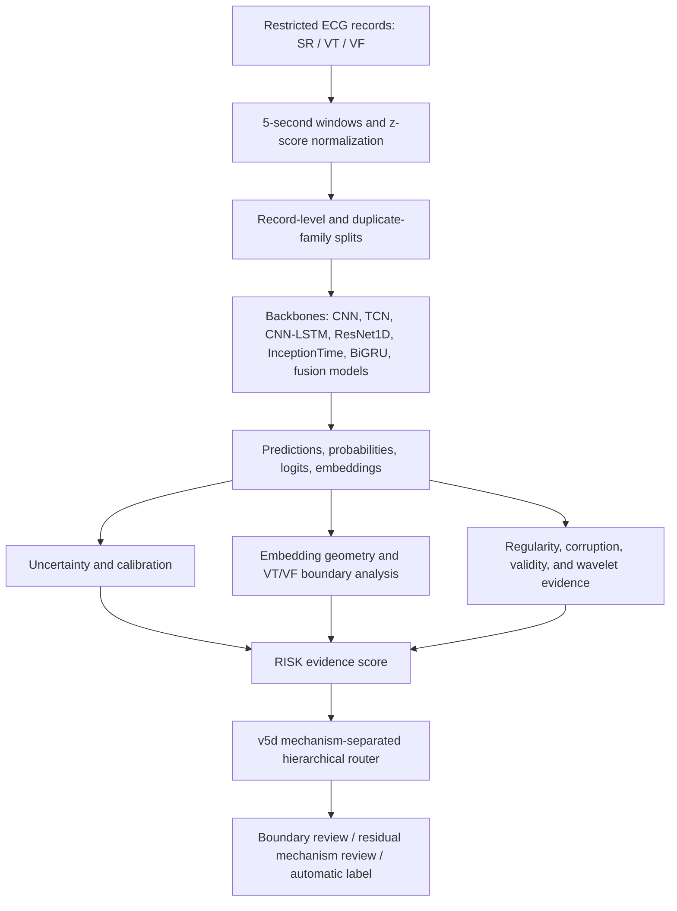
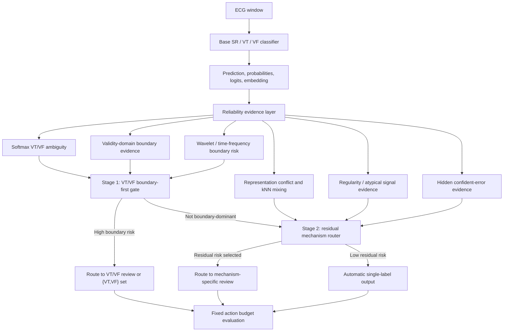

# Method Overview

This project is organized around a reliability question:

> When should an ECG classifier avoid automatic single-label acceptance and
> request review?

## Pipeline

## Reliability Evidence Families

| Signal family | Examples | Reliability question |
| --- | --- | --- |
| Decision uncertainty | MSP, entropy, temperature scaling | Is the classifier uncertain about its own decision? |
| Boundary ambiguity | VT/VF probability ambiguity, VT/VF neighborhood mixing | Is the sample near the fragile VT/VF boundary? |
| Embedding atypicality | kNN atypicality, prototype distance, center distance | Is the sample far from familiar training representations? |
| Representation conflict | layerwise shifts, prototype disagreement, model disagreement | Is the internal evidence inconsistent? |
| Signal structure | regularity, spectral entropy, autocorrelation, wavelet features | Does the ECG morphology suggest ambiguity or degradation? |
| Robustness evidence | corruption response, OOD-style perturbations | Does reliability degrade under plausible signal shifts? |
| Validity-domain evidence | local validity maps and boundary validity | Is the prediction inside a region where the model is usually reliable? |

## Model Interventions

The project tests whether the failure can be solved inside the model:

- CNN and TCN baselines establish ordinary time-series classification.
- CNN-LSTM tests whether explicit temporal recurrence improves boundary
  behavior.
- PRO/prototype separation tests whether class-center structure can reduce
  boundary errors.
- ProRisk/Risk-Pro-readable adds reliability-oriented constraints.
- CNN-TCN-Validity and wavelet variants test whether validity-domain and
  time-frequency boundary evidence help the model.

The main lesson is careful: model-side structure can improve some evidence,
but representation improvement alone does not guarantee safer VT/VF decisions.
Embedding-derived evidence is therefore used as a validated routing signal, not
as a standalone proof that a representation-regularized classifier is safer.

## Final Decision Policy

RISK is the evidence layer. It aggregates reliability evidence into a
review-priority signal.

v5d is the policy layer. It separates two decisions:

1. VT/VF boundary-first routing for samples that should be treated as boundary
   risk or `{VT,VF}` prediction-set cases.
2. Residual mechanism routing for SR-ventricular confusion, representation
   conflict, atypical signal behavior, and hidden confident errors.

This is why the final method is described as mechanism-separated hierarchical
review routing, not as a single uncertainty score.

The routing policy is also stress-tested internally. Validation downsampling
and duplicate-family cluster concentration audits are used to check whether the
result is only caused by a favorable validation split or one dominant cluster.
These tests do not replace external validation, but they strengthen the
internal reliability claim.

## Evaluation Views

- classification metrics: accuracy, macro-F1, sensitivity, specificity;
- calibration metrics: ECE and reliability diagrams;
- uncertainty metrics: error-detection AUROC/AUPR;
- embedding geometry: class-center distances and projection diagnostics;
- robustness: ECG-like corruption and OOD-style perturbations;
- selective prediction: coverage-risk behavior;
- review routing: error capture at fixed action budgets;
- explanation reliability: whether each evidence family matches its intended
  error mechanism.

This is still a research prototype. It is intended to test reliability
concepts, not to make clinical claims.
