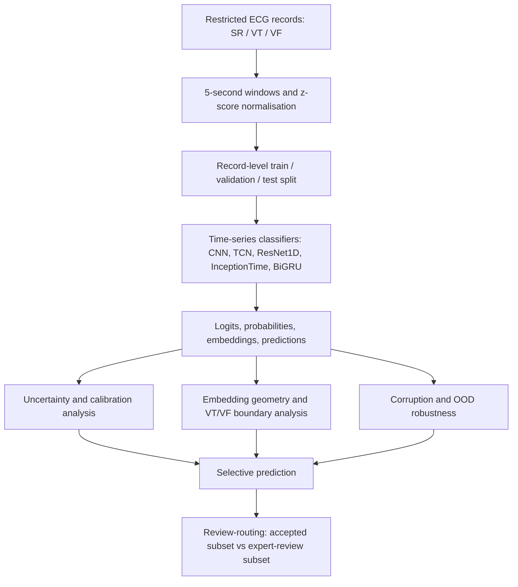

# Method Overview

This project is organised around a reliability question:

> When should an ECG classifier avoid automatic acceptance and request review?

## Pipeline

## Reliability Signals

The repository compares several reliability signals:

| Signal family | Examples | Reliability question |
|---|---|---|
| Decision uncertainty | MSP, entropy, temperature scaling | Is the classifier uncertain about its own decision? |
| Embedding atypicality | kNN, Mahalanobis, prototype distance | Is the window far from familiar training representations? |
| Boundary ambiguity | VT/VF probability ambiguity, VT/VF neighbourhood mixing | Is the model near the clinically important ventricular boundary? |
| Local instability | Neighbourhood disagreement and perturbation sensitivity | Is the prediction stable under local evidence? |
| ECG regularity | Rhythm/frequency regularity features | Do handcrafted signal features explain reliability failures? |

## Main Evaluation Views

The project evaluates reliability from multiple angles:

- classification metrics: accuracy, macro-F1, sensitivity, specificity;
- calibration metrics: ECE and reliability diagrams;
- uncertainty metrics: error-detection AUROC/AUPR;
- embedding geometry: class-centroid distances and projection diagnostics;
- OOD/corruption tests: sensitivity to ECG-like perturbations;
- selective prediction: coverage-risk behaviour;
- review routing: error capture at fixed expert-review budgets.

## Why Review Routing Matters

Reporting an uncertainty score is not enough. A clinically motivated reliability
analysis should ask how uncertainty changes the decision policy. This project
therefore measures how many high-risk VT/VF boundary errors can be captured when
only a limited fraction of windows is routed for review.

This is still a research prototype. It is intended to test reliability concepts,
not to make clinical claims.

