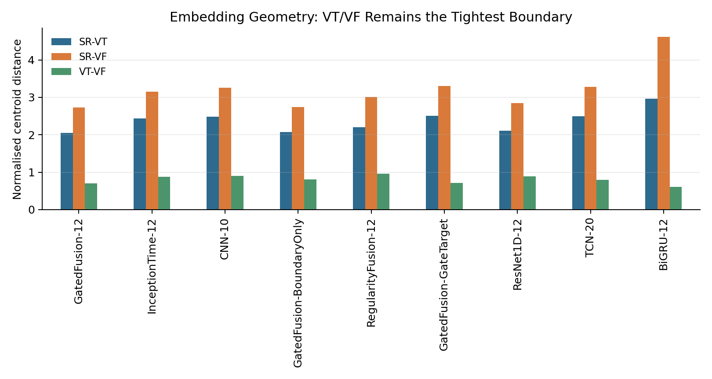
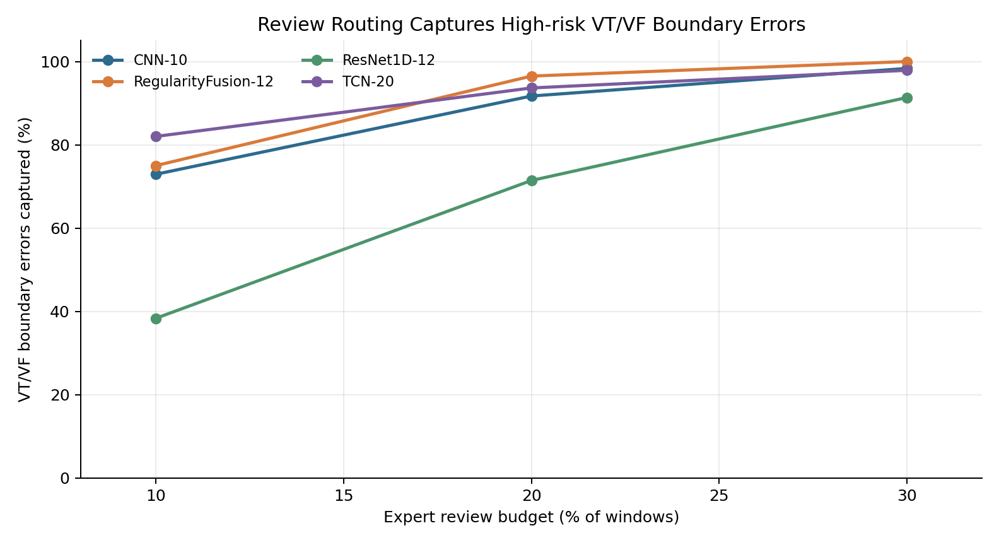
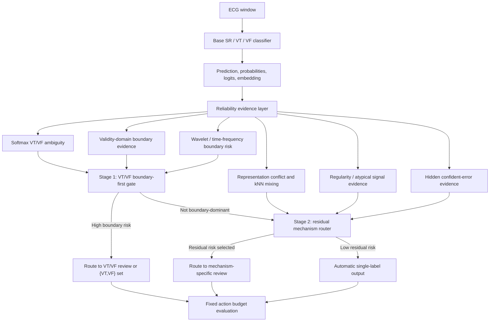

# Research Report

Reliable ECG Classification Under Uncertainty

This report summarizes the public, research-safe version of the project. It is
written for a reader who has not seen the local experiment archive and needs to
understand the full experimental logic: why the project was designed, what was
tested, what improved, what failed, and what remains unproven.

The project is a research prototype only. It is not a diagnostic system, not a
medical device, and not evidence of clinical validation.

## How To Read This GitHub Version

The public repository preserves the research evolution, so some tables and
figures come from earlier V3/V4/V5 experiment versions. Those earlier results
are useful as historical evidence, but they are not all final claims.

For final GitHub interpretation, use the V6 duplicate-family evidence:

- duplicate-family split and leakage audit define the stricter final protocol;
- PRO is treated as a boundary intervention that can reveal error migration,
  not as a stable standalone performance improvement;
- validation-selected deployable RISK is treated as a core evidence score, while
  v5d mechanism-separated hierarchical routing is the final decision policy;
- older paired PRO tables are retained as historical context unless a table name
  explicitly says `duplicate_family`.

## Project Logic At A Glance

The project did not begin as a routing system. It began as a standard
short-window SR/VT/VF classification problem, then gradually changed shape as
the failure evidence became clearer.

The first observation was that aggregate accuracy hid the most important
failure mode. In learned representation space, `SR` was generally easier to
separate from ventricular rhythms, while `VT` and `VF` were much closer to each
other. This made the VT/VF boundary the central reliability problem.

The second step was to test whether this was only an artifact of one neural
network. Multiple model families were trained, including CNN, TCN, ResNet1D,
InceptionTime, BiGRU, regularity-fusion models, gated-fusion models, and
temporal variants such as CNN-LSTM. These models showed that better aggregate
classification did not automatically mean safer VT/VF behavior.

The third step was to analyze the failures in detail. The project measured
embedding geometry, PCA structure, normalized class-center distance, kNN
neighborhood atypicality, local VT/VF mixing, prototype distance, calibration,
softmax ambiguity, OOD corruption response, ECG regularity, validity-domain
evidence, and wavelet/time-frequency boundary evidence. These analyses produced
many candidate reliability signals, but they also exposed an important
limitation: a representation that looks more separated is not necessarily a
representation that reduces VT/VF misclassification.

The fourth step was to test whether the model itself could be structurally
improved. This included prototype/PRO intervention, ProRisk/Risk-Pro-readable
constraints, RISK-aware or reliability-privileged variants, CNN-LSTM and
CNN/TCN-style temporal upgrades, validity-domain evidence, and
wavelet/time-frequency boundary modeling. The result was mixed. Some models
improved geometry or reduced selected boundary errors, but other runs showed
error migration. In other words, the project found that "making the embedding
look better" is not a sufficient safety criterion.

The fifth step was therefore a change in research objective. Instead of asking
only how to force the classifier to make every label correctly, the project
asked which predictions should not be automatically trusted. This produced the
RISK evidence score: a review-priority signal distilled from multiple
reliability mechanisms.

The final step was the v5d router. RISK remained the evidence layer, but the
decision policy became mechanism-separated and hierarchical. The first branch
handles VT/VF boundary risk using softmax ambiguity, validity-domain boundary
evidence, and wavelet/time-frequency boundary risk. The second branch reserves
part of the action budget for residual mechanisms such as SR-ventricular
confusion, representation conflict, atypical signal evidence, and hidden
confident errors.

This is the final project narrative:

```text
SR/VT/VF classification
  -> VT/VF boundary discovered as the fragile region
  -> CNN/TCN/CNN-LSTM and other backbones tested
  -> embedding, uncertainty, regularity, OOD, validity, and wavelet evidence extracted
  -> ProRisk, PRO, constrained, and structured models tested
  -> negative lesson: representation improvement does not guarantee safer VT/VF decisions
  -> RISK evidence score built for review prioritization
  -> v5d mechanism-separated hierarchical routing used as final policy
```

The research contribution is therefore not just "a better ECG classifier." It
is an evidence-to-decision framework for review-oriented reliability under
internal validation.

## 1. Research Question

The task is short-window ECG classification into three rhythm classes:

- `SR`: sinus or non-ventricular rhythm;
- `VT`: ventricular tachycardia;
- `VF`: ventricular fibrillation.

The central research question is not only whether a neural network can classify
these windows accurately. The more important question is:

> Can the model recognize when its own SR/VT/VF prediction is unreliable, and
> can high-risk VT/VF boundary cases be routed to expert review under a fixed
> review budget?

This framing changes the project from ordinary classification into
review-oriented reliability analysis. A model can have high overall accuracy
while still making dangerous VT/VF boundary errors. The project therefore
evaluates accuracy, calibration, uncertainty, embedding geometry, signal
regularity, corruption robustness, and review-routing behavior together.

## 2. Experimental Roadmap

The experiments are organized into eleven stages.

| Stage | Purpose | Main evidence |
| --- | --- | --- |
| 1. Data protocol and leakage audit | Make the split defensible before trusting metrics. | Record-level split, duplicate-family audit, public split table. |
| 2. Backbone training | Establish classification baselines across model families. | CNN, TCN, CNN-LSTM style temporal variants, ResNet1D, InceptionTime, BiGRU, fusion variants. |
| 3. Embedding and PCA analysis | Inspect whether VT/VF errors have representation structure. | PCA, LDA, 3D projections, normalized class distances. |
| 4. Uncertainty and selective prediction | Test whether confidence scores detect errors and support abstention. | MSP, entropy, temperature-scaled confidence, energy, coverage-risk curves. |
| 5. OOD and corruption robustness | Test whether reliability scores respond to ECG-like signal degradation. | Noise, baseline drift, masking, spikes, amplitude and mixed corruptions. |
| 6. Regularity interpretability | Connect reliability to ECG signal structure. | Rhythm/frequency features and regularity ablations. |
| 7. Structured model interventions | Test whether representation structure can be changed and whether errors migrate. | PRO, ProRisk/Risk-Pro-readable constraints, temporal upgrades, validity and wavelet boundary evidence, plus duplicate-family error-migration analysis. |
| 8. RISK review scoring | Distil multi-source reliability evidence into a deployable review score. | Validation-selected risk head, fixed-budget capture, six-error analysis. |
| 9. v5d hierarchical routing | Convert evidence scores into mechanism-separated review decisions. | Boundary-first routing plus reserved residual budget. |
| 10. Frozen encoder comparison | Test whether a label-free frozen ECG encoder is worth promoting into the pipeline. | Lightweight self-supervised encoder, frozen classifier/risk heads. |
| 11. Explanation reliability audit | Test whether explanations align with the error mechanisms they claim to justify. | Evidence-family AUROC/AUPR, top-budget capture, route-level precision. |

## 3. Stage 1: Data Protocol And Leakage Control

The code expects a local `RHYTHMS.mat` file containing SR, VT, and VF ECG
records. The raw data are not redistributed in this repository.

The split is record-level rather than window-level. This matters because
adjacent windows from the same ECG record can be highly correlated. A
window-level split would risk train-test leakage and would make reliability
metrics look stronger than they really are.

The later V6 upgrade adds a stricter duplicate-family perspective. The purpose
is to handle the possibility that identical or near-identical ECG windows can
connect different records. Instead of treating those records as independent,
duplicate-family grouping keeps connected records inside the same split group.
This makes the final interpretation more conservative.

The final duplicate-family audit grouped 594 source records into 591
exact-duplicate-connected families. For seeds 42, 43, and 44, the pairwise
train/validation/test audits found zero record overlap, zero duplicate-family
overlap, and zero exact-window hash overlap.

Public evidence:

- `results_public/tables/dataset_split_statistics.csv`
- `results_public/tables/duplicate_family_baseline_pro_summary.csv`
- `src/audit_data_protocol.py`
- `src/audit_duplicate_family_splits.py`
- `src/duplicate_leakage_sensitivity.py`

## 4. Stage 2: Backbone Training And Classification Baselines

The first modeling stage compares several time-series architectures rather than
depending on one backbone. This is important because a reliability conclusion is
weak if it only appears for one model family.

The backbone stage was also the first test of the user's model-structure
question. CNN and TCN baselines established ordinary convolutional and temporal
convolutional behavior. CNN-LSTM style variants then tested whether adding an
explicit recurrent temporal component could reduce boundary confusion. The
answer was useful but not sufficient: temporal structure can improve some
VT/VF cross-error behavior and embedding summaries, but it does not remove the
need for boundary-aware reliability routing.

Public summary:


Selected aggregate results:

| Model | Accuracy | Macro-F1 | ECE | Interpretation |
| --- | ---: | ---: | ---: | --- |
| CNN-10 | 92.4% | 71.6% | 1.6% | Strong baseline and useful review-routing behavior. |
| TCN-20 | 88.6% | 66.0% | 2.3% | Lower accuracy, but strong VT/VF review capture. |
| ResNet1D-12 | 92.4% | 67.3% | 6.0% | Competitive classifier, weaker under review-budget routing. |
| InceptionTime-12 | 93.9% | 74.1% | 1.4% | Strong classification baseline. |
| BiGRU-12 | 81.9% | 53.4% | 9.5% | Weaker baseline in this setup. |
| RegularityFusion-12 | 91.6% | 69.1% | 3.0% | Useful bridge between signal features and reliability. |
| GatedFusion-12 | 94.9% | 77.5% | 2.9% | Best public aggregate classifier, but accuracy alone is not the final objective. |

Main conclusion: classification quality is necessary, but it is not enough. The
project continues by asking whether the models know when not to trust
themselves.

## 5. Stage 3: Embedding Geometry, PCA, And VT/VF Boundary Analysis

The embedding analysis asks whether the learned feature space explains why some
errors occur. PCA and related projections are used as diagnostic tools, not as
proof of separability.

The key question is:

> Are VT and VF locally mixed in the model's representation space, and do
> boundary errors concentrate in those mixed regions?

The answer is important because it motivates later stages. If the error is
structural, then the project should not only tune hyperparameters. It should
study boundary-aware reliability signals, representation interventions, and
review routing.

Public summary:



Full public PCA/projection evidence:

- `results_public/figures/01_embedding_pca/contact_sheet.png`
- `results_public/figures/01_embedding_pca/`

Interpretation:

- SR is generally easier to separate from ventricular rhythms than VT and VF
  are from each other.
- VT/VF ambiguity is not just a metric artifact. It appears in local
  representation structure.
- PCA and 3D projections support the research narrative, but they should be
  interpreted as explanatory evidence rather than standalone statistical proof.

## 6. Stage 4: Uncertainty, Calibration, Selective Prediction, And Conformal Baselines

This stage evaluates whether confidence and uncertainty scores identify model
errors. It compares softmax confidence, entropy, temperature-scaled confidence,
energy score, embedding distance, local neighborhood evidence, and conformal
prediction sets.

Public summary:


Representative error-detection AUROC values:

| Model | MSP AUROC | Entropy AUROC | Energy AUROC | Interpretation |
| --- | ---: | ---: | ---: | --- |
| CNN-10 | 0.902 | 0.899 | 0.100 | Confidence scores work; energy is weak/inverted here. |
| TCN-20 | 0.947 | 0.949 | 0.052 | Strong softmax uncertainty; energy fails. |
| ResNet1D-12 | 0.892 | 0.893 | 0.112 | Useful confidence signal with weaker calibration profile. |
| RegularityFusion-12 | 0.932 | 0.930 | 0.070 | Strong uncertainty ranking. |
| GatedFusion-12 | 0.846 | 0.847 | 0.150 | Strong classifier, but not the strongest uncertainty ranker. |

Main conclusion: uncertainty is not one thing. Softmax-based scores can be
strong for ordinary error detection, while embedding and neighborhood scores
help interpret atypicality and boundary mixing. Energy score is a clear
negative result in these summaries.

Conformal prediction is included as a baseline for set-valued prediction. For
VT/VF ambiguity, a set such as `{VT, VF}` can be more honest than forcing one
label. However, conformal validity and fixed-budget review capture answer
different questions, so both are reported.

## 7. Stage 5: OOD And Corruption Robustness

Clean test metrics do not show what happens when ECG quality degrades. This
stage applies ECG-like perturbations such as noise, baseline drift, masking,
spikes, amplitude changes, clipping, and mixed degradation.

Public evidence:

- `results_public/figures/04_ood_corruption/contact_sheet.png`
- `results_public/figures/08_risk_corruption_robustness/contact_sheet.png`
- `src/evaluate_ood.py`
- `src/evaluate_corruption_severity.py`
- `src/evaluate_risk_corruption_robustness.py`

The V5 upgrade adds a dedicated RISK corruption experiment. The model obtains
embeddings from progressively corrupted ECG windows, the RISK head produces a
review score, and the analysis asks three questions:

1. does the RISK score rise as degradation severity increases?
2. does RISK still rank corrupted prediction errors?
3. how many errors are captured at 10%, 20%, and 30% review budgets?

Main conclusion: RISK is degradation-sensitive under many corruptions, but
severe clipping, strong noise, and mixed degradation remain difficult. The
project therefore does not claim solved OOD robustness.

## 8. Stage 6: ECG Regularity And Interpretability

The regularity branch asks whether signal-level rhythm structure helps explain
model reliability. VT and VF are not arbitrary labels; they differ in rhythm
regularity and signal morphology. The project therefore evaluates features such
as spectral entropy, dominant frequency, autocorrelation structure, and related
regularity descriptors.

Public evidence:

- `results_public/figures/03_regularity_interpretability/contact_sheet.png`
- `src/regularity_analysis.py`
- `src/regularity_feature_ablation.py`
- `src/feature_only_analysis.py`

Main conclusion: regularity features do not replace learned embeddings, but
they make the reliability story more interpretable. They help explain why some
short windows are unstable: the signal itself may be morphologically ambiguous,
irregular, degraded, or locally atypical.

## 9. Stage 7: Structured Model Interventions And PRO Boundary Analysis

This stage tested whether the model architecture or training objective could
solve the VT/VF problem directly. It included PRO/prototype separation,
ProRisk/Risk-Pro-readable constraints, RISK-aware or reliability-privileged
variants, CNN-LSTM and CNN/TCN-style temporal upgrades, validity-domain
evidence, and wavelet/time-frequency boundary evidence.

PRO was introduced to test whether the VT/VF embedding boundary can be improved
through prototype or center-separation style intervention. The broader purpose
of this stage was not only to improve a metric. It was to test whether the
failure mechanism identified by the embedding analysis could be corrected
inside the model itself.

The mature interpretation is careful:

- In earlier evidence, PRO reduced automatic-route VT/VF errors and improved
  some representation-geometry summaries.
- V5 reframed PRO as boundary-structure mitigation, not merely a prototype
  loss.
- V6 made the conclusion more conservative: under stricter duplicate-family
  evidence, PRO can expose error migration. It may reduce one error direction
  while increasing another.
- The temporal and constrained variants are therefore treated as mechanism
  probes as well as candidate models. Their value is that they show which
  reliability evidence is useful, and where model-side correction is still not
  enough.

Public evidence:

- `results_public/figures/06_pro_geometry/contact_sheet.png`
- `results_public/figures/09_pro_boundary_mitigation/contact_sheet.png`
- `results_public/figures/10_v6_pro_error_migration/contact_sheet.png`
- `results_public/tables/paired_classification_comparisons.csv`
- `results_public/tables/paired_review_routing_comparisons.csv`

The older paired three-seed summary for prototype separation is retained as
historical evidence from an earlier split:

| Metric | Baseline mean | PRO mean | Mean difference | 95% CI | Interpretation |
| --- | ---: | ---: | ---: | --- | --- |
| Accuracy | 0.892 | 0.929 | +0.037 | -0.016 to 0.091 | Promising, but CI crosses zero. |
| Macro-F1 | 0.624 | 0.669 | +0.044 | 0.024 to 0.064 | Consistent positive signal across three seeds. |
| VT/VF cross-errors | 194.7 | 179.3 | -15.3 | -40.8 to 10.2 | Directionally useful, not definitive. |
| Automatic-route VT/VF cross-errors | 41.3 | 13.3 | -28.0 | -71.0 to 15.0 | Safety-relevant improvement, but still small-n evidence. |

Under the stricter duplicate-family split, the final interpretation changes.
The baseline/teacher achieved mean accuracy 0.9451, macro-F1 0.7603, ECE
0.0274, and 140.7 VT/VF cross-errors across three seeds. PRO achieved mean
accuracy 0.9148, macro-F1 0.7162, ECE 0.0651, and 160.0 VT/VF cross-errors.
The seed-level changes also showed error migration: for example, seed 44
reduced VT/VF cross-errors from 60 to 56 but increased `SR_to_VT` errors from
28 to 354.

Final conclusion: PRO is best presented as a boundary-structure analysis. It
shows that the representation boundary can be manipulated, but it is not a
stable standalone solution under the stricter split. This result motivates
review-routing supervision rather than weakening the project.

### Why Embedding Evidence Is Diagnostic, Not A Guaranteed Fix

The project uses embedding evidence in two different ways, and the distinction
is essential.

As analysis, embedding geometry is useful. PCA, class-center distances, kNN
mixing, prototype conflict, and layerwise representation diagnostics expose
where the model is likely to confuse VT and VF. These signals can then be
tested against downstream error capture. In that role, embedding evidence is a
mechanism diagnosis and a routing feature.

As a direct model-improvement objective, embedding geometry is weaker. The
structured intervention results show why. A model can make the representation
space look more regular while preserving or even stabilizing the wrong
decision regions. This means "better separated embeddings" and "safer VT/VF
classification" are related hypotheses, not the same claim.

The final interpretation is therefore careful:

- embedding analysis helps identify the kind of failure;
- embedding-derived signals can help route uncertain samples;
- embedding regularization alone is not accepted as proof that the classifier
  has become safer.

## 10. Stage 8: RISK As Reliability-Privileged Knowledge Distillation

RISK is a core evidence layer because it directly matches the review-routing
objective. In the final framing, however, RISK is not the whole method. It is
one important review-priority signal inside a broader decision policy.

The idea is to use rich reliability evidence during training or analysis:

- entropy;
- local instability;
- VT/VF neighborhood mixing;
- KNN atypicality;
- softmax VT/VF ambiguity;
- embedding-neighborhood evidence.

These signals are distilled into a lightweight risk head. At deployment time,
the classifier embedding is sufficient to produce a review-priority score.

This is why the project frames RISK as reliability-privileged knowledge
distillation rather than as another ordinary classifier.

Public review-routing evidence:



VT/VF boundary error capture at 20% review burden:

| Model | VT/VF error captured | All error captured | Automatic-route error rate |
| --- | ---: | ---: | ---: |
| CNN-10 | 91.7% | 73.4% | 2.54% |
| TCN-20 | 93.7% | 79.9% | 2.87% |
| ResNet1D-12 | 71.4% | 73.2% | 2.54% |
| RegularityFusion-12 | 96.5% | 68.4% | 3.31% |

Public RISK evidence:

- `results_public/figures/05_risk_supervisor_ablation/contact_sheet.png`
- `results_public/figures/11_v6_risk_distillation/contact_sheet.png`
- `results_public/tables/duplicate_family_selected_risk_review_aggregate.csv`
- `results_public/tables/duplicate_family_risk_error_type_capture_mean_std.csv`
- `results_public/tables/duplicate_family_risk_record_cluster_ci.csv`
- `src/generate_risk_targets.py`
- `src/select_deployable_risk_weights.py`
- `src/train_embedding_risk_head.py`
- `src/risk_head_review_analysis.py`

Under the final duplicate-family protocol, validation-selected deployable RISK
captured 82.8% of VT/VF cross-errors at a 10% review burden and 100.0% at 20%
and 30% review burdens across the three paired seeds. Mean error AUROC was
0.9215, mean VT/VF-error AUROC was 0.9596, and mean risk-target Spearman
correlation was 0.7520.

RISK also exposes residual limitations. At 20% review burden, VT-to-SR and
VF-to-SR capture were weaker than VT/VF boundary capture, and seed 42 had a
wider record-cluster bootstrap lower bound for VT/VF capture. The result should
therefore be written as strong internal review-routing evidence, not clinical
validation.

Main conclusion: RISK is not a diagnosis. It is a review-priority signal. The
research value is that it connects multiple reliability mechanisms to a
decision policy.

## 11. Stage 9: v5d Mechanism-Separated Hierarchical Routing

The final decision policy is v5d: mechanism-separated hierarchical routing with
a reserved residual budget. This changes the final contribution from a single
review score into a two-stage decision system.

Stage 1 is a VT/VF boundary-first branch. It combines softmax VT/VF ambiguity,
validity-domain boundary evidence, and wavelet/time-frequency boundary risk.
High-risk boundary samples are routed to a `{VT,VF}` prediction set or VT/VF
expert review.

Stage 2 handles residual failure mechanisms. A fixed fraction of the review
budget is reserved for SR-ventricular risk, representation conflict, atypical
signal evidence, and related non-boundary mechanisms. This prevents the
boundary branch from consuming the entire action budget under low-budget
settings.

The routing mechanism can be read as the following decision graph:



Across ten paired duplicate-family splits, v5d with a 20% residual-budget
reserve achieved the following at a 20% action budget:

| Method | All-error capture | VT/VF cross-error capture | Automatic unresolved VT/VF rate |
| --- | ---: | ---: | ---: |
| v4 optimized mechanism router | 82.6% | 87.9% | 0.82% |
| v5d, 20% residual reserve | 86.0% | 99.0% | 0.07% |

### Internal Stress Test For Dataset Size Effects

Because the dataset is internal and not large, the project tested whether the
router might be benefiting from a favorable validation split or a small number
of concentrated duplicate-family clusters.

The validation downsampling audit reduced the amount of validation evidence
used by the boundary-first router. VT/VF capture remained stable: at a 10%
action budget, capture was 90.3% with 25% validation evidence and 90.4% with
the full validation evidence. At a 20% action budget, both settings captured
about 99.7% of VT/VF cross-errors.

The cluster concentration audit found that some VT/VF capture was concentrated
in a small number of duplicate-family clusters, so the analysis also removed
the largest cluster and reevaluated capture. Without the top cluster, VT/VF
capture remained 76.6% at a 10% action budget and 99.3% at a 20% action
budget.

This does not replace external validation. It does, however, make the internal
claim more credible: the v5d result is not only a one-split validation artifact
or a single-cluster effect.

This is the cleanest final method statement:

> RISK and other reliability scores form the evidence layer; v5d is the final
> decision policy that converts evidence into boundary review, residual
> mechanism review, or automatic single-label output.

## 12. Stage 10: Frozen Self-Supervised Encoder Comparison

A lightweight frozen self-supervised ECG encoder comparison was added as a
foundation-model readiness test. The encoder was trained without labels on the
training split, then frozen. A shallow classifier and validation-fitted risk
heads were trained on top of the frozen embeddings.

This is not external pretrained ECG foundation-model validation. It is an
internal frozen-encoder baseline that tests whether this line is worth
upgrading to a real external foundation model later.

Across three duplicate-family seeds with four self-supervised epochs and at
most 4096 training windows for SSL pretraining:

| Metric | Mean |
| --- | ---: |
| Accuracy | 89.4% |
| Macro-F1 | 66.8% |
| ECE | 4.7% |
| Any-error AUROC | 0.945 |
| VT/VF-error AUROC | 0.968 |

At a 20% action budget, the SSL VT/VF-boundary risk head captured 99.8% of
VT/VF cross-errors, while the SSL any-error risk head captured 91.6% of all
errors and 92.8% of VT/VF cross-errors.

Interpretation: the frozen self-supervised encoder is not strong enough to
replace the current supervised backbone or v5d router, but it is a useful
foundation-ready baseline. The next version can swap this lightweight encoder
for a real external pretrained ECG foundation model and rerun the same frozen
head protocol.

## 13. Stage 11: Explanation Reliability Audit

The project already contains many interpretability artifacts: waveform
galleries, embedding projections, regularity features, KNN neighborhoods,
prototype geometry, validity signals, and wavelet evidence. The new audit asks
a stricter question:

> Does each explanation family actually identify the error mechanism it claims
> to explain?

Across ten paired seeds, the alignment results were:

| Evidence family | Intended target | AUROC | AUPR | Top 10% capture | Top 20% capture |
| --- | ---: | ---: | ---: | ---: | ---: |
| Boundary explanation | VT/VF cross-error | 0.965 | 0.427 | 82.5% | 99.5% |
| Representation explanation | Representation conflict | 0.970 | 0.454 | 90.1% | 99.5% |
| Second-opinion explanation | Any error | 0.818 | 0.411 | 48.8% | 71.2% |
| SR-ventricular explanation | SR-ventricular error | 0.884 | 0.384 | 59.7% | 78.4% |
| Regularity/atypicality explanation | Atypical signal error | 0.636 | 0.160 | 21.8% | 39.6% |
| Hidden-confidence explanation | Hidden confident error | 0.882 | 0.034 | 13.3% | 22.7% |

This means the strongest explanations are boundary and representation evidence.
Regularity and hidden-confidence evidence should be written more cautiously:
they are useful components, but weaker as stand-alone justifications.

## 14. V5 To V6 Upgrade Before Public Release

The V5 to V6 upgrade changed the project in several important ways.

First, PCA and embedding analysis became more explicitly interpretive. The
projection figures are not decorative. They explain why VT/VF ambiguity is a
structured boundary problem and why boundary-aware methods were tested.

Second, duplicate-family split logic made the evidence stricter. This reduced
the risk that repeated or near-repeated ECG windows inflated the apparent
generalization quality.

Third, PRO was reframed. Instead of presenting it as a clean success, V6 treats
PRO as a boundary intervention that can also reveal error migration.

Fourth, validation-selected deployable RISK became a core evidence score, and
v5d hierarchical routing became the final decision policy. This is better
aligned with the project goal because it distinguishes boundary review,
residual mechanism review, and automatic single-label acceptance.

Fifth, V6 adds stronger evidence discipline: six-direction error analysis,
record-cluster bootstrap, fixed review budgets, explanation reliability
auditing, frozen-encoder comparison, and clearer statements about what the
project does not prove.

## 15. Negative Results And Limitations

The negative and mixed results are part of the research contribution.

Important negative findings:

- A stronger classifier does not automatically give better review routing.
  ResNet1D-12 is competitive as a classifier but weaker for VT/VF review
  capture under constrained budgets.
- Energy score is weak or inverted as an error detector in the public
  summaries.
- Earlier PRO results improved some paired summaries, but final
  duplicate-family evidence shows that PRO can shift errors and is not a stable
  standalone improvement.
- RISK is degradation-sensitive, but severe-corruption error ranking is not
  uniformly robust.
- The lightweight frozen self-supervised encoder is useful as a risk-ranking
  baseline, but it is not an external ECG foundation model.
- Regularity and hidden-confidence explanations are weaker than boundary and
  representation explanations as stand-alone mechanism justifications.
- Three paired seeds are useful but not enough for strong statistical claims.

Limitations:

- The dataset is restricted and not externally validated here.
- The public repository excludes raw ECG signals and sample-level evidence.
- Synthetic corruption does not replace external OOD validation.
- Window-level classification is not patient-level diagnosis.
- The work is a research prototype, not a clinical system.

## 16. Public Repository Evidence

The GitHub repository is organized to expose the research logic without
redistributing restricted biomedical material.

| Evidence type | Location |
| --- | --- |
| Documentation guide | `docs/README.md` |
| Compact experiment summary | `docs/EXPERIMENT_EVIDENCE_SUMMARY.md` |
| Full stage-ordered report | `docs/RESEARCH_REPORT.md` |
| Method overview | `docs/METHOD_OVERVIEW.md` |
| Experiment pipeline | `docs/EXPERIMENT_PIPELINE.md` |
| Figure atlas | `docs/FIGURE_ATLAS.md` and `results_public/figures/` |
| Public tables | `results_public/tables/`, with duplicate-family tables used for final claims and older paired tables retained as historical evidence |
| Code map | `src/README.md` |

The repository intentionally excludes raw ECG records, private review examples,
doctor-review figures, model checkpoints, embeddings, logits, probabilities,
window-level prediction files, and raw waveform galleries.

## 17. Final Research Positioning

The safest final positioning is:

> This project studies review-oriented reliability supervision for short-window
> SR/VT/VF ECG classification. It shows that VT/VF boundary errors have
> representation and uncertainty structure, that ordinary accuracy is
> insufficient for safety-relevant evaluation, and that multi-source reliability
> evidence can be converted into a mechanism-separated hierarchical review
> policy. RISK is a core evidence score, while v5d is the final decision policy.
> The work remains a research prototype and requires external validation before
> any clinical interpretation.
