# 硕士论文主线：因果机制归因与多目标优化框架

日期：2026-06-30

这份文档用于梳理 2026-06-29 至 2026-06-30 两天内重新校正后的“因果推断 + 多目标优化”主线。它的目的不是再新增一个实验名字，而是形成硕士论文和潜在投稿都能讲清楚的核心方法框架。

## 1. 最终一句话

本项目最终不应写成“我们把因果推断直接塞进某个模型或路由器”，而应写成：

> 本文将 ECG 可靠性问题建模为因果机制感知的多目标优化问题。我们先从模型失败中识别可量化机制变量，再用 paired do-intervention proxy 定量估计训练约束、机制证据和路由策略如何改变这些机制变量及其 outcome，最后用多目标 Pareto 逻辑选择模型约束和机制路由策略。

## 1.1 四个方法支柱

本文的 ABCD 四个点应固定为方法组件，而不是证据流程：

| 点 | 方法组件 | 解决的问题 | 在本项目中的位置 |
| --- | --- | --- | --- |
| A | 多尺度卷积 / 多尺度时频建模 | ECG 信号应该从哪些时间尺度上看 | Inception 多尺度 kernel、TCN dilation、多尺度 wavelet/filter-bank、短中长尺度波形表征 |
| B | 注意力 / 可靠性门控机制 | 模型应该重点看哪一段、哪一尺度、哪一通道或哪类机制证据 | reliability gate、validity gate、boundary gate、机制权重；当前实现更接近 attention-like gating，而不是标准 Transformer self-attention |
| C | 因果推断式干预 | 这些机制只是相关，还是干预后真的改变错误 | `do(training constraint)`、`do(add evidence family)`、`do(change routing weight)` 与 paired same-seed delta |
| D | 多目标优化 | 如何在多个冲突目标之间选择方案 | Pareto 选择 accuracy、macro-F1、ECE、VT/VF error、total error、migration、review burden、unresolved risk |

这四个点之间的关系可以写成：

```text
multi-scale ECG representation
  -> attention / reliability-gated focus
  -> causal-style intervention test
  -> multi-objective Pareto selection
```

更短地说：

```text
机制诊断
  -> 机制变量量化
  -> do-intervention evidence chain
  -> multi-objective Pareto selection
  -> model / routing upgrade
```

## 2. 必须遵守的层级规则

这两天最重要的不是多跑了几个实验，而是把因果推断的位置放到正确层级。后续所有论文表述必须遵守以下规则。

### 规则 1：Evidence head 必须先组成完整 router，才可以比较 router

- `wavelet_boundary`, `validity_boundary`, `representation_conflict` 是 evidence head 或机制信号；
- V5D 是一个完整 routing/recover policy；
- evidence head 不能直接和完整 router 比。

```text
evidence head -> complete routing policy -> compare complete router
```

只有当 wavelet、validity、representation、regularity 等证据被组合成完整 policy，包含 candidate mask、budget selection、recover action 后，才可以和 V5D 或其他完整 router 比较。

### 规则 2：模型分类器只能和模型分类器比较

- CNN、CNN-LSTM、PRO、ProRisk、constrained models 是模型层分类器；
- V5D 是分类后如何 review/recover 的路由层策略；
- 分类模型和 recover policy 不在同一个比较层。

| 层级 | 可以比较谁 |
| --- | --- |
| model-only | CNN vs CNN-LSTM vs PRO vs constrained models |
| evidence-head-only | entropy vs KNN vs wavelet vs validity evidence |
| router-only | V5D vs optimized mechanism router vs wavelet-heavy router |
| fixed-router downstream | V5D(model=A) vs V5D(model=B) |

### 规则 3：机制分析必须转成定量证据链

机制分析只是说明“可能有原因结构”，不等于证明它影响 outcome。导师指出的问题就在这里：如果没有定量证据链，这些分析只是堆了一堆解释。

```text
do(intervention)
  -> mechanism variable changes
  -> outcome changes
```

也就是说，要问：

- 改变训练约束后，embedding/KNN/prototype/validity 是否真的变了？
- 机制变量变化是否和 accuracy、macro-F1、ECE、VT/VF cross-errors、total errors、migration penalty 有关联？
- 改变 evidence/policy 后，routing capture 和 residual risk 是否真的变了？

### 规则 4：本文做的是内部 causal-style evidence，不是临床病因证明

本项目不能声称发现了真实临床生理因果机制，但可以做内部 paired do-intervention proxy：

```text
same seed / same split
baseline vs candidate
observe mechanism delta and outcome delta
```

这是一种内部因果风格证据，而不是外部临床因果证明。

## 3. 最终正确框架

### 总体 DAG

```mermaid
flowchart TD
    A["ECG waveform / rhythm structure"] --> B["Waveform regularity and wavelet evidence"]
    A --> C["Model input distribution"]
    C --> D["Training intervention / constraint"]
    D --> E["Embedding geometry / KNN / prototype"]
    D --> F["Softmax confidence and boundary ambiguity"]
    D --> G["Validity gate / risk signal"]
    B --> H["Mechanism evidence heads"]
    E --> H
    F --> H
    G --> H
    H --> I["Routing / review / recover policy"]
    E --> J["Model classification outcome"]
    F --> J
    G --> J
    I --> K["Routing outcome: capture / residual risk"]
```



这个图里有四类变量。

| 类型 | 在本项目中的含义 | 例子 |
| --- | --- | --- |
| 不可干预背景变量 | ECG 波形与数据结构 | SR/VT/VF waveform, rhythm regularity |
| 可干预变量 | 实验中可以改变的训练约束、evidence、policy | prototype loss, boundary CE, wavelet policy, review score |
| 机制变量 / mediator | 训练后或 evidence 计算后得到的机制量 | KNN purity, VT/VF ambiguity, wavelet risk, mechanism AUROC |
| outcome | 模型或路由结果 | accuracy, macro-F1, ECE, VT/VF errors, capture, residual risk |

## 4. 两条证据链

这两天已经形成两条互补证据链。

### 证据链 A：模型层

形式：

```text
do(training constraint)
  -> embedding/KNN/prototype/softmax/validity mechanism
  -> model outcome
```

对应脚本：

- `src/run_causal_mechanism_quantification.py`

对应结果：

- `results/causal_mechanism_quantification_20260630/`

覆盖：

- 24 个 completed model runs；
- 21 个 paired candidate-seed deltas；
- 32 个机制变量；
- 192 条 mechanism-outcome association。

主结论：

`boundary075_prototype` 相对 same-seed baseline 在 3 个 seed 上全部 6 个 outcome 同向改善：

| outcome | mean delta |
| --- | ---: |
| accuracy | +0.0317 |
| macro-F1 | +0.0429 |
| ECE | -0.0183 |
| VT/VF cross-errors | -20.33 |
| total errors | -135.0 |
| error migration penalty | -85.0 |

对应机制也发生变化：

| mechanism | mean delta | 解释 |
| --- | ---: | --- |
| `silhouette_full` | +0.2067 | embedding separation 增强 |
| `local_purity_k_mean` | +0.0204 | KNN 同类邻域纯度提高 |
| `prototype_vtvf_ambiguity_ventricular_mean` | -0.0488 | VT/VF prototype ambiguity 降低 |
| `softmax_vtvf_ambiguity_ventricular_mean` | -0.0417 | VT/VF softmax ambiguity 降低 |
| `gate_x_boundary_any_error_auroc` | +0.6785 | validity-boundary 错误识别增强 |

强机制-outcome 关联：

| mechanism | outcome | Spearman r |
| --- | --- | ---: |
| `gate_x_boundary_any_error_auroc` | migration penalty | -0.709 |
| `local_purity_k_mean` | migration penalty | -0.701 |
| `local_purity_k_mean` | ECE | -0.691 |
| `local_purity_k_mean` | total errors | -0.681 |
| `local_purity_k_mean` | accuracy | +0.665 |

这条证据链说明：模型约束不是凭感觉加的，它们确实改变了可测机制变量，而这些机制变量与 outcome 改善相关。

### 证据链 B：机制库 / 路由层

形式：

```text
do(evidence family / policy choice)
  -> mechanism signal quality
  -> routing / review / explanation outcome
```

对应脚本：

- `src/build_mechanism_library_evidence_chain.py`

对应结果：

- `results/mechanism_library_evidence_chain_20260630/`

覆盖：

- 400 条 mechanism signal evidence；
- 288 条 policy/review outcome evidence；
- 9 个历史结果文件；
- wavelet、regularity、mechanism heads、explanation alignment、mechanism router。

主结果：

| mechanism family | key evidence |
| --- | --- |
| wavelet | `wavelet_vtvf_boundary_risk` 对 VT/VF cross-error AUROC = 0.9619 |
| mechanism heads | `representation_conflict` AUROC = 0.9899, `vtvf_boundary` AUROC = 0.9539 |
| explanation alignment | `boundary_explanation` 对 VT/VF cross-error AUROC = 0.9646 |
| regularity | periodicity/frequency features 对 VT/VF boundary AUROC 约 0.96-0.98 |
| hidden confident | AUROC = 0.5，当前不可靠，应作为负结果 |

使用 `v5_wavelet_boundary_router`：

| budget | all-error addressed | VT/VF cross-error addressed | unresolved VT/VF rate |
| ---: | ---: | ---: | ---: |
| 20% | 0.8469 | 0.9345 | 0.00428 |
| 30% | 0.9513 | 0.9974 | 0.00021 |

使用 optimized mechanism router：

| budget | all-error addressed | VT/VF cross-error addressed | unresolved VT/VF rate |
| ---: | ---: | ---: | ---: |
| 10% | 0.5773 | 0.5968 | 0.0204 |
| 20% | 0.8263 | 0.8786 | 0.00822 |
| 30% | 0.9381 | 0.9725 | 0.00222 |

这条证据链说明：机制 evidence 不是随意放进 routing 的，而是有信号强度、目标对齐和固定预算 outcome 支撑。

## 5. 多目标优化到底优化什么

多目标优化不是泛泛地“让所有东西都好”，而是同时平衡多个彼此冲突的目标。

### 模型层目标

| 目标 | 方向 |
| --- | --- |
| accuracy | 越高越好 |
| macro-F1 | 越高越好 |
| ECE | 越低越好 |
| VT/VF cross-errors | 越低越好 |
| total errors | 越低越好 |
| error migration penalty | 越低越好 |

### 路由层目标

| 目标 | 方向 |
| --- | --- |
| all-error capture | 越高越好 |
| VT/VF cross-error capture | 越高越好 |
| review budget | 越低越好 |
| automatic unresolved error rate | 越低越好 |
| automatic unresolved VT/VF rate | 越低越好 |
| explanation alignment | 越高越好 |

### 为什么必须多目标

因为 ECG reliability 中存在典型冲突：

- 只追 accuracy 可能迁移 VT/VF 错误；
- 只追 VT/VF capture 可能增加 review burden；
- 只追 embedding separation 不一定减少错误；
- 只追 calibration 可能牺牲 boundary sensitivity；
- regularity 有波形意义，但解释对齐比 boundary/representation 弱。

所以需要 Pareto 逻辑：不是找单个“最高分”，而是找不同目标之间不可被支配的候选。

## 6. 最终方法名称建议

建议论文中不要叫“因果推断模型”这么宽泛。更准确的名字：

> Causal Mechanism-Aware Multi-Objective Optimization for Reliable ECG Classification

中文：

> 面向可靠心电分类的因果机制感知多目标优化框架

如果想强调归因：

> Causal Mechanism Attribution and Pareto Optimization for ECG Reliability

中文：

> 面向 ECG 可靠性的因果机制归因与 Pareto 优化

## 7. 最终主结果表应如何组织

论文里建议放三张主表。

### 表 1：机制变量字典

| mechanism | variable | source | role |
| --- | --- | --- | --- |
| embedding geometry | silhouette, norm distance | embeddings | mediator |
| KNN neighborhood | local purity, KNN entropy, VT/VF mixing | embeddings + labels | mediator |
| prototype ambiguity | VT/VF prototype ambiguity | train centroids | mediator |
| softmax ambiguity | entropy, VT/VF ambiguity | logits | mediator |
| validity boundary | gate, boundary score | validity head | mediator |
| wavelet | wavelet boundary risk | waveform time-frequency | evidence head |
| regularity | frequency/periodicity/complexity | waveform features | evidence head |
| explanation | boundary/representation explanation | explanation audit | alignment check |

### 表 2：模型层 do-intervention 证据

核心放 `prototype_guard`, `boundary075_prototype`, `boundary075_prototype_calibrated`，并写清楚：

- old strong baseline；
- new causal-Pareto recombination；
- paired same-seed delta；
- 3 seeds；
- 不做临床泛化声称。

### 表 3：机制库证据

放 wavelet、mechanism heads、regularity、explanation alignment：

| family | strongest evidence | conclusion |
| --- | --- | --- |
| wavelet | VT/VF AUROC 0.9619 | strong boundary evidence |
| representation conflict | AUROC 0.9899 | strongest mechanism head |
| boundary explanation | AUROC 0.9646 | explanation aligns with VT/VF errors |
| regularity | VT/VF AUROC up to 0.9834 | useful auxiliary waveform evidence |
| hidden confident | AUROC 0.5 | currently rejected/negative result |

## 8. 最终保留、降级、淘汰

### 保留为核心机制

- VT/VF boundary；
- representation conflict；
- KNN neighborhood purity/mixing；
- prototype ambiguity；
- softmax ambiguity；
- validity-boundary error separability；
- wavelet VT/VF boundary evidence。

### 保留为辅助机制

- regularity waveform evidence；
- local instability；
- SR/ventricular confusion；
- entropy review score。

### 降级处理

- regularity explanation：可以辅助解释 atypical signal，但不能写成主解释机制；
- calibration-only candidate：可作为辅助目标，不应单独作为主方法。

### 淘汰或作为负结果

- hidden_confident mechanism head：当前 AUROC = 0.5，不可作为有效路由机制；
- 任何 evidence head 直接和 V5D 比较的旧说法；
- 任何 classifier 直接和 routing/recover policy 比较的旧说法。

## 9. 论文中可以写的正式段落

中文：

> 本研究并不将表征分析、波形分析和不确定性分析作为事后解释的堆叠，而是将其组织为因果机制感知的证据链。具体而言，我们首先从 ECG 分类模型在 VT/VF 边界、embedding 邻域、prototype ambiguity、softmax ambiguity、validity gate、wavelet 时频结构和 regularity 波形结构上的失败中定义机制变量；随后将训练约束、机制证据和路由策略视为可干预变量，采用 paired same-seed comparison 构造内部 do-intervention proxy，定量估计干预对机制变量和 outcome 的影响；最后在 accuracy、macro-F1、ECE、VT/VF cross-errors、total errors、error migration penalty、review capture 和 residual risk 等目标之间进行 Pareto 选择。该框架避免了将机制诊断直接等同于因果证明，也避免了将 evidence head、分类模型和 routing policy 混在同一层级比较。

英文：

> Rather than treating representation, waveform, and uncertainty analyses as independent post-hoc diagnostics, we organize them into a causal mechanism-aware evidence chain. We define measurable mechanism variables from model failures at the VT/VF boundary, embedding neighborhoods, prototype ambiguity, softmax ambiguity, validity gates, wavelet time-frequency structure, and waveform regularity. Training constraints, mechanism evidence families, and routing policies are then treated as intervenable variables, and paired same-seed comparisons are used as internal do-intervention proxies to estimate how interventions change mechanism variables and downstream outcomes. Finally, Pareto selection is used to balance accuracy, macro-F1, calibration error, VT/VF cross-errors, total errors, error migration penalty, review capture, and residual automatic risk. This design avoids equating diagnostics with causal proof and keeps evidence heads, classifiers, and routing policies in separate comparison layers.

## 10. 证据边界

必须保留以下限制，尤其是论文和投稿时：

- 本研究是可靠性研究原型，不是医疗诊断系统；
- 没有外部 ECG 数据集，因此不能声称外部临床泛化；
- 目前因果证据是 internal paired do-intervention proxy，不是正式随机化因果中介证明；
- 3-seed 模型层结果仍需谨慎；
- 10-seed routing/evidence 结果更稳定，但仍然是内部数据；
- record-level split 和 leakage check 必须持续保留；
- 跨层比较必须删除或重写。

## 11. 接下来最应该做什么

现在不建议马上再堆新实验。最应该做的是把这套框架转成论文结构：

1. 方法章：写因果机制感知多目标优化框架；
2. 结果章：放模型层证据链和机制库证据链；
3. 讨论章：解释为什么该框架比单纯 accuracy 或单纯 post-hoc analysis 更有说服力；
4. 限制章：明确无外部验证、内部因果 proxy、非临床声明。

下一份最值得写的文件是：

```text
docs/THESIS_METHOD_SECTION_CAUSAL_MECHANISM_CN.md
```

也就是把本文件压缩成可以直接放入硕士论文的方法章节。
