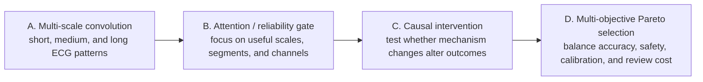

# 论文正文小节：因果机制感知的多目标优化

> 本小节是可直接改写进论文正文的压缩版本。它只描述研究型可靠性证据，不作临床诊断、临床有效性或医疗器械验证声明。

## 因果机制感知的多目标优化框架

本研究将 SR、VT、VF 心电图分类任务从单一分类准确率优化，扩展为因果机制感知的多目标可靠性优化问题。传统分类模型主要回答“预测是否正确”，但在 VT/VF 边界样本、隐藏高置信错误和校准不稳定样本中，仅报告 accuracy 或 macro-F1 难以解释模型为什么失败。因此，本研究进一步引入表征几何、局部邻域结构、原型歧义、softmax 歧义、小波时频特征、节律规则性和机制解释一致性等变量，用于量化训练约束和路由策略对可靠性结果的影响路径。

本文的方法主线由四个互相连接的组件构成：

| 组件 | 作用 | 在本项目中的含义 |
| --- | --- | --- |
| A. 多尺度卷积 / 多尺度时频建模 | 决定 ECG 应该从哪些时间尺度上被观察 | 短尺度捕获尖峰、边缘和局部震颤；中尺度捕获连续波形变化；长尺度捕获节律、周期性和混乱程度 |
| B. 注意力 / 可靠性门控机制 | 决定模型更应该关注哪一段、哪一类尺度或哪一类特征 | 当前实现更准确地说是 reliability gate / validity gate，用于调节波形表征与规则性特征、边界专家信息的融合 |
| C. 因果推断式干预 | 判断机制变量是否只是相关，还是在干预后会改变 outcome | 通过 `do(training constraint)`、`do(add evidence)`、`do(change routing weight)` 检查 embedding、KNN、prototype、validity 和错误结果是否同步变化 |
| D. 多目标优化 | 在多个互相冲突的目标之间选择候选 | 同时平衡 accuracy、macro-F1、ECE、VT/VF 错误、total error、error migration、review burden 和 unresolved risk |

这四个组件的关系不是并列堆叠，而是形成从特征提取到可靠性选择的完整链条：多尺度卷积负责“看见不同时间尺度的 ECG 结构”，注意力或可靠性门控负责“决定哪些信息更重要”，因果推断式干预负责“验证这些机制是否真的影响结果”，多目标优化负责“在安全性、准确性、校准、解释性和专家成本之间做选择”。

本研究中的因果推断并不指 ECG 生理病理因果证明，而是指在固定数据划分、固定标签定义和同随机种子比较下，对模型设计变量进行干预，并观察机制变量和结果变量是否发生一致变化。其基本证据链为：

```text
do(可干预设计变量) -> 机制变量变化 -> 可靠性 outcome 变化
```

其中，不可干预变量包括原始 ECG 波形结构、SR/VT/VF 标签定义、record-level 数据划分和固定实验协议。可干预变量包括训练约束权重、机制证据是否纳入、路由策略权重和 review budget。机制变量包括 embedding silhouette、KNN local purity、prototype VT/VF ambiguity、softmax VT/VF ambiguity、validity signal、小波边界风险、节律规则性特征和 explanation alignment。结果变量则按层面区分：模型层结果包括 accuracy、macro-F1、ECE、VT/VF cross-error、total error 和 error migration penalty；路由层结果包括 fixed-budget error capture、VT/VF capture、unresolved VT/VF risk 和 explanation reliability。



## 模型层干预

在模型层，本研究将 prototype constraint、boundary risk weighting、regularity auxiliary loss、stability consistency、calibration-related risk entropy 等训练设计视为可干预变量。对于每一个候选干预，采用同 seed paired comparison：

```text
Delta mechanism = M_candidate(seed_i) - M_baseline(seed_i)
Delta outcome   = Y_candidate(seed_i) - Y_baseline(seed_i)
```

这种设计的目的不是证明某个 loss 在所有数据集上必然有效，而是检验在本项目的 ECG 可靠性任务中，改变训练约束是否会通过可测量机制变量影响模型 outcome。若某个候选方案同时改善表征分离、局部邻域纯度、VT/VF 原型歧义、softmax 歧义和 validity signal，并进一步改善 accuracy、macro-F1、ECE、VT/VF cross-error 和 total error，则该候选可以被解释为具有较完整的“干预 -> 机制 -> outcome”证据链。

2026 年 6 月 30 日下午进行的 full search 属于这一类模型层干预实验。该实验不是重新设计一个全新的网络架构，而是在同一个 `reliability_gated_fusion` 模型训练入口上，对已有强候选约束进行重组和剂量搜索。实验共包含 8 组候选，每组 3 个 seed，每个 seed 训练 30 epochs，总计 24 个训练 run。候选包括 baseline、prototype-only guard、boundary risk，以及 boundary 与 prototype、regularity、stability、calibration 相关约束的组合。其目的在于筛选哪一种训练约束组合位于更好的多目标 Pareto 区域。

该实验显示，`boundary075_prototype` 和 `boundary075_prototype_calibrated` 被选入后续 full validation。其中 `boundary075_prototype` 在 3 个 paired seeds 上同时改善 6 个目标：accuracy、macro-F1、ECE、VT/VF cross-error、total error 和 error migration penalty。这一结果说明，较轻剂量的 boundary weighting 与 prototype geometry constraint 组合，比单独依赖 boundary risk 或更重剂量 boundary constraint 更适合作为模型层机制干预候选。

## 路由层机制证据

在路由层，本研究不将单个 evidence head 直接与完整 V5D router 比较，而是先建立机制证据库，再由证据库组成完整 routing policy。机制证据库包括 wavelet time-frequency risk、regularity waveform descriptors、mechanism-specific error heads 和 explanation alignment scores。每个机制信号都需要回答两个问题：第一，它是否能识别特定错误类型；第二，它是否能在固定 review budget 下帮助完整路由策略捕获关键错误。

因此，路由层的公平比较单位是完整 routing policy，而不是单个模型或单个机制头。V5D stage1/stage2 router、causal-Pareto weighted router 和 fixed-budget router 可以互相比较；单个 wavelet head、validity head 或 explanation score 只能作为 routing policy 的组成证据。这个分层原则避免了将分类模型、证据头、路由策略和 recovery action 混在一起比较。

## 多目标选择

本研究采用 Pareto-style 多目标选择，而不是单指标排序。模型层目标为：

```text
maximize accuracy
maximize macro-F1
minimize ECE
minimize VT/VF cross-error
minimize total error
minimize error migration penalty
```

路由层目标为：

```text
maximize all-error capture
maximize VT/VF capture
minimize unresolved VT/VF risk
minimize review budget
maximize explanation reliability
```

只有当一个候选方案在多个关键可靠性目标上同时不劣于基线，并至少在一个目标上具有明确优势时，才被视为更优候选。对于不能完全支配基线的方案，本研究保留 trade-off 解释，而不将其简单写作总体提升。

## 方法边界

本方法提供的是内部机制证据链和多目标可靠性优化框架。它能够说明训练约束、机制信号和路由策略如何影响本项目中的模型可靠性 outcome，但不能替代外部独立数据验证，也不能被描述为临床诊断可靠性证明。由于当前模型层实验主要基于有限 seed，结论应写作结构化的内部证据，而不是最终泛化结论。
