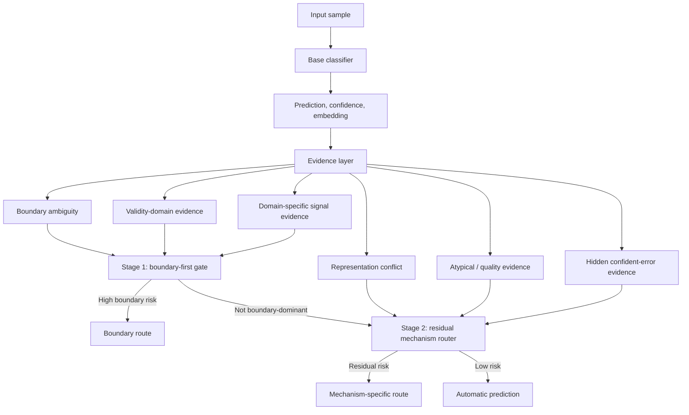

# VT/VF 项目可迁移方法框架

这份文件不是项目流水账，也不是旧版本实验归档。它把 VT/VF reliability
项目中真正可复用的方法抽象出来，作为后续文稿、博士申请材料、或其他项目的
方法母文档。

核心用途：

- 给其他文稿提供一套完整的可靠性研究逻辑；
- 给其他项目提供一套从错误机制分析到模型升级的路线；
- 避免只复制结果，而是复用方法；
- 把 VT/VF 项目的经验转成通用的 mechanism-aware reliability framework。

## 1. 核心思想

本项目的核心思想不是“训练一个更强 ECG 分类器”，而是：

> 先识别模型在哪些机制下不可靠，再把这些机制证据转化为可验证的决策策略，
> 最后再考虑是否把机制标签反哺回模型训练。

在 VT/VF 项目中，这个逻辑具体表现为：

```text
SR/VT/VF 分类
  -> 发现 VT/VF 是核心脆弱边界
  -> 用 embedding、uncertainty、regularity、validity、wavelet 等证据解释错误
  -> 测试 PRO、ProRisk、CNN-LSTM、CNN-TCN-Validity 等结构性改进
  -> 发现 representation improvement 不等于 decision reliability
  -> 将多源证据组织成 mechanism-separated router
  -> 用 v5d routing policy 做 fixed-budget error capture
  -> 再考虑 router-supervised / mechanism-conditioned model refinement
```

这套逻辑可以迁移到任何存在“高风险边界错误”的分类任务，例如医学影像、
时间序列、机器人动作失败、VLA 任务失败、金融异常检测或其他安全相关分类。

## 2. 可迁移研究流程

### Step 0: 先处理数据独立性和泄漏风险

在做任何模型创新前，先确认数据划分是否可信。

VT/VF 项目做法：

- record-level split；
- duplicate-family split；
- exact-window hash overlap audit；
- record-cluster bootstrap；
- 不把高度相似窗口当成独立样本。

迁移到其他项目时，应替换为对应的数据独立单元：

| 项目类型 | 不应跨 split 的单位 |
| --- | --- |
| ECG / 医学时间序列 | patient、record、duplicate family、episode |
| 医学影像 | patient、scan、slice group、hospital source |
| 机器人 / VLA | trajectory、scene、object instance、task episode |
| NLP / 多模态 | source document、user/session、template family |
| 金融 / 安全 | account、event family、time block、source system |

可迁移原则：

> 先证明评估不是由数据泄漏或近重复样本撑起来的，再谈模型贡献。

### Step 1: 找到真正的高风险边界

不要只看整体 accuracy。先问：

> 哪一类错误最重要，且最容易被整体指标掩盖？

VT/VF 项目里，SR 与室性节律相对更容易分开，VT 和 VF 更容易混合，所以
核心边界从三分类整体 accuracy 转向 VT/VF boundary reliability。

迁移模板：

```text
原始任务: A / B / C / ...
高风险边界: B vs C
核心错误: B->C, C->B, or high-risk false negative
主研究问题: 模型能否识别这些高风险错误并触发特殊处理？
```

### Step 2: 先做多模型基线，不急着发明新结构

VT/VF 项目中先比较：

- CNN；
- TCN；
- CNN-LSTM；
- ResNet1D；
- InceptionTime；
- BiGRU；
- RegularityFusion；
- GatedFusion。

作用不是选一个最高 accuracy 的模型，而是确认：

- 高风险边界是否跨模型存在；
- 更强分类器是否真的更可靠；
- 哪些模型 accuracy 高但 review-routing 弱；
- 哪些模型 accuracy 一般但 error ranking 有价值。

可迁移原则：

> backbone comparison 的目的不是模型排行榜，而是证明 failure mode 是否稳定存在。

### Step 3: 建立机制证据库

VT/VF 项目最终不是依赖单一 uncertainty score，而是建立了多个 evidence
families：

| Evidence family | VT/VF 项目中的含义 | 可迁移解释 |
| --- | --- | --- |
| Softmax ambiguity | VT/VF 概率接近 | 决策边界不确定 |
| Entropy / MSP | 预测置信度不足 | 普通不确定性 |
| Embedding geometry | 类中心距离、PCA、局部混合 | 表征空间结构 |
| kNN atypicality | 近邻异常、局部类别混合 | 局部经验不足 |
| Prototype conflict | 距离多个原型接近或冲突 | 类别证据不一致 |
| Regularity features | 节律/频谱/自相关异常 | 任务领域特征 |
| Validity-domain evidence | 当前样本是否落在可靠区域 | 局部有效域判断 |
| Wavelet/time-frequency | VT/VF 边界的频域风险 | 多尺度信号证据 |
| Model disagreement | teacher vs readable / second opinion | 第二意见机制 |
| Hidden confident error | 高置信但错误 | 最危险的稳定错判 |

可迁移原则：

> 不要问“哪个单一分数最好”，而是问“不同错误机制需要哪些不同证据”。

### Step 4: 用 embedding 做诊断，但不要把它当成充分证明

这是 VT/VF 项目最重要的经验之一。

Embedding 分析有用，因为它能回答：

- 哪些类别在表征层混合；
- 错误是否集中在局部边界；
- KNN 近邻是否显示局部异质性；
- prototype 是否冲突；
- layerwise representation 是否逐层变坏或变好。

但是 embedding 改善不等于模型更安全。项目中 PRO、ProRisk、Risk-Pro-readable、
CNN-LSTM、CNN-TCN-Validity 等实验都说明：

- 表征可以更平滑；
- 类中心可以更分开；
- silhouette 可以更好；
- 但 VT/VF cross-error 不一定下降；
- 有时错误会迁移到 SR-to-VT、VT-to-SR 等其他方向；
- 错误区域甚至可能变得更稳定、更高置信。

最终结论：

> Embedding is diagnostic evidence, not sufficient proof of decision reliability.

迁移到其他项目时，应写成：

```text
We use representation analysis to identify candidate failure mechanisms.
However, representation separation is not treated as a success criterion by
itself. A mechanism is considered useful only if it improves downstream error
capture, calibration, or residual-risk reduction under held-out evaluation.
```

### Step 5: 做结构性模型实验，但要允许负结果成立

VT/VF 项目测试了多种结构性改进：

- CNN-LSTM：测试 temporal modeling 是否改善边界；
- PRO/prototype separation：测试类中心结构是否能修复边界；
- ProRisk/Risk-Pro-readable：测试 reliability-aware constraints；
- CNN-TCN-Validity：测试有效域 bottleneck；
- CNN-Wavelet-TCN：测试 time-frequency boundary evidence；
- frozen self-supervised encoder：测试 foundation-model-ready baseline。

这些实验的价值不只是“提高指标”，还包括：

- 证明某些直觉不成立；
- 发现 error migration；
- 发现某些证据适合 routing，但不适合作为直接训练目标；
- 给最终 mechanism router 提供证据来源。

可迁移原则：

> Negative results are not failed experiments if they clarify which mechanism is
> real and which intervention is unsafe.

### Step 6: 把证据转成机制标签

VT/VF 项目中，最终不是简单地输出一个 risk score，而是把样本分成机制类别：

```text
low-risk auto-route
VT/VF boundary risk
SR-ventricular confusion risk
representation conflict
atypical / noisy signal
hidden confident error
```

这些机制类别来自前面的证据库，而不是人工随便命名。

迁移模板：

```text
Mechanism category = function(
    model confidence,
    boundary ambiguity,
    representation neighborhood,
    domain-specific features,
    corruption / quality evidence,
    disagreement / second-opinion evidence
)
```

### Step 7: 建立 mechanism-separated decision policy

VT/VF 项目的最终方法是 v5d hierarchical router。



可迁移原则：

> 不同错误机制不应被压缩成同一个阈值。更强的设计是让不同机制进入不同 route。

### Step 8: 用 fixed-budget 指标验证，而不是只看 accuracy

VT/VF 项目的核心评估不是：

```text
accuracy 是否提高？
```

而是：

```text
在 10%、20%、30% action budget 下，能捕获多少重要错误？
自动路径还剩多少高风险错误？
```

关键指标：

- all-error capture；
- VT/VF cross-error capture；
- automatic unresolved VT/VF rate；
- calibration / ECE；
- AUROC / AUPR for error detection；
- error-type capture；
- record-cluster bootstrap；
- cluster concentration audit。

可迁移模板：

| Metric | Purpose |
| --- | --- |
| high-risk error capture @ budget | 复核资源有限时能抓住多少关键错误 |
| residual high-risk error rate | 自动路径里还剩多少危险错误 |
| all-error capture | 方法是否只偏向一种错误 |
| calibration | 风险分数是否可信 |
| subgroup / cluster stress test | 是否由某一组样本撑起结果 |
| external or leave-cluster-out validation | 是否有分布外稳定性 |

### Step 9: 做 small-data / cluster stress test

VT/VF 项目专门检查过结果是否由小数据集放大：

- validation downsampling：25% validation evidence 下，10% budget VT/VF capture
  为 90.3%，full validation 为 90.4%；20% budget 都约 99.7%；
- cluster concentration audit：去掉最大 duplicate-family cluster 后，10% budget
  仍有 76.6%，20% budget 仍有 99.3%。

这不能替代 external validation，但能说明结果不是完全由单一验证集或单一 cluster
撑起来。

迁移原则：

> 如果没有外部数据，至少要做 stricter internal validation 和 cluster-level stress test。

### Step 10: 评价解释是否可靠，而不是只展示解释图

VT/VF 项目最后做了 explanation reliability audit：

- boundary explanation 是否真的对应 VT/VF cross-error；
- representation explanation 是否真的对应 representation conflict；
- second-opinion explanation 是否能捕获 any error；
- regularity explanation 是否真的对应 atypical signal；
- hidden-confidence evidence 是否能找到高置信错误。

迁移原则：

> Explanation should be evaluated against the error mechanism it claims to explain.

不要只放 saliency、PCA、attention 图。要问：

```text
这个解释是否真的预测了它声称解释的错误类型？
```

## 3. 从路由反哺模型的下一步方法

这部分是从当前 VT/VF 项目自然延伸出来的下一阶段，可以迁移到其他项目。

当前系统已经有：

```text
input -> base classifier -> task label
input + evidence -> mechanism router -> mechanism category
```

下一步可以把 router 的机制类别反哺模型训练：

```text
input -> encoder -> embedding
              -> task head
              -> mechanism head
              -> risk head
              -> mechanism-conditioned task head
```

可选设计：

### 3.1 Router-supervised auxiliary learning

用 router 生成的 mechanism labels 作为辅助监督：

```text
Loss = CE(task label)
     + lambda1 * CE(mechanism label)
     + lambda2 * RiskLoss
     + lambda3 * BoundaryLoss
```

目标不是让模型“解释得更好看”，而是让模型内部学习哪些样本属于哪种失败机制。

### 3.2 Mechanism-conditioned classifier

先预测机制概率，再把机制概率喂回分类头：

```text
embedding -> mechanism probabilities
embedding + mechanism probabilities -> final task classifier
```

这对应用户前面提出的关键思路：

> 我们已经知道样本更像 VT/VF boundary 还是 SR-ventricular confusion，
> 为什么不让模型本身利用这个机制判断？

### 3.3 Cross-fitted mechanism distillation

为了避免泄漏，机制标签不能用 test set 真实错误直接生成后再训练模型。

严谨做法：

```text
train fold A -> train router
train fold B -> generate out-of-fold mechanism labels
repeat K folds
use out-of-fold mechanism labels to train mechanism-supervised classifier
final test set -> only evaluate, never generate labels from test errors
```

可迁移原则：

> Router labels can be distilled into the model only if they are generated
> without using held-out test error information.

## 4. 可复制到其他项目的写作模板

### 4.1 研究问题模板

```text
The task is not only to improve aggregate accuracy. We identify the
safety-relevant boundary where the model's errors are most consequential, then
ask whether uncertainty, representation, and domain-specific evidence can be
converted into a mechanism-aware decision policy.
```

### 4.2 方法模板

```text
We first train multiple backbone models to establish whether the failure mode
is architecture-specific. We then characterize failures using uncertainty,
calibration, representation geometry, local-neighborhood evidence, and
domain-specific signal features. Model-side interventions are tested but not
accepted unless they improve downstream error capture. Finally, the validated
evidence families are organized into a mechanism-separated router.
```

### 4.3 负结果模板

```text
Improved representation geometry does not necessarily imply improved decision
reliability. Some interventions make embeddings more regular while preserving
or stabilizing incorrect decision regions. We therefore evaluate mechanisms by
held-out error capture and residual-risk reduction rather than by representation
separation alone.
```

### 4.4 路由模板

```text
The final policy separates boundary-dominant failures from residual mechanisms.
Boundary-risk samples are routed first, while a reserved budget handles
representation conflict, atypical signal evidence, and hidden confident errors.
This prevents one high-scoring mechanism from consuming the entire action
budget.
```

### 4.5 stress test 模板

```text
Because the dataset is limited, we test whether the routing result is driven by
one validation split or one dominant cluster. We perform validation
downsampling, leave-cluster-out or cluster-removal analysis, and cluster-level
bootstrap. These checks do not replace external validation, but they reduce the
risk of reporting a small-sample artifact.
```

## 5. 其他项目使用这份框架时应该替换什么

| VT/VF 项目元素 | 其他项目中应替换为 |
| --- | --- |
| SR / VT / VF | 目标任务类别 |
| VT/VF boundary | 最关键的高风险边界 |
| ECG regularity | 领域特定可解释特征 |
| wavelet/time-frequency | 该领域的多尺度或结构证据 |
| duplicate-family split | 项目对应的独立分组单位 |
| review routing | 人工复核、保守预测、二阶段验证或安全动作 |
| VT/VF cross-error capture | 高风险错误捕获率 |
| automatic unresolved VT/VF rate | 自动路径残留高风险错误率 |

## 6. 不能迁移或需要谨慎迁移的内容

不要直接复制：

- ECG 原始数据；
- VT/VF-specific clinical wording；
- 当前项目的内部数值作为其他项目结果；
- 没有外部验证的临床/部署 claim；
- 用 test error 生成机制标签再训练模型的流程。

可以迁移：

- 研究逻辑；
- evidence families 的组织方式；
- 负结果判断标准；
- fixed-budget evaluation；
- mechanism-separated routing；
- router-supervised refinement 思路；
- stress-test 设计。

## 7. 给其他项目的最短提示词

下面这段可以直接喂给别的文稿或项目：

```text
Use the VT/VF reliability project as a methodological template, not as a source
of copied results. First identify the safety-relevant boundary or failure mode
hidden by aggregate accuracy. Then build a multi-source evidence layer using
uncertainty, calibration, representation geometry, local-neighborhood evidence,
domain-specific features, robustness/OOD behavior, and model disagreement.
Treat representation analysis as diagnostic evidence rather than proof of
model improvement. Test structured interventions, including negative results
and error migration. Convert validated evidence into mechanism categories and a
mechanism-separated routing policy. Evaluate by fixed-budget high-risk error
capture, residual automatic-path error, calibration, and cluster/subgroup stress
tests. If useful, distill router-generated mechanism labels back into the model
with cross-fitting to avoid test leakage.
```

## 8. 最终可迁移贡献表述

最适合写进论文或博士申请的方法贡献是：

> This work develops a mechanism-aware reliability framework: it diagnoses
> boundary failures using representation, uncertainty, and domain-specific
> evidence; tests whether structural interventions truly improve downstream
> reliability; and converts validated evidence into a hierarchical decision
> policy that separates boundary-risk routing from residual failure mechanisms.

中文表述：

> 本项目提出的不是单一不确定性分数，而是一套可迁移的机制感知可靠性框架：
> 先通过表征、置信度、局部邻域和领域特征识别高风险错误机制，再验证这些机制
> 是否真的捕获下游错误，最后将其组织为分层路由或反哺模型训练的机制标签。

