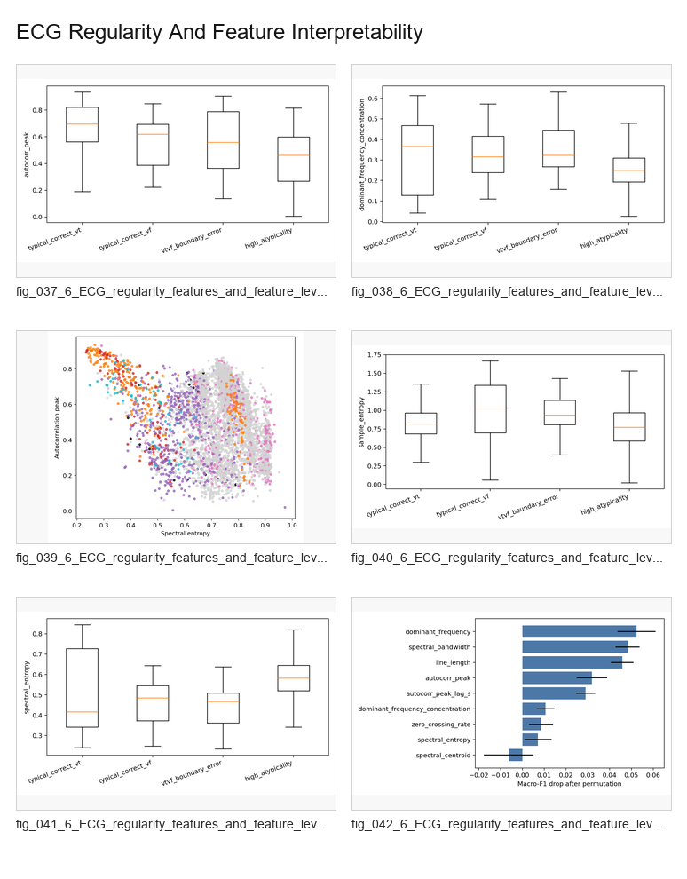

# ECG Regularity And Feature Interpretability

Regularity and feature-level evidence linking model reliability to ECG signal structure.

## Contact Sheet

## Included Figures

1. [`fig_037_6_ECG_regularity_features_and_feature_level_interpretability.png`](individual_figures/fig_037_6_ECG_regularity_features_and_feature_level_interpretability.png)
2. [`fig_038_6_ECG_regularity_features_and_feature_level_interpretability.png`](individual_figures/fig_038_6_ECG_regularity_features_and_feature_level_interpretability.png)
3. [`fig_039_6_ECG_regularity_features_and_feature_level_interpretability.png`](individual_figures/fig_039_6_ECG_regularity_features_and_feature_level_interpretability.png)
4. [`fig_040_6_ECG_regularity_features_and_feature_level_interpretability.png`](individual_figures/fig_040_6_ECG_regularity_features_and_feature_level_interpretability.png)
5. [`fig_041_6_ECG_regularity_features_and_feature_level_interpretability.png`](individual_figures/fig_041_6_ECG_regularity_features_and_feature_level_interpretability.png)
6. [`fig_042_6_ECG_regularity_features_and_feature_level_interpretability.png`](individual_figures/fig_042_6_ECG_regularity_features_and_feature_level_interpretability.png)
