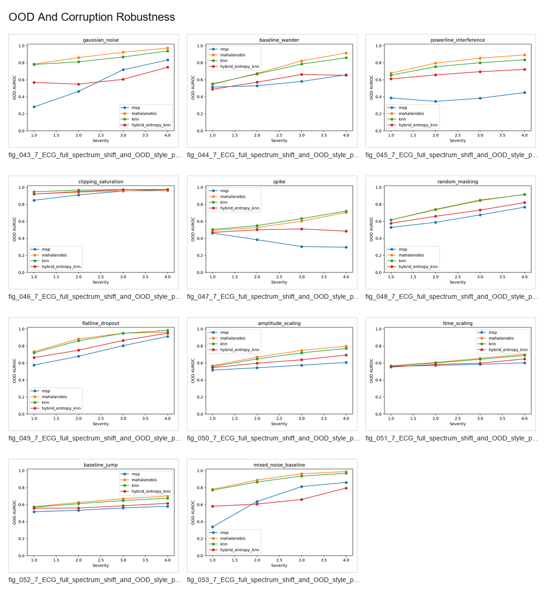

# OOD And Corruption Robustness

Full-spectrum shift, severity, and ECG-like perturbation evidence.

## Contact Sheet

## Included Figures

1. [`fig_043_7_ECG_full_spectrum_shift_and_OOD_style_perturbation_benchmark.png`](individual_figures/fig_043_7_ECG_full_spectrum_shift_and_OOD_style_perturbation_benchmark.png)
2. [`fig_044_7_ECG_full_spectrum_shift_and_OOD_style_perturbation_benchmark.png`](individual_figures/fig_044_7_ECG_full_spectrum_shift_and_OOD_style_perturbation_benchmark.png)
3. [`fig_045_7_ECG_full_spectrum_shift_and_OOD_style_perturbation_benchmark.png`](individual_figures/fig_045_7_ECG_full_spectrum_shift_and_OOD_style_perturbation_benchmark.png)
4. [`fig_046_7_ECG_full_spectrum_shift_and_OOD_style_perturbation_benchmark.png`](individual_figures/fig_046_7_ECG_full_spectrum_shift_and_OOD_style_perturbation_benchmark.png)
5. [`fig_047_7_ECG_full_spectrum_shift_and_OOD_style_perturbation_benchmark.png`](individual_figures/fig_047_7_ECG_full_spectrum_shift_and_OOD_style_perturbation_benchmark.png)
6. [`fig_048_7_ECG_full_spectrum_shift_and_OOD_style_perturbation_benchmark.png`](individual_figures/fig_048_7_ECG_full_spectrum_shift_and_OOD_style_perturbation_benchmark.png)
7. [`fig_049_7_ECG_full_spectrum_shift_and_OOD_style_perturbation_benchmark.png`](individual_figures/fig_049_7_ECG_full_spectrum_shift_and_OOD_style_perturbation_benchmark.png)
8. [`fig_050_7_ECG_full_spectrum_shift_and_OOD_style_perturbation_benchmark.png`](individual_figures/fig_050_7_ECG_full_spectrum_shift_and_OOD_style_perturbation_benchmark.png)
9. [`fig_051_7_ECG_full_spectrum_shift_and_OOD_style_perturbation_benchmark.png`](individual_figures/fig_051_7_ECG_full_spectrum_shift_and_OOD_style_perturbation_benchmark.png)
10. [`fig_052_7_ECG_full_spectrum_shift_and_OOD_style_perturbation_benchmark.png`](individual_figures/fig_052_7_ECG_full_spectrum_shift_and_OOD_style_perturbation_benchmark.png)
11. [`fig_053_7_ECG_full_spectrum_shift_and_OOD_style_perturbation_benchmark.png`](individual_figures/fig_053_7_ECG_full_spectrum_shift_and_OOD_style_perturbation_benchmark.png)
