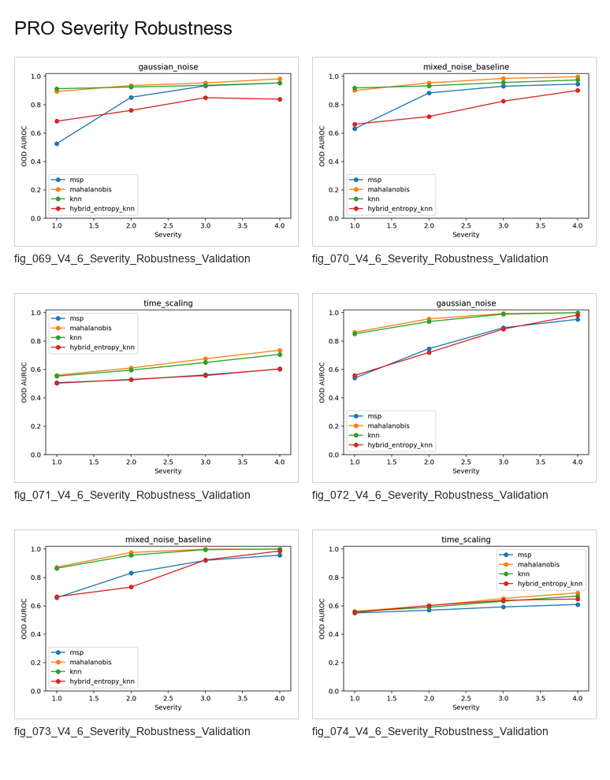

# PRO Severity Robustness

Severity robustness validation for boundary-structure intervention experiments.

## Contact Sheet

## Included Figures

1. [`fig_069_V4_6_Severity_Robustness_Validation.png`](individual_figures/fig_069_V4_6_Severity_Robustness_Validation.png)
2. [`fig_070_V4_6_Severity_Robustness_Validation.png`](individual_figures/fig_070_V4_6_Severity_Robustness_Validation.png)
3. [`fig_071_V4_6_Severity_Robustness_Validation.png`](individual_figures/fig_071_V4_6_Severity_Robustness_Validation.png)
4. [`fig_072_V4_6_Severity_Robustness_Validation.png`](individual_figures/fig_072_V4_6_Severity_Robustness_Validation.png)
5. [`fig_073_V4_6_Severity_Robustness_Validation.png`](individual_figures/fig_073_V4_6_Severity_Robustness_Validation.png)
6. [`fig_074_V4_6_Severity_Robustness_Validation.png`](individual_figures/fig_074_V4_6_Severity_Robustness_Validation.png)
