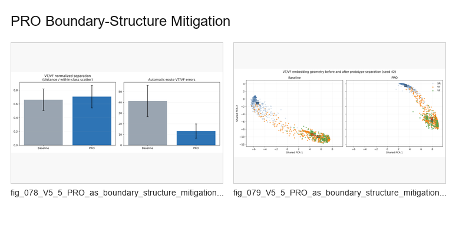

# PRO Boundary-Structure Mitigation

V5 reinterpretation of PRO as boundary-structure mitigation rather than a generic prototype loss.

## Contact Sheet

## Included Figures

1. [`fig_078_V5_5_PRO_as_boundary_structure_mitigation_not_just_prototype_loss.png`](individual_figures/fig_078_V5_5_PRO_as_boundary_structure_mitigation_not_just_prototype_loss.png)
2. [`fig_079_V5_5_PRO_as_boundary_structure_mitigation_not_just_prototype_loss.png`](individual_figures/fig_079_V5_5_PRO_as_boundary_structure_mitigation_not_just_prototype_loss.png)
