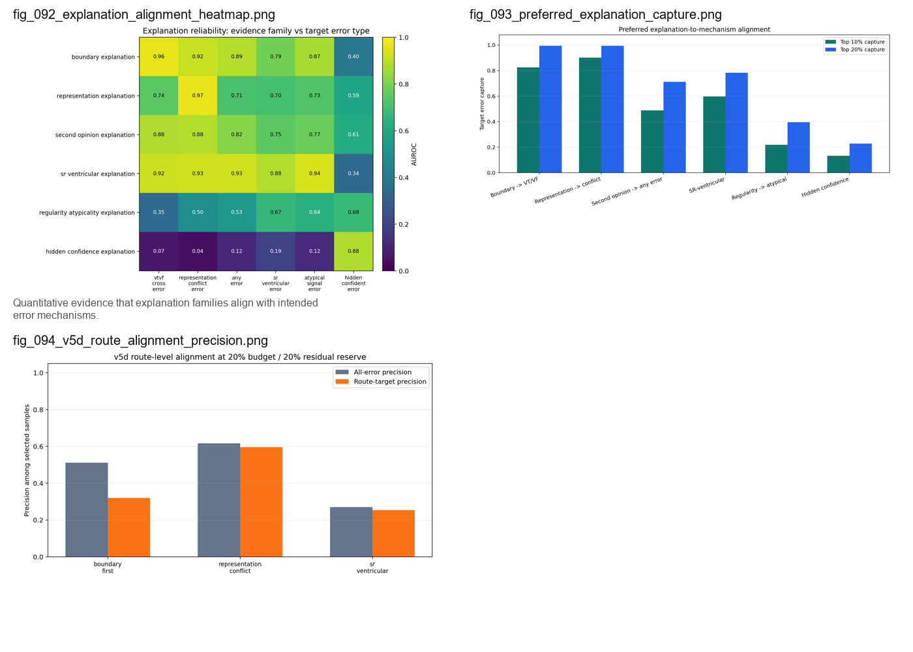

# Explanation Reliability

Quantitative evidence that explanation families align with intended error mechanisms.

## Contact Sheet

## Included Figures

1. [`fig_092_explanation_alignment_heatmap.png`](individual_figures/fig_092_explanation_alignment_heatmap.png)
2. [`fig_093_preferred_explanation_capture.png`](individual_figures/fig_093_preferred_explanation_capture.png)
3. [`fig_094_v5d_route_alignment_precision.png`](individual_figures/fig_094_v5d_route_alignment_precision.png)
